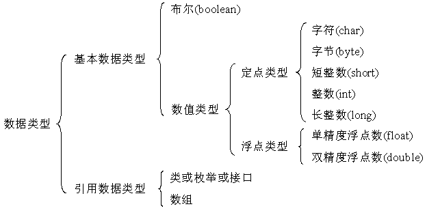

#  第二章 Java基础语法

## 本章的目的

- 标识符(`4种字符:字母、数字、_、$，首字符：字母、_、$`)
- 关键字
- 8种基本数据类型(`boolean\char\byte、short、int、long\float、double`)
- 运算符
- 流程控制
- 结构化程序设计
- 5种参数输入方式

## 标识符和关键字

### 具有特殊含义的字符序列

例如： `public`、 `static`和`class` 
具有特殊用途，不能作为变量名、方法名和类名

### 运算符优先级

越上面优先级越高

1. 一元后缀       [ ]    .   ( )  ++   --
2. 一元前缀       ++  --    +   =   ~   !
3. 创建和强制类型转换  new   (type)
4. 倍数  *  /   %
5. 增量  +  -
6. 移位  <<   >>   >>>
7. 关系  <  >   >=  <=  instanceof
8. 等价 ==  !=
9. 与  &
10. 异或  ^
11. 或  |
12. 布尔与  &&
13. 布尔或  ||
14. 条件  ?:
15. 赋值  ＝  +=  -=  *=  /=   %=  >>=  <<=   >>>=   &=   ^=   |=
