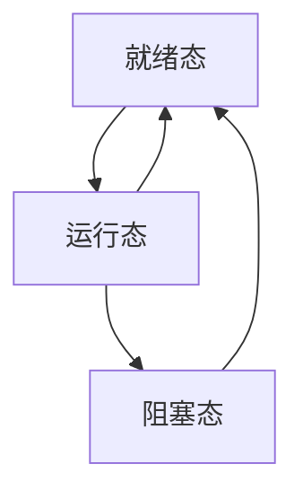
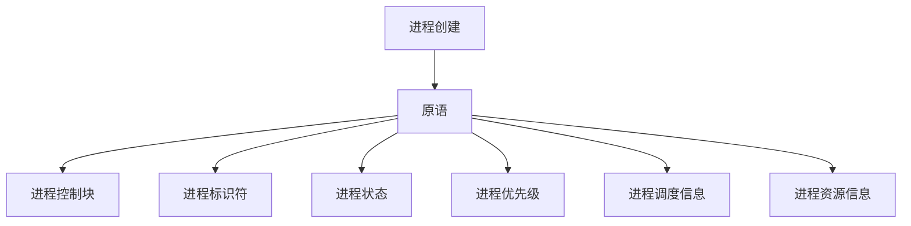
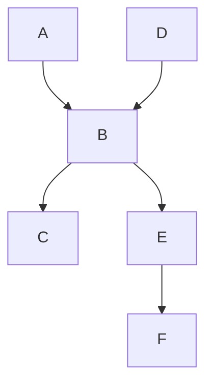

# 进程管理

## 1. 进程的引入

### 前驱图

`前驱图`是用来描述进程之间的依赖关系的，它是一个有向无循环图，图中的节点表示进程，图中的边表示进程之间的依赖关系。

### 程序的顺序执行

`程序`是为解决某一问题而设计的一组指令的集合，它是静态的，是存储在磁盘上的，程序的执行是动态的，是存储在内存中的。
### 1.1 什么是进程

简单定义：`进程`是一个程序的一次执行过程。

`进程`是程序的一次执行过程，是系统进行资源分配和调度的一个独立单位。

#### 进程的映像

1. 可执行的程序(代码段)
2. 相关的数据集
3. 程序计数器
4. 寄存器
5. 堆栈

#### 进程和程序的区别

1. 程序是静态的，是存储在磁盘上的，程序的执行是动态的，是存储在内存中的。
2. 进程是程序的一次执行过程，是系统进行资源分配和调度的一个独立单位。

菜和菜谱的关系：菜是静态的，是存储在菜谱上的，菜的制作是动态的，是在厨房里制作的。
进程和程序的关系：程序是静态的，是存储在磁盘上的，程序的执行是动态的，是在内存中执行的。
### 1.2 进程的特点

1. 动态性：进程是程序的一次执行过程，是动态产生、动态消亡的。
2. 并发性：系统中同时存在多个进程，这些进程都需要得到系统资源的分配和调度。
3. 独立性：进程是系统资源分配和调度的一个独立单位，进程之间是相互独立的。
4. 异步性：进程是异步执行的，进程的执行是不可预知的。

### 1.3 进程的状态

1. 就绪态：进程已经具备了运行的条件，只要系统调度就可以运行。
2. 运行态：进程正在运行。
3. 阻塞态：进程由于某种原因无法运行，需要等待某种事件的发生。

### 1.4 进程的控制块

`进程控制块`是操作系统中用来描述和管理进程的一种数据结构，它包含了进程的各种属性和状态信息。

## 2. 进程的创建

### 2.1 进程的创建方式

1. 系统初始化
2. 用户登录
3. 作业调度
4. 提供服务
5. 应用请求


### 2.2 进程的创建过程

1. 为新进程分配一个唯一的进程标识符
2. 为新进程分配一个进程控制块
3. 初始化进程控制块
4. 为新进程分配资源
5. 将新进程插入就绪队列

### 2.3 linux中的进程创建

1. `fork`系统调用
    - `fork`系统调用是用来创建一个新的进程的，它是通过复制当前进程的副本来创建新的进程的。
    - `fork`系统调用会创建一个新的进程，新的进程是当前进程的副本，新的进程和当前进程是完全独立的，它们之间不共享任何资源。
    - `fork`系统调用会返回两次，父进程中返回子进程的进程标识符，子进程中返回0。
2. `exec`系统调用
3. `clone`系统调用

### 2.4 windows中的进程创建

1. `CreateProcess`函数
2. `CreateThread`函数

### 2.5 macOS中的进程创建

1. `fork`系统调用
2. `exec`系统调用


## 3. 进程的终止


## 程序的并发执行及特征

### 1. 程序的并发执行

`并发执行`是指系统中同时存在多个进程，这些进程都需要得到系统资源的分配和调度。

### 2. 程序的并发特征

1. 动态性：进程是程序的一次执行过程，是动态产生、动态消亡的。
2. 并发性：系统中同时存在多个进程，这些进程都需要得到系统资源的分配和调度。
3. 独立性：进程是系统资源分配和调度的一个独立单位，进程之间是相互独立的。
4. 异步性：进程是异步执行的，进程的执行是不可预知的。

## 程序的并发执行的实现

程序的并发执行是指在一个时间段内，两个或更多的任务（程序、进程、线程等）都在执行。并发执行可以在单核或多核处理器上实现，主要依赖于操作系统的任务调度机制。

以下是并发执行的一些基本实现方式：

1. **多进程**：每个进程在各自独立的地址空间中运行，进程之间的通信需要使用进程间通信（IPC）机制，如管道、消息队列、共享内存等。

```python
import multiprocessing

def worker():
    print('Worker')

if __name__ == '__main__':
    jobs = []
    for _ in range(5):
        p = multiprocessing.Process(target=worker)
        jobs.append(p)
        p.start()
```

2. **多线程**：所有线程在同一地址空间中运行，可以直接访问同一份数据，但也因此需要处理数据同步和互斥的问题。

```python
import threading

def worker():
    print('Worker')

if __name__ == '__main__':
    threads = []
    for _ in range(5):
        t = threading.Thread(target=worker)
        threads.append(t)
        t.start()
```

3. **异步编程**：通过异步I/O和回调，让单线程/进程模拟实现并发。Python中的asyncio就是这样的库。

```python
import asyncio

async def worker():
    print('Worker')

if __name__ == '__main__':
    asyncio.run(worker())
```

以上代码示例都是用Python编写的，但并发执行的概念和实现方式在其他编程语言中也是类似的。

### 例题

```bash
# 程序a

x = 1;
y=0;
if x>= 1 then
    y = 1;
z = y;
```

```bash
# 程序b
x= 0;
t= 0;
if x<1 then
    t = t +2 ;
u = t;
```

程序a和程序b的并发执行结果是什么？

### 例题又一

## 进程的状态及转化

### 1. 三种基本状态

1. 就绪态：进程已经具备了运行的条件，只要系统调度就可以运行。
2. 运行态：进程正在运行。
3. 阻塞态：进程由于某种原因无法运行，需要等待某种事件的发生。（又被称为等待态，或者睡眠态）

进程状态转换图


### 2. 进程状态的转换

1. 就绪态 --> 运行态(被调度或分派)
2. 运行态 --> 阻塞态(等待某种事件的发生)
3. 阻塞态 --> 就绪态(事件发生)
4. 运行态 --> 就绪态(时间片用完)

### 例题

若一个用户进程通过read系统调用从磁盘读取数据，则下列关于此过程的描述中，正确的是（）

A. 若该文件的数据不在内存中，则该进程进入阻塞态
B. 请求read的系统调用会使cpu从用户态转换到内核态
C. read系统调用的参数应包含文件的名称
D. read系统调用结束后会重新让该进程进入就绪态或运行态

答案：A B D


解答：A选项正确，若该文件的数据不在内存中，则该进程进入阻塞态；B选项正确，请求read的系统调用会使cpu从用户态转换到内核态；C选项错误，read系统调用的参数应包含文件的描述符，而不是文件的名称；D选项正确，read系统调用结束后会重新让该进程进入就绪态或运行态。

### 描述符

`描述符`是操作系统中用来描述和管理文件的一种数据结构，它包含了文件的各种属性和状态信息。

### linux进程状态解析

| 状态 | 描述 |
| --- | --- |
| R | 运行态 |
| S | 睡眠态 |
| D | 不可中断的睡眠态 |
| Z | 僵尸态 |
| T | 停止态 |
| X | 死亡态 |
| W | 等待态 |


#### linux的R状态   

`R`状态是指进程正在运行，它是系统中最常见的状态。全称是`Running`，它表示进程正在运行，正在使用CPU。

#### linux的S状态

`S`状态是指进程正在睡眠，它是系统中最常见的状态。全称是`Sleeping`，它表示进程正在等待某种事件的发生。


#### linux的D状态

`D`状态是指进程正在不可中断的睡眠，它是系统中最常见的状态。全称是`Uninterruptible Sleep`，它表示进程正在等待某种事件的发生，这种等待是不可中断的。

#### linux的Z状态

`Z`状态是指僵尸态，它是系统中最常见的状态。全称是`Zombie`，它表示进程已经终止，但是它的父进程还没有对它进行善后处理。

#### linux的T状态

`T`状态是指停止态，它是系统中最常见的状态。全称是`Stopped`，它表示进程已经被停止。

#### linux的X状态

`X`状态是指死亡态，它是系统中最常见的状态。全称是`Dead`，它表示进程已经死亡。

#### linux的W状态

`W`状态是指等待态，它是系统中最常见的状态。全称是`Wait`，它表示进程正在等待某种事件的发生。
### windows进程状态解析

## 进程创建

### 原语

`原语`是操作系统中用来描述和管理进程的一种数据结构，它包含了进程的各种属性和状态信息。



## 进程同步

### 1. 进程同步的概念

`进程同步`是指系统中的多个进程之间需要协调和合作，以便能够正确地共享系统资源。

### 例题

例1：桌上有个只能盛得下一个水果的空盘子。爸爸可向盘中放苹果或桔子，儿子专等吃盘中的桔子，女儿专等吃盘中的苹果。规定：当盘子空时，一次只能放入一个水果供吃者取用。试用信号量的PV操作实现爸爸、儿子和女儿这三个循环进程之间的同步。

解答：信号量的PV操作实现爸爸、儿子和女儿这三个循环进程之间的同步，具体实现如下：

```c
#include <stdio.h>
#include <stdlib.h>
#include <pthread.h>
#include <semaphore.h>

#define N 5

sem_t empty, full;
int in = 0, out = 0;
int buffer[N];

void *father(void *arg) {
    while (1) {
        sem_wait(&empty);
        buffer[in] = 1;
        printf("Father put an apple in the plate\n");
        in = (in + 1) % N;
        sem_post(&full);
    }
}

void *son(void *arg) {
    while (1) {
        sem_wait(&full);
        if (buffer[out] == 1) {
            printf("Son eat an apple from the plate\n");
            out = (out + 1) % N;
            sem_post(&empty);
        }
    }
}

void *daughter(void *arg) {
    while (1) {
        sem_wait(&full);
        if (buffer[out] == 0) {
            printf("Daughter eat an orange from the plate\n");
            out = (out + 1) % N;
            sem_post(&empty);
        }
    }
}

int main() {
    pthread_t father_thread, son_thread, daughter_thread;
    sem_init(&empty, 0, N);
    sem_init(&full, 0, 0);
    pthread_create(&father_thread, NULL, father, NULL);
    pthread_create(&son_thread, NULL, son, NULL);
    pthread_create(&daughter_thread, NULL, daughter, NULL);
    pthread_join(father_thread, NULL);
    pthread_join(son_thread, NULL);
    pthread_join(daughter_thread, NULL);
    sem_destroy(&empty);
    sem_destroy(&full);
    return 0;
}
```

```python
import threading

N = 5
in_ = 0
out = 0
buffer = [0] * N
empty = threading.Semaphore(N)
full = threading.Semaphore(0)

def father():
    global in_
    while True:
        empty.acquire()
        buffer[in_] = 1
        print("Father put an apple in the plate")
        in_ = (in_ + 1) % N
        full.release()

def son():
    global out
    while True:
        full.acquire()
        if buffer[out] == 1:
            print("Son eat an apple from the plate")
            out = (out + 1) % N
            empty.release()

def daughter():
    global out
    while True:
        full.acquire()
        if buffer[out] == 0:
            print("Daughter eat an orange from the plate")
            out = (out + 1) % N
            empty.release()

if __name__ == '__main__':
    father_thread = threading.Thread(target=father)
    son_thread = threading.Thread(target=son)
    daughter_thread = threading.Thread(target=daughter)
    father_thread.start()
    son_thread.start()
    daughter_thread.start()
    father_thread.join()
    son_thread.join()
    daughter_thread.join()
```

### 例题又一
两个进程P1和P2，P1执行任务A、B和C，P2执行任务D、E和F。它们的约束如图所示。需用信号量实现两个进程的同步。请写出所用信号量的定义及其作用，并用wait/signal操作实现两个进程的同步。（2022年计算机联考真题）



解答：两个进程P1和P2，P1执行任务A、B和C，P2执行任务D、E和F。它们的约束如图所示。需用信号量实现两个进程的同步。所用信号量的定义及其作用如下：

```c
#include <stdio.h>
#include <stdlib.h>
#include <pthread.h>
#include <semaphore.h>

sem_t sem1, sem2, sem3, sem4, sem5;

void *P1(void *arg) {
    sem_wait(&sem1);
    printf("A\n");
    sem_post(&sem2);
    sem_wait(&sem3);
    printf("B\n");
    sem_post(&sem4);
    sem_wait(&sem5);
    printf("C\n");
}

void *P2(void *arg) {
    sem_post(&sem1);
    printf("D\n");
    sem_wait(&sem2);
    printf("E\n");
    sem_post(&sem3);
    sem_wait(&sem4);
    printf("F\n");
    sem_post(&sem5);
}

int main() {
    pthread_t P1_thread, P2_thread;
    sem_init(&sem1, 0, 0);
    sem_init(&sem2, 0, 0);
    sem_init(&sem3, 0, 0);
    sem_init(&sem4, 0, 0);
    sem_init(&sem5, 0, 0);
    pthread_create(&P1_thread, NULL, P1, NULL);
    pthread_create(&P2_thread, NULL, P2, NULL);
    pthread_join(P1_thread, NULL);
    pthread_join(P2_thread, NULL);
    sem_destroy(&sem1);
    sem_destroy(&sem2);
    sem_destroy(&sem3);
    sem_destroy(&sem4);
    sem_destroy(&sem5);
    return 0;
}
```

```python
import threading

sem1 = threading.Semaphore(0)
sem2 = threading.Semaphore(0)
sem3 = threading.Semaphore(0)
sem4 = threading.Semaphore(0)
sem5 = threading.Semaphore(0)

def P1():
    sem1.acquire()
    print("A")
    sem2.release()
    sem3.acquire()
    print("B")
    sem4.release()
    sem5.acquire()
    print("C")

def P2():
    sem1.release()
    print("D")
    sem2.acquire()
    print("E")
    sem3.release()
    sem4.acquire()
    print("F")
    sem5.release()

if __name__ == '__main__':
    P1_thread = threading.Thread(target=P1)
    P2_thread = threading.Thread(target=P2)
    P1_thread.start()
    P2_thread.start()
    P1_thread.join()
    P2_thread.join()
```


# 例题集

1. 进程调度算法中，可以设计为可抢占式算法的是（）
- A. 先来先服务调度算法
- B. 最高响应比优先调度算法
- C. 短作业优先调度算法
- D. 时间片轮转调度算法

答案：因为可抢占式算法是指一个进程正在执行时，可以被其他更高优先级的进程抢占CPU，所以最高响应比优先调度算法是可抢占式算法。首先A选项是先来先服务调度算法，不是可抢占式算法；C选项是短作业优先调度算法，不是可抢占式算法；D选项是时间片轮转调度算法，不是可抢占式算法。所以答案是B。 

2. 若每个作业只能建立一个进程，为了照顾短作业用户，应采用（）；为了照顾紧急性作业，应采用（）；为了实现人机交互，应采用（）；为了使短作业，长作业和交互作业都能得到照顾，应采用（）。
- A. FCFS调度算法
- B. 短作业优先调度算法
- C. 时间片轮转调度算法
- D. 多级反馈队列调度算法
- E. 基于优先级的剥夺式调度算法

答案：根据题意，短作业优先调度算法是为了照顾短作业用户，所以第一个空应该填B；基于优先级的剥夺式调度算法是为了照顾紧急性作业，所以第二个空应该填E；时间片轮转调度算法是为了实现人机交互，所以第三个空应该填C；多级反馈队列调度算法是为了使短作业，长作业和交互作业都能得到照顾，所以第四个空应该填D。所以答案是B E C D。

3. 若某单处理机多进程系统中有多个就绪进程，且系统采用时间片轮转调度算法，则在一个时间片内，每个进程最多执行（）次。