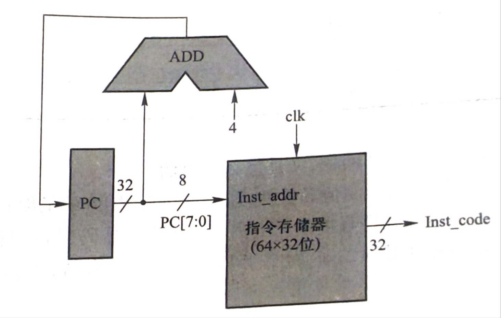
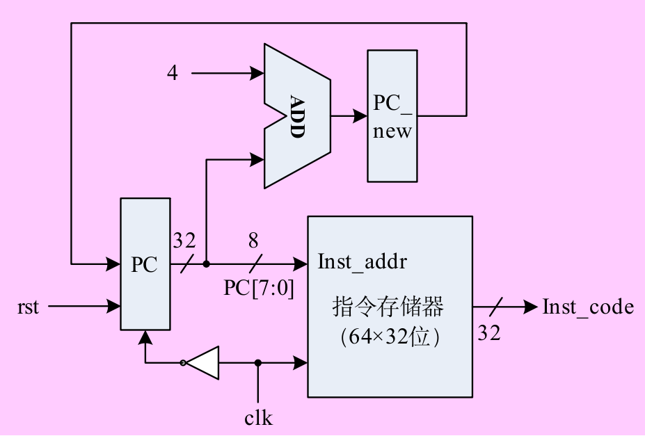
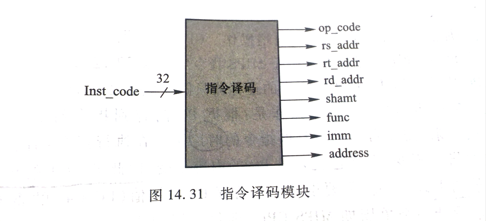
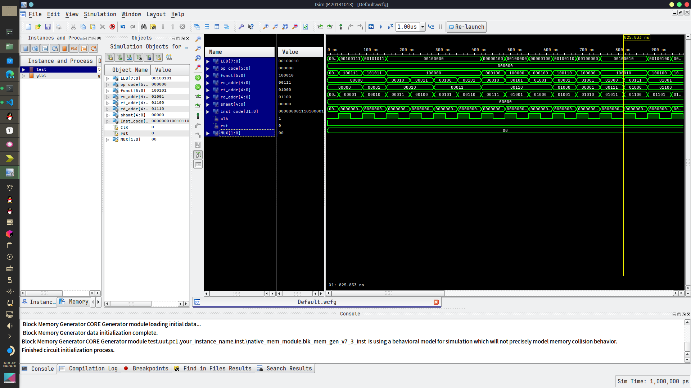

# 计算机组成原理 第七次实验

## 目录

[[toc]]

## 1. 实验目的

- 学习指令存储器的设计；
- 掌握 `CPU` 取指令操作与指令译码的方法和过程；

## 2、实验内容与原理

1. 设计一个指令存储器，只读，物理大小 `64×32` 位；
2. 设计 `PC` 及其自增电路；
   1. `MIPS` 地址 `32` 位，按字节编址；指令存储器：`256×8` 位
   2. `PC` 是 `32` 位，但是指令存储器地址只需 `8` 位；
      

最终目标：设计一个 `单周期MIPS CPU`
在指令周期（即时钟周期）`clk` 上跳沿，执行取指令操作，在 `clk` 下跳沿更新 `PC` 值。
复位信号 `rst：=1` 时，`PC` 清零，即指定 `MIPS CPU` 从 0 号主存开始执行程序。

生成只读的指令存储器时，使用 `Memory IP` 核，同实验五，但是选择 `single port ROM`；

### 2.2、原理（摘抄自实验书课本）

#### 2.2.1、指令存储器与取指令

冯·诺依曼体系结构的计算机将程序指令和数据存储在同一个存储器中，指令和数据的宽度相同，指令计数器和数据地址指针指向同一个存储器的不同物理位置，这种结构又称为普林斯顿结构。采用普林斯顿结构的处理器有英特尔公司的微处理器、ARN 公司的 ARM7、MIPS 公司的 MIPS 处理器等。这种指令和数据共享同一总线的结构使得信息流的传输成为限制计算机性能的瓶颈，影响了数据处理速度的提高。
哈佛结构则是一种将程序的指令和数据别存修在独立的存储器中的体系结构，即程序存储器和数据存储器是两个独立的存储器，每个存储器独立编址、独立访问。显然，哈佛结构的 CPU 可以同时读取指令和数据，大大提高了数据吞吐率，缺点是结构复杂。采用哈佛结构的处理器有 Microchip 公司的 PIC 系列芯片、摩托罗拉公司的 MC68 系列、Zilog 公司的 Z8 系列、AT、MEL 公司的 AVR 系列和 ARM 公司的 ARM9、ARM1O 和 ARMII 等。
由上可知，MIPS 公司生产的 MIPS 处理器也采用指令和数据共用同一存储器的存储器结构，但本次实验采用哈佛结构设计存储器模块，为实现 MIPS 指令子集和 RISC 处理器做准备。因此，需要设计一个只读存储器作为指令存储器，用来单独存储程序。
实验设计的取指令模块结构和数据通路如图所示。

图中包含 3 个部分：

1. 指令存储器：它是只读存储器，只提供读权限，数据通路不会改写指令。而且在任意时刻，指令存储器都根据指令地址来读取其中的指令代码，因此不需要读控制信号。MIPS 指令的长度固定为 32 位，因此指令存储器的宽度应设计为 32 位。为简单起见，指令存储器设计了 64 个单元，将 PC 的低 8 位作为指令存储器的地址。另外，按照常规，读出的指令代码应该存入指令寄存器 IR 中，以保证当前指令代码在执行指令期间保持不变。但是，由于此指令存储器是只读存储器，只要指令地址在指令执行期间保持不变，则从指令存储器取出的指令代码就会维持不变，因此取消了指令寄存器的设置，简化了数据通路。指令存储器可采用 Memory IP 核来实现，具体方法参见实验五。
2. 程序计数器 PC：它是 CPU 中重要的一个专用寄存器，存放 32 位的指令地址，提供给指令存储器来执行取指令操作。由于指令存储器只有 64 个 32 位单元，因此，PC 的 32 位指令地址的高 24 位可直接在设计中清零。
3. PC 自增加法器：用于完成 PC 的自增操作。CPU 每次根据 PC 从指令存储器取出一条指令后，就应该将 PC 指向下一条指令。由于 MIPS 指令字定长 32 位，又是按字节编址的，因此，每次取指令后，PC 应该自增 4。图 14.29 中的运算器只能完成加法运算。

综上所述，在本实验中，取指令操作是：根掘 PC 内容到指令存储器中取出指令，然后 PC+4→PC。接下来，需要考虑的就是取指令的时序了。在执行指令期间，因为要保持从指令存储器中取出的指令不变，那么也就要求 PC 的内容不变，因此 PC+4 的值必须在下一个指令周期开始时赋值给 PC。为此，需要设计一个暂存 PC 自增值（PC+4）的寄存器 PC_new。本实验的最终目标是设计一个单周期 MIPS CPU（即每个周期执行一条指令），因此可以在指令周期（即时钟周期）clk 上升沿执行取指令操作，在 clk 下降沿更新 PC 值。数据通路如图所示。图中添加了复位信号 rst,当 rst=1 时，PC 清零，即指定 MIPS CPU 从 0 号内存开始执行程序。


#### 2.2.2、指令译码

从指令存储器取出 32 位指令码 Inst_code 后，首先可以按照指令格式划分各字段，按照需要，或者直接传递到其他部件，或者保存在临时变量中，以便执行时使用。例如，对于 R 型或 I 型指令来说，寄存器地址字段可以直接传递给寄存器；而对于 I 型指令来说，16 位的立即数或者偏移量则要送至符号扩展部件；对于 J 型指令来说，26 位转移地址则需要送至拼接部件产生 32 位转移地址。对于所有指令，都需要把操作码 OP 字段析出，以方便后续的译码与执行操作。
在本实验中，指令译码可以简单地将所有指令类型中的各字段逐一提取出来，为构造整机实现指令时做连接准备。而具体的指令格式分析、数据通路构造则需要在指令实现的实验中完成。如图所示是指令译码模块的示意图。



## 3、实验要求

1. 在 `ISE` 中使用 `Memory IP` 核生成一个 `Inst_ROM`，当做指令存储器，并关联一个实验六所生成的 `\*.coe` 文件。
2. 编程实现取指令模块，调用 `Inst_ROM` 指令存储器模块。
3. 编写一个实验验证的顶层模块，可按照以下方法设计实验，也可以自行设计验证实验。

   1. 一个按钮提供 rst；1 个按钮提供 clk。
   2. 2 位开关作为指令码显示的选择控制：用于选择读出的 32 位指令码的某个字节到 8 位 LED 灯显示。
   3. 8 位 LED 灯作为读出指令码的字节显示。

4. 撰写实验报告。

## 副录：实验七信号配置表

<table>
  <tr>
    <td> </td>
    <td>信号</td>
    <td>配置设备管脚</td>
    <td>功能说明</td>
  </tr>
  <tr>
    <td rowspan="3">输入信号</td>
    <td>rst</td>
    <td>1个按钮</td>
    <td>=1，清零PC；</td>
  </tr>
  <tr>
    <td>clk</td>
    <td>1个按钮</td>
    <td>时钟引脚，上跳沿取指令</td>
  </tr>
  <tr>
    <td>选择信号</td>
    <td>2个逻辑开关</td>
    <td>选择显示的指令字节；</td>
  </tr>
  <tr>
    <td>输出信号</td>
    <td>LED[7:0]</td>
    <td>8个LED</td>
    <td>显示读出指令的某个字节</td>
  </tr>
</table>

## 4、实验步骤

在 `Xilinx ISE` 中创建工程，编源码，然后编译、综合
编写激励代码，观察仿真波形，直至验证正确



## 5、思考与探索：

| PC 地址    | 读出数字代码 | 关联文件中指令代码 |
| ---------- | ------------ | ------------------ |
| 0000 0000h | 00000827     | 00000827           |
| 0000 0004h | 0001102b     | 0001102b           |
| 0000 0008h | 00421820     | 00421820           |
| 0000 000Ch | 00622020     | 00622020           |
| 0000 0010h | 00832820     | 00832820           |
| 0000 0014h | 00a33020     | 00a33020           |
| 0000 0018h | 00463804     | 00463804           |
| 0000 001Ch | 00a64820     | 00a64820           |
| 0000 0020h | 01264004     | 01264004           |
| 0000 0024h | 00284826     | 00284826           |
| 0000 0028h | 01215020     | 01215020           |
| 0000 002Ch | 01075822     | 01075822           |
| 0000 0030h | 00e86022     | 00e86022           |
| 0000 0034h | 012c6824     | 012c6824           |
| 0000 0038h | 012c7025     | 012c7025           |
| 0000 003Ch | 无           | 00c77825           |

1. 读取指令存储器的前 16 条指令代码记录到表 6.15 中，分析取出的指令代码是否和指令存储器关联文件中的指令码一致？如果不一致，请分析原因。
   1. 答： 不一致，时间线不够
2. 说说你在实验中碰到了哪些问题，你是如何解决的？
   1. 遇到了问题是会综合会报错，但是其实不用管也能正常运行

## 6、解决方法

### 6.1、设计指令存储器

1. 指令存储器是只读的，物理大小为 64×32 位。
2. 可以使用 Memory IP 核来生成这个存储器。
3. 在 Memory IP 核的设置中，选择 single port ROM，然后设置其大小为 64×32 位。

```verilog
/*******************************************************************************
*     This file is owned and controlled by Xilinx and must be used solely      *
*     for design, simulation, implementation and creation of design files      *
*     limited to Xilinx devices or technologies. Use with non-Xilinx           *
*     devices or technologies is expressly prohibited and immediately          *
*     terminates your license.                                                 *
*                                                                              *
*     XILINX IS PROVIDING THIS DESIGN, CODE, OR INFORMATION "AS IS" SOLELY     *
*     FOR USE IN DEVELOPING PROGRAMS AND SOLUTIONS FOR XILINX DEVICES.  BY     *
*     PROVIDING THIS DESIGN, CODE, OR INFORMATION AS ONE POSSIBLE              *
*     IMPLEMENTATION OF THIS FEATURE, APPLICATION OR STANDARD, XILINX IS       *
*     MAKING NO REPRESENTATION THAT THIS IMPLEMENTATION IS FREE FROM ANY       *
*     CLAIMS OF INFRINGEMENT, AND YOU ARE RESPONSIBLE FOR OBTAINING ANY        *
*     RIGHTS YOU MAY REQUIRE FOR YOUR IMPLEMENTATION.  XILINX EXPRESSLY        *
*     DISCLAIMS ANY WARRANTY WHATSOEVER WITH RESPECT TO THE ADEQUACY OF THE    *
*     IMPLEMENTATION, INCLUDING BUT NOT LIMITED TO ANY WARRANTIES OR           *
*     REPRESENTATIONS THAT THIS IMPLEMENTATION IS FREE FROM CLAIMS OF          *
*     INFRINGEMENT, IMPLIED WARRANTIES OF MERCHANTABILITY AND FITNESS FOR A    *
*     PARTICULAR PURPOSE.                                                      *
*                                                                              *
*     Xilinx products are not intended for use in life support appliances,     *
*     devices, or systems.  Use in such applications are expressly             *
*     prohibited.                                                              *
*                                                                              *
*     (c) Copyright 1995-2020 Xilinx, Inc.                                     *
*     All rights reserved.                                                     *
*******************************************************************************/
// You must compile the wrapper file Inst_Rom.v when simulating
// the core, Inst_Rom. When compiling the wrapper file, be sure to
// reference the XilinxCoreLib Verilog simulation library. For detailed
// instructions, please refer to the "CORE Generator Help".

// The synthesis directives "translate_off/translate_on" specified below are
// supported by Xilinx, Mentor Graphics and Synplicity synthesis
// tools. Ensure they are correct for your synthesis tool(s).

`timescale 1ns/1ps

module Inst_Rom(
  clka,
  addra,
  douta
);

input clka;
input [5 : 0] addra;
output [31 : 0] douta;

// synthesis translate_off

  BLK_MEM_GEN_V7_3 #(
    .C_ADDRA_WIDTH(6),
    .C_ADDRB_WIDTH(6),
    .C_ALGORITHM(1),
    .C_AXI_ID_WIDTH(4),
    .C_AXI_SLAVE_TYPE(0),
    .C_AXI_TYPE(1),
    .C_BYTE_SIZE(9),
    .C_COMMON_CLK(0),
    .C_DEFAULT_DATA("0"),
    .C_DISABLE_WARN_BHV_COLL(0),
    .C_DISABLE_WARN_BHV_RANGE(0),
    .C_ENABLE_32BIT_ADDRESS(0),
    .C_FAMILY("spartan6"),
    .C_HAS_AXI_ID(0),
    .C_HAS_ENA(0),
    .C_HAS_ENB(0),
    .C_HAS_INJECTERR(0),
    .C_HAS_MEM_OUTPUT_REGS_A(0),
    .C_HAS_MEM_OUTPUT_REGS_B(0),
    .C_HAS_MUX_OUTPUT_REGS_A(0),
    .C_HAS_MUX_OUTPUT_REGS_B(0),
    .C_HAS_REGCEA(0),
    .C_HAS_REGCEB(0),
    .C_HAS_RSTA(0),
    .C_HAS_RSTB(0),
    .C_HAS_SOFTECC_INPUT_REGS_A(0),
    .C_HAS_SOFTECC_OUTPUT_REGS_B(0),
    .C_INIT_FILE("BlankString"),
    .C_INIT_FILE_NAME("Inst_Rom.mif"),
    .C_INITA_VAL("0"),
    .C_INITB_VAL("0"),
    .C_INTERFACE_TYPE(0),
    .C_LOAD_INIT_FILE(1),
    .C_MEM_TYPE(3),
    .C_MUX_PIPELINE_STAGES(0),
    .C_PRIM_TYPE(1),
    .C_READ_DEPTH_A(64),
    .C_READ_DEPTH_B(64),
    .C_READ_WIDTH_A(32),
    .C_READ_WIDTH_B(32),
    .C_RST_PRIORITY_A("CE"),
    .C_RST_PRIORITY_B("CE"),
    .C_RST_TYPE("SYNC"),
    .C_RSTRAM_A(0),
    .C_RSTRAM_B(0),
    .C_SIM_COLLISION_CHECK("ALL"),
    .C_USE_BRAM_BLOCK(0),
    .C_USE_BYTE_WEA(0),
    .C_USE_BYTE_WEB(0),
    .C_USE_DEFAULT_DATA(0),
    .C_USE_ECC(0),
    .C_USE_SOFTECC(0),
    .C_WEA_WIDTH(1),
    .C_WEB_WIDTH(1),
    .C_WRITE_DEPTH_A(64),
    .C_WRITE_DEPTH_B(64),
    .C_WRITE_MODE_A("WRITE_FIRST"),
    .C_WRITE_MODE_B("WRITE_FIRST"),
    .C_WRITE_WIDTH_A(32),
    .C_WRITE_WIDTH_B(32),
    .C_XDEVICEFAMILY("spartan6")
  )
  inst (
    .CLKA(clka),
    .ADDRA(addra),
    .DOUTA(douta),
    .RSTA(),
    .ENA(),
    .REGCEA(),
    .WEA(),
    .DINA(),
    .CLKB(),
    .RSTB(),
    .ENB(),
    .REGCEB(),
    .WEB(),
    .ADDRB(),
    .DINB(),
    .DOUTB(),
    .INJECTSBITERR(),
    .INJECTDBITERR(),
    .SBITERR(),
    .DBITERR(),
    .RDADDRECC(),
    .S_ACLK(),
    .S_ARESETN(),
    .S_AXI_AWID(),
    .S_AXI_AWADDR(),
    .S_AXI_AWLEN(),
    .S_AXI_AWSIZE(),
    .S_AXI_AWBURST(),
    .S_AXI_AWVALID(),
    .S_AXI_AWREADY(),
    .S_AXI_WDATA(),
    .S_AXI_WSTRB(),
    .S_AXI_WLAST(),
    .S_AXI_WVALID(),
    .S_AXI_WREADY(),
    .S_AXI_BID(),
    .S_AXI_BRESP(),
    .S_AXI_BVALID(),
    .S_AXI_BREADY(),
    .S_AXI_ARID(),
    .S_AXI_ARADDR(),
    .S_AXI_ARLEN(),
    .S_AXI_ARSIZE(),
    .S_AXI_ARBURST(),
    .S_AXI_ARVALID(),
    .S_AXI_ARREADY(),
    .S_AXI_RID(),
    .S_AXI_RDATA(),
    .S_AXI_RRESP(),
    .S_AXI_RLAST(),
    .S_AXI_RVALID(),
    .S_AXI_RREADY(),
    .S_AXI_INJECTSBITERR(),
    .S_AXI_INJECTDBITERR(),
    .S_AXI_SBITERR(),
    .S_AXI_DBITERR(),
    .S_AXI_RDADDRECC()
  );

// synthesis translate_on

endmodule
```

### 6.2、设计 PC 及其自增电路

虽然 PC（程序计数器）是 32 位的，但是由于指令存储器只有 64 个 32 位单元，所以实际上只需要 8 位就足够表示所有的指令存储器地址。
这就是为什么可以设计一个自增电路，每次时钟周期 clk 上跳沿时，只增加 PC 的低 8 位，而高 24 位保持不变（或者清零）。这样，PC 的值就可以在 0 到 63 之间循环，对应指令存储器的所有地址。
可以设计一个 32 位的寄存器作为 PC，然后设计一个自增电路，每次时钟周期 clk 上跳沿时，PC 的值增加 1。

```verilog
module PC(clk,rst,Inst_code);  // 定义一个名为PC的模块，有三个端口：clk, rst, Inst_code
input clk,rst;  // 定义两个输入端口：clk（时钟信号）和rst（复位信号）
wire [31:0]PC_new;  // 定义一个32位宽的线网PC_new，用于存储新的PC值
reg[31:0]PC;  // 定义一个32位宽的寄存器PC，用于存储当前的PC值
initial
    PC = 32'h0000_0000;  // 设置PC的初始值为0
output [31:0]Inst_code;  // 定义一个32位宽的输出端口Inst_code，用于输出指令代码
assign PC_new = PC +4;  // 每个时钟周期，PC的值增加4，新的值存储在PC_new中
Inst_Rom your_instance_name (  // 实例化一个名为your_instance_name的Inst_Rom模块
  .clka(clk), // 输入端口clka连接到clk
  .addra(PC[7:2]), // 输入端口addra连接到PC的[7:2]位
  .douta(Inst_code) // 输出端口douta连接到Inst_code
);
always@(negedge clk or posedge rst)  // 定义一个始终块，该块在clk的下降沿或rst的上升沿触发
    begin
        if(rst)  // 如果rst为1
            begin PC <= 32'h0000_0000; end  // PC被清零
        else  // 否则
            begin PC <=PC_new; end  // PC的值被更新为PC_new
    end
endmodule  // 结束模块定义
```

这段 Verilog 代码定义了一个名为 PC 的模块，该模块实现了一个程序计数器（PC）及其自增电路。以下是代码的详细解释：

1. `input clk,rst;`：定义了两个输入信号，`clk`是时钟信号，`rst`是复位信号。

2. `wire [31:0]PC_new;`：定义了一个 32 位宽的线网`PC_new`，用于存储新的 PC 值。

3. `reg[31:0]PC;`：定义了一个 32 位宽的寄存器`PC`，用于存储当前的 PC 值。

4. `initial PC = 32'h0000_0000;`：设置 PC 的初始值为 0。

5. `output [31:0]Inst_code;`：定义了一个 32 位宽的输出信号`Inst_code`，用于输出指令代码。

6. `assign PC_new = PC +4;`：每个时钟周期，PC 的值增加 4，新的值存储在`PC_new`中。

7. `Inst_Rom your_instance_name (.clka(clk), .addra(PC[7:2]), .douta(Inst_code));`：实例化了一个名为`your_instance_name`的`Inst_Rom`模块。`Inst_Rom`模块的输入信号`clka`连接到`clk`，输入信号`addra`连接到 PC 的[7:2]位，输出信号`douta`连接到`Inst_code`。

8. `always@(negedge clk or posedge rst)`：定义了一个始终块，该块在`clk`的下降沿或`rst`的上升沿触发。

9. `if(rst) begin PC <= 32'h0000_0000; end else begin PC <=PC_new; end`：如果`rst`为 1，那么 PC 被清零；否则，PC 的值被更新为`PC_new`。

这个模块实现了一个基本的取指令操作：每个时钟周期，PC 的值增加 4，然后从 ROM 中读取新的指令。注意，由于 PC 的值每次增加 4，所以实际上这个模块实现的是字地址的自增，而不是字节地址的自增。这是因为在 MIPS 架构中，每个指令都是 32 位的，占用 4 个字节，所以指令地址是按字（4 字节）而不是按字节进行寻址的。

### 6.3、设计取指令模块（同时也是顶层模块）

```verilog
module Fetch_Inst_Code(clk,rst,LED,MUX,op_code,funct,rs_addr,rt_addr,rd_addr,shamt,Inst_code);  // 定义一个名为Fetch_Inst_Code的模块，有11个端口
input clk,rst;  // 定义两个输入端口：clk（时钟信号）和rst（复位信号）
input [1:0]MUX;  // 定义一个2位宽的输入端口MUX
output [31:0]Inst_code;  // 定义一个32位宽的输出端口Inst_code，用于输出指令代码
output reg[7:0]LED;  // 定义一个8位宽的输出寄存器LED
reg [31:0]PC;  // 定义一个32位宽的寄存器PC，用于存储当前的PC值
wire [31:0]PC_new;  // 定义一个32位宽的线网PC_new，用于存储新的PC值
output [5:0]op_code,funct;  // 定义两个6位宽的输出端口：op_code（操作码）和funct（功能码）
output [4:0]rs_addr,rt_addr,rd_addr,shamt;  // 定义四个5位宽的输出端口：rs_addr（源寄存器地址）、rt_addr（目标寄存器地址）、rd_addr（目的寄存器地址）和shamt（位移量）
PC pc1(clk,rst,Inst_code);  // 实例化一个名为pc1的PC模块
always@(*)  // 定义一个组合逻辑块，该块在MUX的值改变时触发
    begin
        case(MUX)  // 根据MUX的值选择LED的值
            2'b00:LED = Inst_code[7:0];  // 如果MUX为00，LED的值为Inst_code的低8位
            2'b01:LED = Inst_code[15:8];  // 如果MUX为01，LED的值为Inst_code的[15:8]位
            2'b10:LED = Inst_code[23:16];  // 如果MUX为10，LED的值为Inst_code的[23:16]位
            2'b11:LED = Inst_code[31:25];  // 如果MUX为11，LED的值为Inst_code的高7位
        endcase
    end
assign op_code = Inst_code[31:26];  // op_code的值为Inst_code的高6位
assign rs_addr = Inst_code[25:21];  // rs_addr的值为Inst_code的[25:21]位
assign rt_addr = Inst_code[20:16];  // rt_addr的值为Inst_code的[20:16]位
assign rd_addr = Inst_code[15:11];  // rd_addr的值为Inst_code的[15:11]位
assign shamt = Inst_code[10:6];  // shamt的值为Inst_code的[10:6]位
assign funct = Inst_code[5:0];  // funct的值为Inst_code的低6位
endmodule  // 结束模块定义
```

### 6.4、测试用例

```verilog
module test;

	// Inputs
	reg clk;
	reg rst;
	reg [1:0] MUX;

	// Outputs
	wire [7:0] LED;
	wire [5:0] op_code;
	wire [5:0] funct;
	wire [4:0] rs_addr;
	wire [4:0] rt_addr;
	wire [4:0] rd_addr;
	wire [4:0] shamt;
	wire [31:0] Inst_code;

	// Instantiate the Unit Under Test (UUT)
	Fetch_Inst_Code uut (
		.clk(clk),
		.rst(rst),
		.LED(LED),
		.MUX(MUX),
		.op_code(op_code),
		.funct(funct),
		.rs_addr(rs_addr),
		.rt_addr(rt_addr),
		.rd_addr(rd_addr),
		.shamt(shamt),
		.Inst_code(Inst_code)
	);
	always #33 clk = ~clk;
	initial begin
		// Initialize Inputs
		clk = 0;
		rst = 1;
		MUX = 0;

		// Wait 100 ns for global reset to finish
		#2;
      rst = 0;
		// Add stimulus here

	end

endmodule
```
