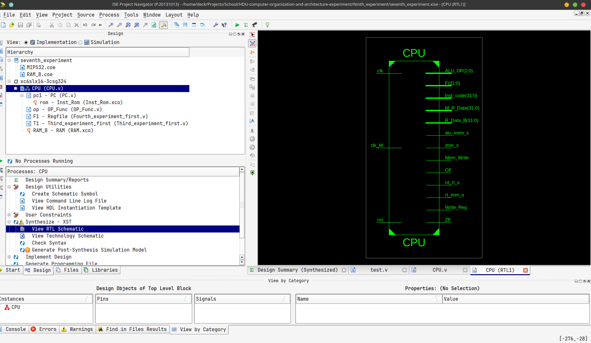

# 实验九

## 1、实验目的 
- 掌握MIPS R型和I型指令的综合数据通路设计
- 掌握数据流的多路选通控制方法
- 掌握取数指令lw和存数指令sw指令的寻址方式及其有效地址产生方法
- 实现MIPS的部分 I型和R型指令的功能

## 2、实验内容与原理

- 实验八的基础上，再行实现MIPS的6条I型指令：

  - 4条立即数寻址的运算和传送指令
  - 2条相对寄存器寻址的存数和取数指令。
  - 与原理课相比，多了4条立即数运算指令。

- MIPS指令opcode和funct为什么要分开
  - 因为只有R类指令需要funct，其他的比如I和J类指令都不需要funct


### （1）MIPS的I型立即数寻址指令及数据通路


#### I型与R型指令有明显不同

- 没有rd寄存器，使用rt作为目的寄存器；
- 源操作数有一个为立即数，位于指令的低16位。

#### 解决目的寄存器的可选性

- 设置一个二选一数据选择器，控制信号为rd_rt_s：
  - 当rd_rt_s=0，将指令的rd字段送写地址W_Addr；
  - 当rd_rt_s=1，将指令的rt字段送写地址W_Addr。

**Verilog语句如下：**

```verilog
 assign W_Addr = (rd_rt_s) ? rt : rd;
```


#### 扩展16位的立即数imm

- 设置一位imm_s来控制这两种扩展：
  - imm_s=1，符号扩展；
  - imm_s=0，则0扩展。

**Verilog语句如下：**

```verilog
assign imm_data=(imm_s) ?{16{imm[15]},imm} :{16{1’b0},imm};
```

#### ALU的输入数据B端的数据选择

- 设置二选一数据选择器（控制信号为rt_imm_s）
  - 当rt_imm_s=0，将寄存器堆的B端口读出数据R_Data_B送ALU的B端
  - 当rt_imm_s=1，将扩展好的立即数imm_data送ALU的B输入端

**Verilog语句如下:**

```verilog
assign ALU_B = (rt_imm_s) ? imm_data :R_Data_B;
```


#### 改造的数据通路


### （2）I型取数/存数指令及其数据通路

#### MIPS I型存储器访问指令格式及编码


#### 改进数据通路，实现两条访存指令

##### 添加一个数据存储器RAM，存放指令访问的数据

必须添加吗？

##### 有效地址EA的计算

ALU来实现，置rt_imm_s=1，imm_s=1。

为何是带符号扩展？

##### 将ALU的输出直接送存储器地址端口

**Verilog描述：**

```verilog
assign Mem_Addr = ALU_F
```


##### 存储器读出的数据

- alu_mem_s=0，则将ALU的输出送寄存器堆的写数据端口
- alu_mem_s=1，则将存储器的读出数据送寄存器堆的写数据端口。

**Verilog描述如下:**

```verilog
assign W_Data=alu_mem_s ?M_R_Data :ALU_F;
```


##### 存储器的写入数据

将寄存器堆的B端口数据直接送至存储器的写数据端口

**Verilog描述如下:**

```verilog
assign M_W_Data = R_Data_B;
```

**实验八（R型指令的CPU)：**

实验八的长这样


**实验九（R-I型指令的CPU)：**

#### 新的完整的R-I型指令数据通路


- 可以看出实验九相对于实验八：没有rd寄存器，使用rt作为目的寄存器；
  - 因此为了解决寄存器的可选性，设置一个二选一数据选择器，控制信号为rd_rt_s：

#### R-I型指令的控制流


### （3）I型指令的时序

- 立即数寻址的I型指令，执行的时序同R型指令：
  - **在clk的上跳沿**，指令存储器执行读操作
  - **在clk正脉冲内**，读出的指令经过译码、执行运算
  - **在clk的下跳沿**，将运算结果打入目的寄存器rd或者rt
- 对于取数/存数指令，对数据存储器的读和写访问都要与clk脉冲同步。

### （4）指令测试

#### 测试代码

```assembly
#baseAddr 0000
xori	$1,	$0,	0x1234;		#$1=0000_1234
addi	$2,	$0,	0x6789;		#$2=0000_6789
addi 	$3,	$0,	-0x7000;	         #$3=FFFF_9000
xori	$4,	$0,	0x0010;		#$4=0000_0010
sllv	$5,	$2,	$4;			#$5=6789_0000
or	$6,	$1,	$5;			#$6=6789_1234
sllv	$7,	$3,	$4;			#$7=9000_0000
add	$8,	$2,	$6;		        #$8=6789_79BD
sub	$9,	$2,	$1;			#$9=0000_5555
sub	$10,	$1,	$2;		       #$10=FFFF_AAAB
addi	$11,	$3,	0x7FFF;	       #$11=0000_0FFF
addi	$12,	$3,	-0x8000;	       #$12=FFFF_1000
andi	$13,	$10,	0xFFFF;	      #$13=0000_AAAB
sltiu	$14,	$2,	0x6788;	      #$14=0000_0000
sltiu	$15,	$2,	0x678A;	      #$15=0000_0001
sw	$11,	0($4);	#mem(0000_0010)=0000_0FFF
sw	$12,	20($0);	#mem(0000_0014)=FFFF_1000
sw	$13,	16($4);	#mem(0000_0020)=0000_AAAB
sw	$14,	20($4);	#mem(0000_0024)=0000_0000
lw	$16,	16($0);  #$16=mem(0000_0010)=0000_0FFF
lw	$17,	4($4);    #$17=mem(0000_0014)=FFFF_1000
or	$18,	$16,	$17;	#$18=FFFF_1FFF
lw	$19,	16($4); #$19=mem(0000_0020)=0000_AAAB
lw	$20,	20($4);#$20=mem(0000_0024)=0000_0000
nor	$21,	$19,	$20;	#$21=FFFF_5554
lw	$22,	-0x10($4); #$22=mem(0000_0000)，譬如8888_8888
lw	$23,	-0x0C($4); #$23=mem(0000_0004)，譬如9999_9999
sltu	$24,	$22,	$23 #$24=?  ，譬如=0000_0001       
                                        
```


#### 汇编后机器码

```bash
38011234,20026789,20039000,38040010,00822804,00253025,00833804,00464020,00414822,00225022,206b7fff,206c8000,314dffff,2c4e6788,2c4f678a,ac8b0000,ac0c0014,ac8d0010,ac8e0014,8c100010,8c910004,02119025,8c930010,8c940014,0274a827,8c96fff0,8c97fff4,02d7c02b
```


- 将上述机器指令码填入到和指令存储器模块ROM_B相关联的*.coe文件中，也可以调用*.coe的生成软件来完成。

- 在和数据存储器模块RAM_B相关联的*.coe文件中，可以随意填入一些数据

### 顶层测试模块


## 3.实验要求

1. 在实验八的基础上，编写一个CPU模块
   1. 实现实验八的8条R型指令
   2. 实现新的6条I型指令
2. 编写一个实验验证的顶层模块
3. 撰写实验报告。

### 信号表


## 4、实验步骤 

- 在Xilinx ISE中创建工程，编源码，然后编译、综合
- 编写激励代码，观察仿真波形，直至验证正确

## 5、实验代码

### （1）顶层模块

```verilog
`timescale 1ns / 1ps
module CPU(clk,rst,OF,ZF,F,ALU_OP,M_R_Data,rd_rt_s,imm_s,rt_imm_s,Mem_Write,alu_mem_s,Write_Reg,clk_M,R_Data_B,Inst_code);
// 定义CPU模块，包含输入输出端口

input clk,rst,clk_M;
// 输入信号：时钟，复位，存储器时钟

wire [31:0]Inst_code;
// 32位指令代码

wire [5:0]op_code,funct;
// 操作码和功能码

wire [4:0]rs_addr,rt_addr,rd_addr,shamt;
// 源寄存器地址，目标寄存器地址，目的寄存器地址，移位量

output [31:0]F;
// ALU的输出

output OF,ZF;
// 溢出标志，零标志

output [31:0]M_R_Data;
// 存储器读取的数据

output [2:0]ALU_OP;
// ALU操作码

wire [31:0]Mem_Addr;
// 存储器地址

wire [4:0]W_Addr;
// 写入地址

output rd_rt_s,imm_s,rt_imm_s,Mem_Write,alu_mem_s,Write_Reg;
// 控制信号

output [31:0]Inst_code;
// 指令代码

wire [31:0]imm_data;
// 立即数数据

wire [31:0]R_Data_A;
// 寄存器A的数据

output [31:0] R_Data_B;
// 寄存器B的数据

wire [15:0]imm;
// 16位立即数

wire [31:0]ALU_B;
// ALU的输入B

wire [31:0]W_Data;
// 写入数据

PC pc1(clk,rst,Inst_code);
// 程序计数器模块

assign op_code = Inst_code[31:26];
// 操作码赋值

assign rs_addr = Inst_code[25:21];
// 源寄存器地址赋值

assign rt_addr = Inst_code[20:16];
// 目标寄存器地址赋值

assign rd_addr = Inst_code[15:11];
// 目的寄存器地址赋值

assign shamt = Inst_code[10:6];
// 移位量赋值

assign funct = Inst_code[5:0];
// 功能码赋值

assign imm = Inst_code[15:0];
// 立即数赋值

OP_Func op(op_code,funct,Write_Reg,ALU_OP,rd_rt_s,imm_s,rt_imm_s,Mem_Write,alu_mem_s);
// 操作函数模块

assign W_Addr = (rd_rt_s)?rt_addr:rd_addr;
// 写入地址选择

assign imm_data = (imm_s)?{{16{imm[15]}},imm}:{{16{1'b0}},imm};
// 立即数数据选择

assign W_Data = alu_mem_s?M_R_Data:F;
// 写入数据选择

Regfile F1(rs_addr,rt_addr,Write_Reg,R_Data_A,R_Data_B,rst,~clk,W_Addr,W_Data);
// 寄存器文件模块

assign ALU_B = (rt_imm_s)?imm_data:R_Data_B;	
// ALU的输入B选择

MyALU T1(OF,ZF,ALU_OP,R_Data_A,ALU_B,F); 
// 第三次实验的第一部分模块

RAM RAM_B (
  .clka(clk_M), // 输入时钟
  .wea(Mem_Write), // 写使能
  .addra(F[5:0]), // 地址
  .dina(R_Data_B), // 写入数据
  .douta(M_R_Data) // 读出数据
);
// RAM模块

endmodule
// 结束模块定义
```


### （2.1）PC 及自增电路(实验七)


**PC及其自增电路：**

- MIPS地址32位，按字节编址；指令存储器：256×8位
- PC是32位，但是指令存储器地址只需8位
- 在指令周期（即时钟周期）clk上跳沿，执行取指令操作，在clk下跳沿更新PC值。
- 复位信号rst：=1时，PC清零，即指定MIPS CPU从0号主存开始执行程序。

```verilog
module PC(clk, rst, Inst_code);
    input clk, rst; // 输入信号：时钟（clk），复位（rst）
    reg [31:0] PC; // 程序计数器寄存器
    initial
        PC = 32'h0000_0000; // 初始化PC值为0

    output [31:0] Inst_code; // 输出信号：指令代码
    wire [31:0] PC_new; // 内部线网：新的PC值
    assign PC_new = PC + 4; // 计算新PC值（当前PC值加4）

    // 指令存储器ROM
    Inst_Rom rom(
        .clka(clk), // 输入：时钟
        .addra(PC[7:2]), // 输入：地址（取PC的部分位）
        .douta(Inst_code) // 输出：指令代码
    );

    // 时钟的下降沿或复位信号的上升沿触发
    always @(negedge clk or posedge rst)
    begin
        if (rst)
            PC <= 32'h0000_0000; // 复位时，将PC设置为0
        else
            PC <= PC_new; // 非复位时，更新PC为新值
    end
endmodule

```

```verilog
`timescale 1ns / 1ps
module OP_Func(op_code, funct, Write_Reg, ALU_OP, rd_rt_s, imm_s, rt_imm_s, Mem_Write, alu_mem_s);
    input [5:0] op_code; // 输入信号：操作码
    input [5:0] funct; // 输入信号：函数码
    output reg [2:0] ALU_OP; // 输出信号：ALU操作码
    output reg Write_Reg; // 输出信号：是否写回寄存器
    output reg rd_rt_s; // 输出信号：目标寄存器选择
    output reg imm_s; // 输出信号：立即数符号扩展
    output reg rt_imm_s; // 输出信号：ALU第二操作数选择
    output reg Mem_Write; // 输出信号：内存写使能
    output reg alu_mem_s; // 输出信号：写回数据选择

    // 逻辑块：根据操作码和函数码设置控制信号
    always @(*)
    begin   
        // 默认值设置
        Write_Reg = 1;
        ALU_OP = 0;
        rd_rt_s = 0;
        imm_s = 0;
        rt_imm_s = 0;
        Mem_Write = 0;
        alu_mem_s = 0;

        // R-type指令处理
        if (op_code == 0)
        begin 
            //这段代码是在实现MIPS指令集中的R类型指令的解码过程。
            //在MIPS指令集中，R类型指令的操作码（op_code）是0，而具体的操作类型（如ADD、SUB等）是由功能码（funct）来确定的。
            //当操作码（op_code）为0时，代码进入case语句，根据功能码（funct）的值来设置ALU的操作类型（ALU_OP）。
            //例如，当功能码（funct）为6'b100000时，设置ALU的操作类型（ALU_OP）为3'b100，对应的是ADD操作。
            //这样写的目的是为了实现MIPS指令集中的R类型指令的解码，根据不同的功能码（funct）来设置不同的ALU操作类型（ALU_OP）。
            case (funct)
                6'b100000: ALU_OP = 3'b100; // ADD  
                6'b100010: ALU_OP = 3'b101; // SUB
                6'b100100: ALU_OP = 3'b000; // AND
                6'b100101: ALU_OP = 3'b001; // OR
                6'b100110: ALU_OP = 3'b010; // XOR
                6'b100111: ALU_OP = 3'b011; // NOR
                6'b101011: ALU_OP = 3'b110; // SLTU 
                6'b000100: ALU_OP = 3'b111; // SLLV 
            endcase 
        end
        else // I-type 和 J-type 指令处理
        begin
            case (op_code)
                6'b001000: {rd_rt_s, imm_s, rt_imm_s, ALU_OP} = {1'b1, 1'b1, 1'b1, 3'b100}; // ADDI
                6'b001100: {rd_rt_s, rt_imm_s, ALU_OP} = {1'b1, 1'b1, 3'b000}; // ANDI
                6'b001110: {rd_rt_s, rt_imm_s, ALU_OP} = {1'b1, 1'b1, 3'b010}; // XORI
                6'b001011: {rd_rt_s, rt_imm_s, ALU_OP} = {1'b1, 1'b1, 3'b110}; // SLTIU
                6'b100011: {rd_rt_s, imm_s, rt_imm_s, alu_mem_s, ALU_OP} = {1'b1, 1'b1, 1'b1, 1'b1, 3'b100}; // LW
                6'b101011: {imm_s, rt_imm_s, ALU_OP, Write_Reg, Mem_Write} = {1'b1, 1'b1, 3'b100, 1'b0, 1'b1}; // SW
            endcase
        end
    end
endmodule

```


模块实现了 PC 及自增电路的功能。

功能实现方式：使用 ROM IP 核实现指令存储器，使用时钟下降沿触发 PC 自增。

### （2.2）指令存储器(实验七)

PS:这边直接ise生成就好了的说

实验七是要求：设计一个指令存储器，只读，物理大小`64×32`位；

这个是基于实验五的，看看实验五这边，其实差不多（生成只读的指令存储器时，使用Memory IP核，同实验五，但是选择single port ROM）

为MIPS处理器设计一个`256×8`位的物理存储器，具有读写功能，按**字节编址**，**按字访问**，即`64×32`位 

#### 存储器模块输入输出端口 


#### 字地址小端格式


#### 存储器功能表


#### 信号配置表


```verilog
//ROM_Instruction.v
/*******************************************************************************
*     This file is owned and controlled by Xilinx and must be used solely      *
*     for design, simulation, implementation and creation of design files      *
*     limited to Xilinx devices or technologies. Use with non-Xilinx           *
*     devices or technologies is expressly prohibited and immediately          *
*     terminates your license.                                                 *
*                                                                              *
*     XILINX IS PROVIDING THIS DESIGN, CODE, OR INFORMATION "AS IS" SOLELY     *
*     FOR USE IN DEVELOPING PROGRAMS AND SOLUTIONS FOR XILINX DEVICES.  BY     *
*     PROVIDING THIS DESIGN, CODE, OR INFORMATION AS ONE POSSIBLE              *
*     IMPLEMENTATION OF THIS FEATURE, APPLICATION OR STANDARD, XILINX IS       *
*     MAKING NO REPRESENTATION THAT THIS IMPLEMENTATION IS FREE FROM ANY       *
*     CLAIMS OF INFRINGEMENT, AND YOU ARE RESPONSIBLE FOR OBTAINING ANY        *
*     RIGHTS YOU MAY REQUIRE FOR YOUR IMPLEMENTATION.  XILINX EXPRESSLY        *
*     DISCLAIMS ANY WARRANTY WHATSOEVER WITH RESPECT TO THE ADEQUACY OF THE    *
*     IMPLEMENTATION, INCLUDING BUT NOT LIMITED TO ANY WARRANTIES OR           *
*     REPRESENTATIONS THAT THIS IMPLEMENTATION IS FREE FROM CLAIMS OF          *
*     INFRINGEMENT, IMPLIED WARRANTIES OF MERCHANTABILITY AND FITNESS FOR A    *
*     PARTICULAR PURPOSE.                                                      *
*                                                                              *
*     Xilinx products are not intended for use in life support appliances,     *
*     devices, or systems.  Use in such applications are expressly             *
*     prohibited.                                                              *
*                                                                              *
*     (c) Copyright 1995-2018 Xilinx, Inc.                                     *
*     All rights reserved.                                                     *
*******************************************************************************/
// You must compile the wrapper file Rom_Instraction.v when simulating
// the core, Rom_Instraction. When compiling the wrapper file, be sure to
// reference the XilinxCoreLib Verilog simulation library. For detailed
// instructions, please refer to the "CORE Generator Help".

// The synthesis directives "translate_off/translate_on" specified below are
// supported by Xilinx, Mentor Graphics and Synplicity synthesis
// tools. Ensure they are correct for your synthesis tool(s).

`timescale 1ns/1ps

module Rom_Instraction(
  clka,
  addra,
  douta
);

input clka;
input [5 : 0] addra;
output [31 : 0] douta;

// synthesis translate_off

  BLK_MEM_GEN_V7_3 #(
    .C_ADDRA_WIDTH(6),
    .C_ADDRB_WIDTH(6),
    .C_ALGORITHM(1),
    .C_AXI_ID_WIDTH(4),
    .C_AXI_SLAVE_TYPE(0),
    .C_AXI_TYPE(1),
    .C_BYTE_SIZE(9),
    .C_COMMON_CLK(0),
    .C_DEFAULT_DATA("0"),
    .C_DISABLE_WARN_BHV_COLL(0),
    .C_DISABLE_WARN_BHV_RANGE(0),
    .C_ENABLE_32BIT_ADDRESS(0),
    .C_FAMILY("artix7"),
    .C_HAS_AXI_ID(0),
    .C_HAS_ENA(0),
    .C_HAS_ENB(0),
    .C_HAS_INJECTERR(0),
    .C_HAS_MEM_OUTPUT_REGS_A(0),
    .C_HAS_MEM_OUTPUT_REGS_B(0),
    .C_HAS_MUX_OUTPUT_REGS_A(0),
    .C_HAS_MUX_OUTPUT_REGS_B(0),
    .C_HAS_REGCEA(0),
    .C_HAS_REGCEB(0),
    .C_HAS_RSTA(0),
    .C_HAS_RSTB(0),
    .C_HAS_SOFTECC_INPUT_REGS_A(0),
    .C_HAS_SOFTECC_OUTPUT_REGS_B(0),
    .C_INIT_FILE("BlankString"),
    .C_INIT_FILE_NAME("Rom_Instraction.mif"),
    .C_INITA_VAL("0"),
    .C_INITB_VAL("0"),
    .C_INTERFACE_TYPE(0),
    .C_LOAD_INIT_FILE(1),
    .C_MEM_TYPE(3),
    .C_MUX_PIPELINE_STAGES(0),
    .C_PRIM_TYPE(1),
    .C_READ_DEPTH_A(64),
    .C_READ_DEPTH_B(64),
    .C_READ_WIDTH_A(32),
    .C_READ_WIDTH_B(32),
    .C_RST_PRIORITY_A("CE"),
    .C_RST_PRIORITY_B("CE"),
    .C_RST_TYPE("SYNC"),
    .C_RSTRAM_A(0),
    .C_RSTRAM_B(0),
    .C_SIM_COLLISION_CHECK("ALL"),
    .C_USE_BRAM_BLOCK(0),
    .C_USE_BYTE_WEA(0),
    .C_USE_BYTE_WEB(0),
    .C_USE_DEFAULT_DATA(0),
    .C_USE_ECC(0),
    .C_USE_SOFTECC(0),
    .C_WEA_WIDTH(1),
    .C_WEB_WIDTH(1),
    .C_WRITE_DEPTH_A(64),
    .C_WRITE_DEPTH_B(64),
    .C_WRITE_MODE_A("WRITE_FIRST"),
    .C_WRITE_MODE_B("WRITE_FIRST"),
    .C_WRITE_WIDTH_A(32),
    .C_WRITE_WIDTH_B(32),
    .C_XDEVICEFAMILY("artix7")
  )
  inst (
    .CLKA(clka),
    .ADDRA(addra),
    .DOUTA(douta),
    .RSTA(),
    .ENA(),
    .REGCEA(),
    .WEA(),
    .DINA(),
    .CLKB(),
    .RSTB(),
    .ENB(),
    .REGCEB(),
    .WEB(),
    .ADDRB(),
    .DINB(),
    .DOUTB(),
    .INJECTSBITERR(),
    .INJECTDBITERR(),
    .SBITERR(),
    .DBITERR(),
    .RDADDRECC(),
    .S_ACLK(),
    .S_ARESETN(),
    .S_AXI_AWID(),
    .S_AXI_AWADDR(),
    .S_AXI_AWLEN(),
    .S_AXI_AWSIZE(),
    .S_AXI_AWBURST(),
    .S_AXI_AWVALID(),
    .S_AXI_AWREADY(),
    .S_AXI_WDATA(),
    .S_AXI_WSTRB(),
    .S_AXI_WLAST(),
    .S_AXI_WVALID(),
    .S_AXI_WREADY(),
    .S_AXI_BID(),
    .S_AXI_BRESP(),
    .S_AXI_BVALID(),
    .S_AXI_BREADY(),
    .S_AXI_ARID(),
    .S_AXI_ARADDR(),
    .S_AXI_ARLEN(),
    .S_AXI_ARSIZE(),
    .S_AXI_ARBURST(),
    .S_AXI_ARVALID(),
    .S_AXI_ARREADY(),
    .S_AXI_RID(),
    .S_AXI_RDATA(),
    .S_AXI_RRESP(),
    .S_AXI_RLAST(),
    .S_AXI_RVALID(),
    .S_AXI_RREADY(),
    .S_AXI_INJECTSBITERR(),
    .S_AXI_INJECTDBITERR(),
    .S_AXI_SBITERR(),
    .S_AXI_DBITERR(),
    .S_AXI_RDADDRECC()
  );

// synthesis translate_on

endmodule
```

本模块实现了指令存储器的功能。

功能实现方式：使用 IP 核生成指令存储器。

### （3）寄存器堆(实验四)

设计一个32×32位的寄存器堆（即含有32个寄存器，每个寄存器32位）

- 双端口读：2个读端口
- 单端口写：1个写端口

#### 输入输出端口示意图


- 读访问操作：无需时钟同步，只要给出寄存器地址，即可读出寄存器中的数据。
- 写访问操作：需要时钟同步，所有写入操作的输入信号必须在时钟边沿来临时，已经有效（Write_Reg=1、地址和数据） 。

#### 寄存器堆功能表


#### 寄存器堆逻辑结构图


#### 实现

- 寄存器堆：
  - reg类型信号的数组
  - reg [31:0] REG_Files[0:31];
- 读操作：
  - 组合逻辑电路
  - assign R_Data_A = REG_Files[R_Addr_A];
  - assign R_Data_B = REG_Files[R_Addr_B];
- 写操作：
  - 时序逻辑电路
  - 需要Reset信号：用于初始化寄存器（全部清零）
  - 需要clk信号：用于写入寄存器

#### 信号配置表


```verilog
`timescale 1ns / 1ps
// 寄存器堆模块
module MyALU(OF,ZF,ALU_OP,A,B,F);
// 定义ALU模块，包含输入输出端口

input [2:0]ALU_OP;
// 输入信号：ALU操作码

input [31:0]A,B;
// 输入信号：A，B操作数

output reg[31:0]F;
// 输出信号：ALU的结果

reg C32;
// 32位进位信号

output reg OF;
// 输出信号：溢出标志

output reg ZF;
// 输出信号：零标志

always @(ALU_OP or A or B)
// 当ALU操作码或A，B操作数改变时，执行以下操作
begin
    OF <= 0;
    // 默认溢出标志为0

    C32 <= 0;
    // 默认进位信号为0

    case(ALU_OP)
    // 根据ALU操作码执行不同的操作
             3'b000:F<=A&B;
             // 与操作

             3'b001:F<=A|B;
             // 或操作

             3'b010:F<=A^B;
             // 异或操作

             3'b011:F<=A~^B;
             // 等价操作

             3'b100:{C32,F}<=A+B;
             // 加法操作

             3'b101:{C32,F}<=A-B;
             // 减法操作

             3'b110:begin if(A<B)  F<=32'h0000_0001;else F<=32'h0000_0000;end
             // 小于操作

             3'b111:begin F<=B<<A;end
             // 左移操作
    endcase
    // 结束case语句

    if(F==32'h0000_0000)	
            ZF<=1;
    // 如果结果为0，零标志为1

    else
            ZF<=0;
    // 否则，零标志为0

    if((ALU_OP == 3'b100) || (ALU_OP == 3'b101))
        OF<=C32^F[31]^A[31]^B[31];	
    // 如果是加法或减法操作，计算溢出标志

    else
        OF <=0; 
    // 否则，溢出标志为0
    end 
// 结束always语句
endmodule
// 结束模块定义
```

本模块实现了寄存器堆的功能。

功能实现方式：使用数组实现寄存器堆，使用时钟上升沿触发写入，使用组合逻辑实现读取。

### （4）ALU(实验三)

8种运算功能由**多个部件并行实现**，运算结果则经过一个八选一多路数据选择器由3根控制线ALU_OP[2:0]选通输出。


从上到下是

1. and -> 0
2. or -> 1
3. xor -> 2
4. nor -> 3
5. 加减 -> 4/5
6. 比较 -> 6
7. 移位 -> 7


#### 信号配置表 


```verilog
`timescale 1ns / 1ps
// ALU 模块, 添加 ADC 运算.
module ALU(OP, A, B, F, ZF, CF, OF, SF, PF);
    parameter SIZE = 32;    // 运算位数
    input [3:0] OP;         // 运算符编码(剩余7个空位)
    input [SIZE:1] A;       // 左操作数 
    input [SIZE:1] B;       // 右操作数
    output reg [SIZE:1] F;  // 运算结果F
    output reg ZF, CF, OF, SF, PF; // 标志位
    reg C; // 最高位进位(减法时将自动取反)
    always @(*) begin
        case(OP) // 判断运算符并进行运算
            0: {C,F} <= A & B;        // 按位与
            1: {C,F} <= A | B;        // 按位或
            2: {C,F} <= A ^ B;        // 按位异或
            3: {C,F} <= ~(A | B);     // 按位或非
            4: {C,F} <= A + B;        // 加法
            5: {C,F} <= A - B;        // 减法
            6: {C,F} <= A < B;        // A<B 则结果为1, 否则为0
            7: {C,F} <= B << A;       // 将 B 左移 A 位
            8: {C,F} <= A + B + 1;    // 低位有进位加法(ADC)
            default: {C,F} <= 0;    // 未定义运算, 结果置零
        endcase
        ZF <= F==0; // 零标志, 结果为全零则置1, 否则置0
        CF <= C;    // 进借位标志取最高位进位(减法时需取反)(只对无符号数有意义)
        OF <= A[SIZE]^B[SIZE]^F[SIZE]^C; // 溢出标志由判溢公式计算(只对有符号数有意义)
        SF <= F[SIZE]; // 符号标志取结果最高位(补码符号位0正1负)(只对有符号数有意义)
        PF <= ~^F;     // 奇偶标志, 结果中1为偶数个则置1, 否则置0
    end
endmodule
```

本模块实现了 ALU 的功能。

功能实现方式：使用 case 语句实现不同的运算。

### （5）指令译码与控制单元

```verilog
`timescale 1ns / 1ps
// 指令译码及控制模块
module Control(OP, func, CF,
    Write_Reg,ALU_OP); // 控制信号
    input [5:0] OP, func; // Inst_code: OP func 字段
    input CF; // 进借位标志寄存器CF, 用于判断adc指令调用的实际运算
    output reg Write_Reg;// 输出控制信号
    output reg [3:0] ALU_OP; // ALU 运算符编码

    always @(*) begin
        if (OP === 6'b00_0000) begin// R型指令, 判断 func 字段
            Write_Reg <= (func !== 6'b00_1111); //则写入寄存器堆
            case(func)// 添加指令 adc(00_D)
                6'b10_0100: ALU_OP <= 4'b0000; // 0 and   按位与
                6'b10_0101: ALU_OP <= 4'b0001; // 1 or    按位或
                6'b10_0110: ALU_OP <= 4'b0010; // 2 xor   按位异或
                6'b10_0111: ALU_OP <= 4'b0011; // 3 nor   按位或非
                6'b10_0000: ALU_OP <= 4'b0100; // 4 add   加法运算(低位无进位 adc)
                6'b10_0010: ALU_OP <= 4'b0101; // 5 sub   减法运算
                6'b10_1011: ALU_OP <= 4'b0110; // 6 sltu  无符号A小于B则置位
                6'b00_0100: ALU_OP <= 4'b0111; // 7 sllv  将B左移A位
                default: ALU_OP <= 4'bXXXX; // R型非算术运算指令, ALU 结果置零
            endcase
        end
        else begin // 未定义指令
            Write_Reg <= 1'bX;
            ALU_OP <= 4'bXXXX;
        end
    end
endmodule
```

## 测试模块

```verilog
module CPU_Test();
    reg rst, clk, clk_ram;
    wire [31:0] PC, Inst_code,
        RF_A, RF_B, ALU_F, M_R_Data;
    wire [3:0] ALU_OP;
    wire [1:0] W_Data_Select;
    wire W_Addr_Select, Write_Reg, RF_B_OUT,
        imm_signed, ALU_B_Select, Write_Mem,
        ZF, CF, OF, SF, PF;

    CPU_R_I CPU_Instance1(rst, clk, clk_ram, // 输入控制信号
    PC, Inst_code, // 取指令和指令分段模块输出
    W_Addr_Select, W_Data_Select, Write_Reg, RF_B_OUT, // 寄存器堆控制信号
    RF_A, RF_B, // 寄存器堆读出数据
    ALU_F, ZF, CF, OF, SF, PF, // ALU运算结果,标志寄存器
    Write_Mem, M_R_Data, // 数据存储器写入信号，读出数据
    );

    always #50 clk = ~clk;
    always #25 clk_ram = ~clk_ram;// RAM 时钟频率不低于 CPU 时钟频率的 2 倍
    initial begin
        clk = 0; rst = 1; clk_ram = 0; #20; rst = 0;
    end
endmodule
```


