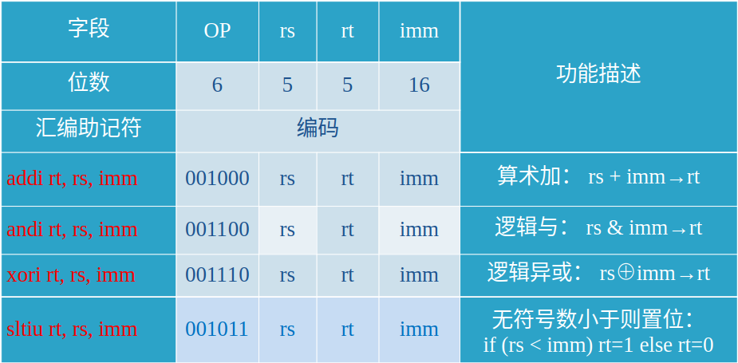
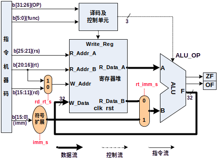
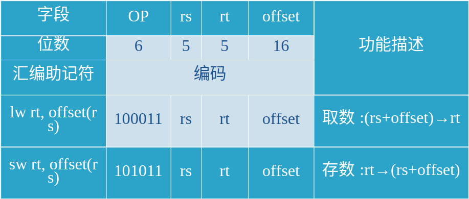
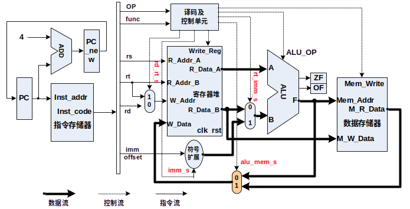
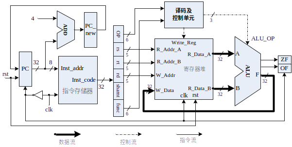
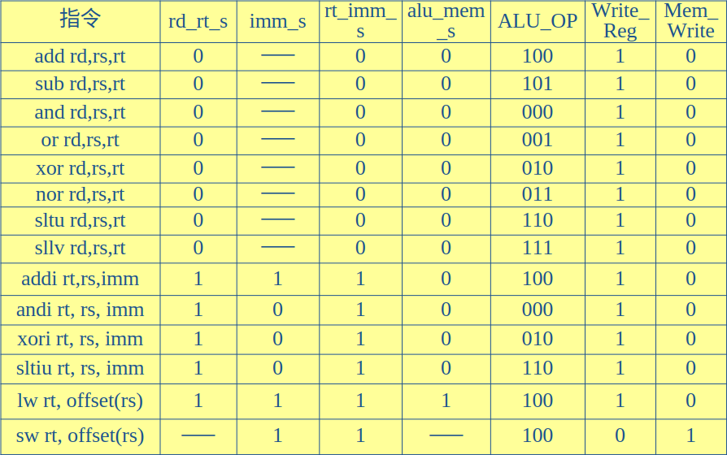
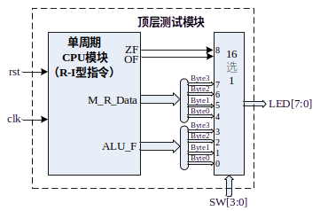
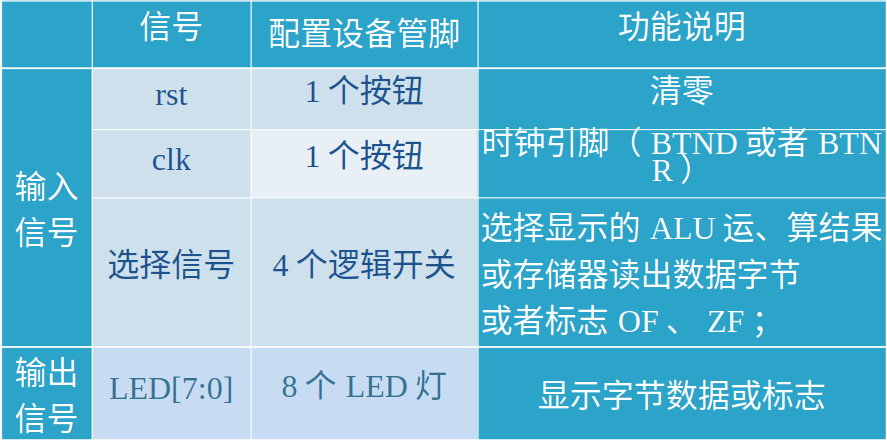

# 实验九

## 1、实验目的 
- 掌握MIPS R型和I型指令的综合数据通路设计
- 掌握数据流的多路选通控制方法
- 掌握取数指令lw和存数指令sw指令的寻址方式及其有效地址产生方法
- 实现MIPS的部分 I型和R型指令的功能

## 2、实验内容与原理

- 实验八的基础上，再行实现MIPS的6条I型指令：

  - 4条立即数寻址的运算和传送指令
  - 2条相对寄存器寻址的存数和取数指令。
  - 与原理课相比，多了4条立即数运算指令。

  

### （1）MIPS的I型立即数寻址指令及数据通路



#### I型与R型指令有明显不同

- 没有rd寄存器，使用rt作为目的寄存器；
- 源操作数有一个为立即数，位于指令的低16位。

#### 解决目的寄存器的可选性

- 设置一个二选一数据选择器，控制信号为rd_rt_s：
  - 当rd_rt_s=0，将指令的rd字段送写地址W_Addr；
  - 当rd_rt_s=1，将指令的rt字段送写地址W_Addr。

**Verilog语句如下：**

```verilog
 assign W_Addr = (rd_rt_s) ? rt : rd;
```


#### 扩展16位的立即数imm

- 设置一位imm_s来控制这两种扩展：
  - imm_s=1，符号扩展；
  - imm_s=0，则0扩展。

**Verilog语句如下：**

```verilog
assign imm_data=(imm_s) ?{16{imm[15]},imm} :{16{1’b0},imm};
```

#### ALU的输入数据B端的数据选择

- 设置二选一数据选择器（控制信号为rt_imm_s）
  - 当rt_imm_s=0，将寄存器堆的B端口读出数据R_Data_B送ALU的B端
  - 当rt_imm_s=1，将扩展好的立即数imm_data送ALU的B输入端

**Verilog语句如下:**

```verilog
assign ALU_B = (rt_imm_s) ? imm_data :R_Data_B;
```


#### 改造的数据通路



### （2）I型取数/存数指令及其数据通路

#### MIPS I型存储器访问指令格式及编码



#### 改进数据通路，实现两条访存指令

##### 添加一个数据存储器RAM，存放指令访问的数据

必须添加吗？

##### 有效地址EA的计算

ALU来实现，置rt_imm_s=1，imm_s=1。

为何是带符号扩展？

##### 将ALU的输出直接送存储器地址端口

**Verilog描述：**

```verilog
assign Mem_Addr = ALU_F
```


##### 存储器读出的数据

- alu_mem_s=0，则将ALU的输出送寄存器堆的写数据端口
- alu_mem_s=1，则将存储器的读出数据送寄存器堆的写数据端口。

**Verilog描述如下:**

```verilog
assign W_Data=alu_mem_s ?M_R_Data :ALU_F;
```


##### 存储器的写入数据

将寄存器堆的B端口数据直接送至存储器的写数据端口

**Verilog描述如下:**

```verilog
assign M_W_Data = R_Data_B;
```

**实验九：**

#### 新的完整的R-I型指令数据通路



**实验八：**

实验八的长这样



可以看出实验九相对于

#### R-I型指令的控制流



### （3）I型指令的时序

- 立即数寻址的I型指令，执行的时序同R型指令：
  - **在clk的上跳沿**，指令存储器执行读操作
  - **在clk正脉冲内**，读出的指令经过译码、执行运算
  - **在clk的下跳沿**，将运算结果打入目的寄存器rd或者rt
- 对于取数/存数指令，对数据存储器的读和写访问都要与clk脉冲同步。

### （4）指令测试

#### 测试代码

```assembly
#baseAddr 0000
xori	$1,	$0,	0x1234;		#$1=0000_1234
addi	$2,	$0,	0x6789;		#$2=0000_6789
addi 	$3,	$0,	-0x7000;	         #$3=FFFF_9000
xori	$4,	$0,	0x0010;		#$4=0000_0010
sllv	$5,	$2,	$4;			#$5=6789_0000
or	$6,	$1,	$5;			#$6=6789_1234
sllv	$7,	$3,	$4;			#$7=9000_0000
add	$8,	$2,	$6;		        #$8=6789_79BD
sub	$9,	$2,	$1;			#$9=0000_5555
sub	$10,	$1,	$2;		       #$10=FFFF_AAAB
addi	$11,	$3,	0x7FFF;	       #$11=0000_0FFF
addi	$12,	$3,	-0x8000;	       #$12=FFFF_1000
andi	$13,	$10,	0xFFFF;	      #$13=0000_AAAB
sltiu	$14,	$2,	0x6788;	      #$14=0000_0000
sltiu	$15,	$2,	0x678A;	      #$15=0000_0001
sw	$11,	0($4);	#mem(0000_0010)=0000_0FFF
sw	$12,	20($0);	#mem(0000_0014)=FFFF_1000
sw	$13,	16($4);	#mem(0000_0020)=0000_AAAB
sw	$14,	20($4);	#mem(0000_0024)=0000_0000
lw	$16,	16($0);  #$16=mem(0000_0010)=0000_0FFF
lw	$17,	4($4);    #$17=mem(0000_0014)=FFFF_1000
or	$18,	$16,	$17;	#$18=FFFF_1FFF
lw	$19,	16($4); #$19=mem(0000_0020)=0000_AAAB
lw	$20,	20($4);#$20=mem(0000_0024)=0000_0000
nor	$21,	$19,	$20;	#$21=FFFF_5554
lw	$22,	-0x10($4); #$22=mem(0000_0000)，譬如8888_8888
lw	$23,	-0x0C($4); #$23=mem(0000_0004)，譬如9999_9999
sltu	$24,	$22,	$23 #$24=?  ，譬如=0000_0001       
                                        
```


#### 汇编后机器码

```bash
38011234,20026789,20039000,38040010,00822804,00253025,00833804,00464020,00414822,00225022,206b7fff,206c8000,314dffff,2c4e6788,2c4f678a,ac8b0000,ac0c0014,ac8d0010,ac8e0014,8c100010,8c910004,02119025,8c930010,8c940014,0274a827,8c96fff0,8c97fff4,02d7c02b
```


- 将上述机器指令码填入到和指令存储器模块ROM_B相关联的*.coe文件中，也可以调用*.coe的生成软件来完成。

- 在和数据存储器模块RAM_B相关联的*.coe文件中，可以随意填入一些数据

### 顶层测试模块



## 3.实验要求

1. 在实验八的基础上，编写一个CPU模块
   1. 实现实验八的8条R型指令
   2. 实现新的6条I型指令
2. 编写一个实验验证的顶层模块
3. 撰写实验报告。

信号表



## 4、实验步骤 

- 在Xilinx ISE中创建工程，编源码，然后编译、综合
- 编写激励代码，观察仿真波形，直至验证正确