# 实验九
尝试按照学习通的视频一步一步修改，但是视频中的代码在我这边有问题，所以还是按照实验八的代码进行修改，最后成功了。
## 1、实验目的 
- 掌握MIPS R型和I型指令的综合数据通路设计
- 掌握数据流的多路选通控制方法
- 掌握取数指令lw和存数指令sw指令的寻址方式及其有效地址产生方法
- 实现MIPS的部分 I型和R型指令的功能

## 2、实验内容与原理

- 实验八的基础上，再行实现MIPS的6条I型指令：

  - 4条立即数寻址的运算和传送指令
  - 2条相对寄存器寻址的存数和取数指令。
  - 与原理课相比，多了4条立即数运算指令。

- MIPS指令opcode和funct为什么要分开
  - 因为只有R类指令需要funct，其他的比如I和J类指令都不需要funct


### （1）MIPS的I型立即数寻址指令及数据通路


#### I型与R型指令有明显不同

- 没有rd寄存器，使用rt作为目的寄存器；
- 源操作数有一个为立即数，位于指令的低16位。

#### 解决目的寄存器的可选性

- 设置一个二选一数据选择器，控制信号为rd_rt_s：
  - 当rd_rt_s=0，将指令的rd字段送写地址W_Addr；
  - 当rd_rt_s=1，将指令的rt字段送写地址W_Addr。

**Verilog语句如下：**

```verilog
 assign W_Addr = (rd_rt_s) ? rt : rd;
```


#### 扩展16位的立即数imm

- 设置一位imm_s来控制这两种扩展：
  - imm_s=1，符号扩展；
  - imm_s=0，则0扩展。

**Verilog语句如下：**

```verilog
assign imm_data=(imm_s) ?{16{imm[15]},imm} :{16{1’b0},imm};
```

#### ALU的输入数据B端的数据选择

- 设置二选一数据选择器（控制信号为rt_imm_s）
  - 当rt_imm_s=0，将寄存器堆的B端口读出数据R_Data_B送ALU的B端
  - 当rt_imm_s=1，将扩展好的立即数imm_data送ALU的B输入端

**Verilog语句如下:**

```verilog
assign ALU_B = (rt_imm_s) ? imm_data :R_Data_B;
```


#### 改造的数据通路


### （2）I型取数/存数指令及其数据通路

#### MIPS I型存储器访问指令格式及编码

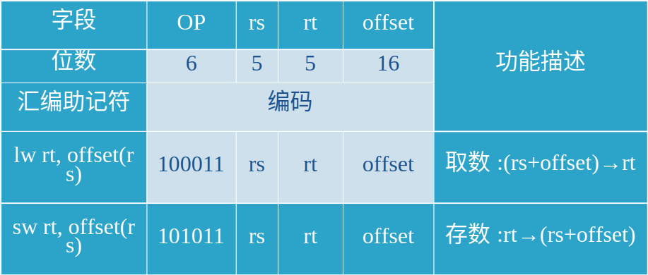

#### 改进数据通路，实现两条访存指令

##### 添加一个数据存储器RAM，存放指令访问的数据

必须添加吗？

##### 有效地址EA的计算

ALU来实现，置rt_imm_s=1，imm_s=1。

为何是带符号扩展？

##### 将ALU的输出直接送存储器地址端口

**Verilog描述：**

```verilog
assign Mem_Addr = ALU_F
```


##### 存储器读出的数据

- alu_mem_s=0，则将ALU的输出送寄存器堆的写数据端口
- alu_mem_s=1，则将存储器的读出数据送寄存器堆的写数据端口。

**Verilog描述如下:**

```verilog
assign W_Data=alu_mem_s ?M_R_Data :ALU_F;
```


##### 存储器的写入数据

将寄存器堆的B端口数据直接送至存储器的写数据端口

**Verilog描述如下:**

```verilog
assign M_W_Data = R_Data_B;
```

**实验八（R型指令的CPU)：**

实验八的长这样

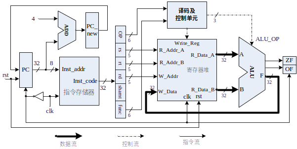

**实验九（R-I型指令的CPU)：**

#### 新的完整的R-I型指令数据通路


- 可以看出实验九相对于实验八：没有rd寄存器，使用rt作为目的寄存器；
  - 因此为了解决寄存器的可选性，设置一个二选一数据选择器，控制信号为rd_rt_s：

#### R-I型指令的控制流


### （3）I型指令的时序

- 立即数寻址的I型指令，执行的时序同R型指令：
  - **在clk的上跳沿**，指令存储器执行读操作
  - **在clk正脉冲内**，读出的指令经过译码、执行运算
  - **在clk的下跳沿**，将运算结果打入目的寄存器rd或者rt
- 对于取数/存数指令，对数据存储器的读和写访问都要与clk脉冲同步。

### （4）指令测试

#### 测试代码

```assembly
#baseAddr 0000
xori	$1,	$0,	0x1234;		#$1=0000_1234
addi	$2,	$0,	0x6789;		#$2=0000_6789
addi 	$3,	$0,	-0x7000;	         #$3=FFFF_9000
xori	$4,	$0,	0x0010;		#$4=0000_0010
sllv	$5,	$2,	$4;			#$5=6789_0000
or	$6,	$1,	$5;			#$6=6789_1234
sllv	$7,	$3,	$4;			#$7=9000_0000
add	$8,	$2,	$6;		        #$8=6789_79BD
sub	$9,	$2,	$1;			#$9=0000_5555
sub	$10,	$1,	$2;		       #$10=FFFF_AAAB
addi	$11,	$3,	0x7FFF;	       #$11=0000_0FFF
addi	$12,	$3,	-0x8000;	       #$12=FFFF_1000
andi	$13,	$10,	0xFFFF;	      #$13=0000_AAAB
sltiu	$14,	$2,	0x6788;	      #$14=0000_0000
sltiu	$15,	$2,	0x678A;	      #$15=0000_0001
sw	$11,	0($4);	#mem(0000_0010)=0000_0FFF
sw	$12,	20($0);	#mem(0000_0014)=FFFF_1000
sw	$13,	16($4);	#mem(0000_0020)=0000_AAAB
sw	$14,	20($4);	#mem(0000_0024)=0000_0000
lw	$16,	16($0);  #$16=mem(0000_0010)=0000_0FFF
lw	$17,	4($4);    #$17=mem(0000_0014)=FFFF_1000
or	$18,	$16,	$17;	#$18=FFFF_1FFF
lw	$19,	16($4); #$19=mem(0000_0020)=0000_AAAB
lw	$20,	20($4);#$20=mem(0000_0024)=0000_0000
nor	$21,	$19,	$20;	#$21=FFFF_5554
lw	$22,	-0x10($4); #$22=mem(0000_0000)，譬如8888_8888
lw	$23,	-0x0C($4); #$23=mem(0000_0004)，譬如9999_9999
sltu	$24,	$22,	$23 #$24=?  ，譬如=0000_0001       
                                        
```


#### 汇编后机器码

```bash
38011234,20026789,20039000,38040010,00822804,00253025,00833804,00464020,00414822,00225022,206b7fff,206c8000,314dffff,2c4e6788,2c4f678a,ac8b0000,ac0c0014,ac8d0010,ac8e0014,8c100010,8c910004,02119025,8c930010,8c940014,0274a827,8c96fff0,8c97fff4,02d7c02b
```


- 将上述机器指令码填入到和指令存储器模块ROM_B相关联的*.coe文件中，也可以调用*.coe的生成软件来完成。

- 在和数据存储器模块RAM_B相关联的*.coe文件中，可以随意填入一些数据

### 顶层测试模块

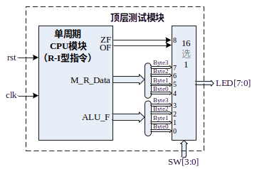

## 3.实验要求

1. 在实验八的基础上，编写一个CPU模块
   1. 实现实验八的8条R型指令
   2. 实现新的6条I型指令
2. 编写一个实验验证的顶层模块
3. 撰写实验报告。

### 信号表

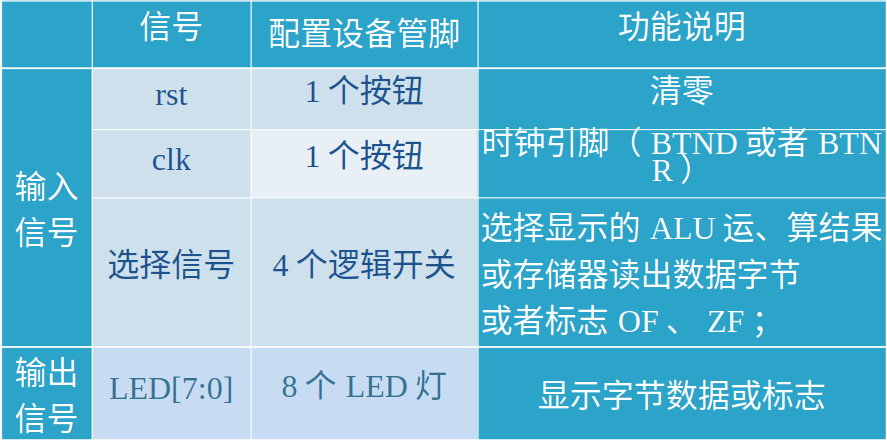

## 4、实验步骤 

- 在Xilinx ISE中创建工程，编源码，然后编译、综合
- 编写激励代码，观察仿真波形，直至验证正确

## 5、实验代码

### （1）顶层模块

```verilog
`timescale 1ns / 1ps
module CPU(clk,rst,OF,ZF,F,ALU_OP,M_R_Data,rd_rt_s,imm_s,rt_imm_s,Mem_Write,alu_mem_s,Write_Reg,clk_RAM,R_Data_B,Inst_code);
input clk,rst,clk_RAM;
wire [31:0]Inst_code;
wire [5:0]op_code,funct;
wire [4:0]rs_addr,rt_addr,rd_addr,shamt;
output [31:0]F;
output OF,ZF;
output [31:0]M_R_Data;
output [2:0]ALU_OP;
wire [31:0]Mem_Addr;
wire [4:0]W_Addr;
output rd_rt_s,imm_s,rt_imm_s,Mem_Write,alu_mem_s,Write_Reg;
output [31:0]Inst_code;
wire [31:0]imm_data;
wire [31:0]R_Data_A;
output [31:0] R_Data_B;
wire [15:0]imm;
wire [31:0]ALU_B;
wire [31:0]W_Data;
// PC 取指令 模块
PC pc1(clk,rst,Inst_code);
// OP_Func 指令分段译码 模块
assign op_code = Inst_code[31:26];
assign rs_addr = Inst_code[25:21];
assign rt_addr = Inst_code[20:16];
assign rd_addr = Inst_code[15:11];
assign shamt = Inst_code[10:6];
assign funct = Inst_code[5:0];
assign imm = Inst_code[15:0];
OP_Func op(op_code,funct,Write_Reg,ALU_OP,rd_rt_s,imm_s,rt_imm_s,Mem_Write,alu_mem_s);
// RegFile 寄存器堆 模块
assign W_Addr = (rd_rt_s)?rt_addr:rd_addr;
assign imm_data = (imm_s)?{{16{imm[15]}},imm}:{{16{1'b0}},imm};//这边ppt上有写
assign W_Data = alu_mem_s?M_R_Data:F;
RegFile F1(rs_addr,rt_addr,Write_Reg,R_Data_A,R_Data_B,rst,~clk,W_Addr,W_Data);
// ALU 模块
assign ALU_B = (rt_imm_s)?imm_data:R_Data_B;	
MyALU T1(OF,ZF,ALU_OP,R_Data_A,ALU_B,F); 
// RAM 模块
RAM RAM_B (
  .clka(clk_RAM), // input clka
  .wea(Mem_Write), // input [0 : 0] wea
  .addra(F[5:0]), // input [5 : 0] addra
  .dina(R_Data_B), // input [31 : 0] dina
  .douta(M_R_Data) // output [31 : 0] douta
);
endmodule

```


### （2.1）PC 及自增电路(实验七)

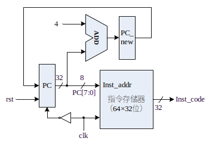

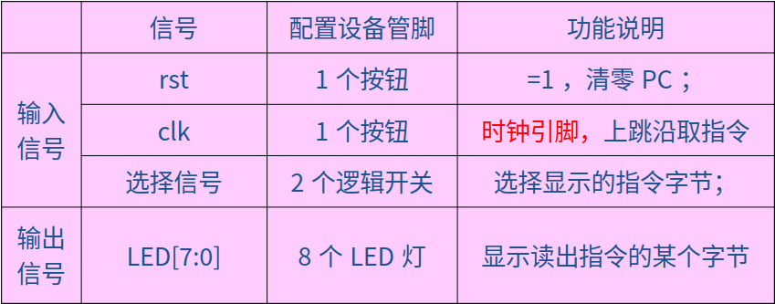

**PC及其自增电路：**

- MIPS地址32位，按字节编址；指令存储器：256×8位
- PC是32位，但是指令存储器地址只需8位
- 在指令周期（即时钟周期）clk上跳沿，执行取指令操作，在clk下跳沿更新PC值。
- 复位信号rst：=1时，PC清零，即指定MIPS CPU从0号主存开始执行程序。

这边和实验七以及实验八实际上是有变化的

```verilog
`timescale 1ns / 1ps
module PC(clk,rst,Inst_code);//PC模块
input clk,rst;//输入时钟和复位信号
wire [31:0]PC_new;//输出新的PC值
reg[31:0]PC;//PC值
initial
	PC = 32'h0000_0000;//初始化PC值
output [31:0]Inst_code;//输出指令
assign PC_new = PC +4;//PC值加4
Inst_Rom rom(//ROM模块
  .clka(clk), // input clka
  .addra(PC[7:2]), // input [5 : 0] addra
  .douta(Inst_code) // output [31 : 0] douta
);
always@(negedge clk or posedge rst)//时钟下降沿或复位信号上升沿时
	begin
		if(rst)//复位
			begin PC <= 32'h0000_0000; end//复位
		else
			begin PC <= PC_new; end//PC值加4
	end
endmodule

```

模块实现了 PC 及自增电路的功能。

功能实现方式：使用 ROM IP 核实现指令存储器，使用时钟下降沿触发 PC 自增。

### （2.2）指令存储器(实验七)

PS:这边直接ise生成就好了的说

实验七是要求：设计一个指令存储器，只读，物理大小`64×32`位；

这个是基于实验五的，看看实验五这边，其实差不多（生成只读的指令存储器时，使用Memory IP核，同实验五，但是选择single port ROM）

为MIPS处理器设计一个`256×8`位的物理存储器，具有读写功能，按**字节编址**，**按字访问**，即`64×32`位 

#### 存储器模块输入输出端口 

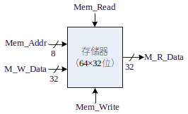

#### 字地址小端格式


#### 存储器功能表

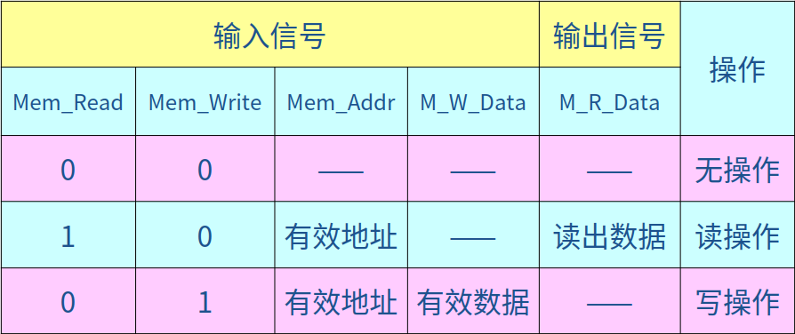

#### 信号配置表

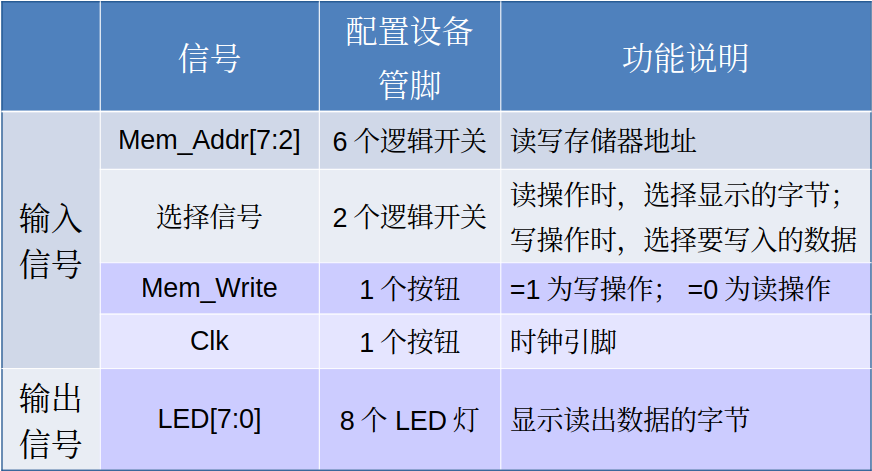

本模块实现了指令存储器的功能。

功能实现方式：使用 IP 核生成指令存储器。代码太长了而且不好贴

### （3）寄存器堆(实验四)

设计一个32×32位的寄存器堆（即含有32个寄存器，每个寄存器32位）

- 双端口读：2个读端口
- 单端口写：1个写端口

#### 输入输出端口示意图

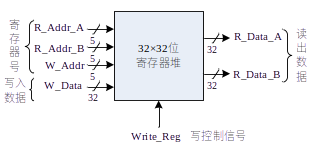

- 读访问操作：无需时钟同步，只要给出寄存器地址，即可读出寄存器中的数据。
- 写访问操作：需要时钟同步，所有写入操作的输入信号必须在时钟边沿来临时，已经有效（Write_Reg=1、地址和数据） 。

#### 寄存器堆功能表

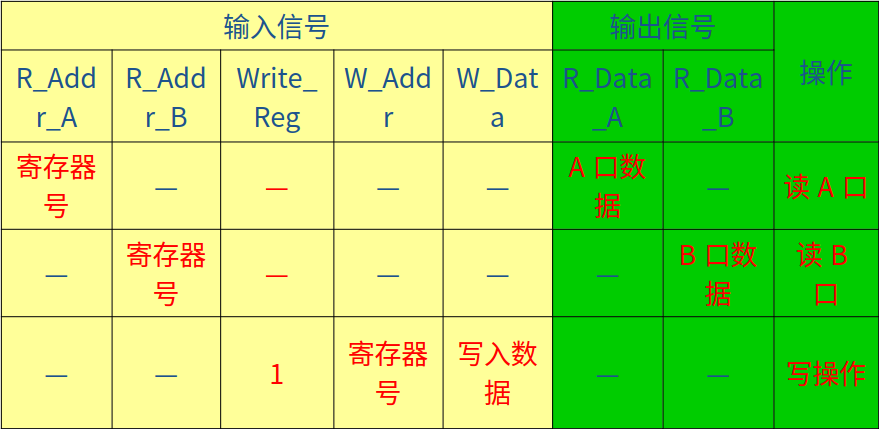

#### 寄存器堆逻辑结构图

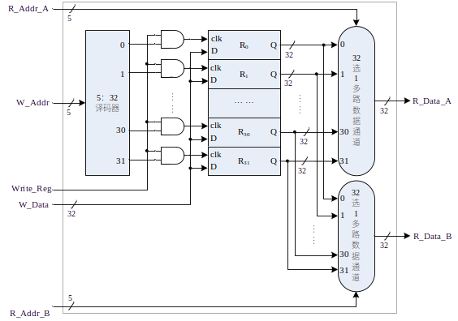

#### 实现

- 寄存器堆：
  - reg类型信号的数组
  - reg [31:0] REG_Files[0:31];
- 读操作：
  - 组合逻辑电路
  - assign R_Data_A = REG_Files[R_Addr_A];
  - assign R_Data_B = REG_Files[R_Addr_B];
- 写操作：
  - 时序逻辑电路
  - 需要Reset信号：用于初始化寄存器（全部清零）
  - 需要clk信号：用于写入寄存器

#### 信号配置表

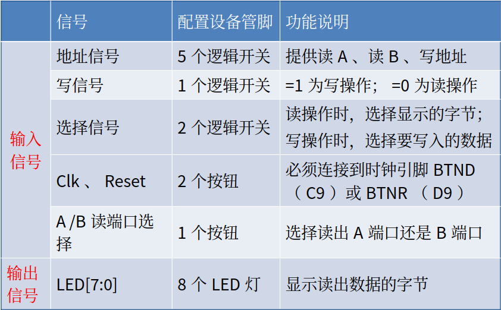


```verilog
`timescale 1ns / 1ps

module RegFile(R_Addr_A,R_Addr_B,Write_Reg,R_Data_A,R_Data_B,Reset,Clk,W_Addr,W_Data);
input [4:0]R_Addr_A,R_Addr_B,W_Addr;//这部分是寄存器的地址
input Write_Reg,Reset,Clk;//这部分是控制信号
input[31:0] W_Data;//这部分是写入的数据
output [31:0] R_Data_A,R_Data_B;//这部分是输出的数据
reg [31:0] REG_Files[0:31];//这部分是寄存器的内容
integer i=0;
initial
        for(i=0;i<32;i=i+1) REG_Files[i]<=0;//初始化寄存器的内容
always @ (posedge Clk or posedge Reset)//这部分是寄存器的写入和清零
	begin
		if(Reset)
			begin
				for(i=0;i<=31;i=i+1)
					REG_Files[i]<=0;//清零
			end
		else
			begin
				if(Write_Reg)
					REG_Files[W_Addr]<=W_Data;//写入
			end
	end
	assign R_Data_A = REG_Files[R_Addr_A];//这部分是寄存器的读取
	assign R_Data_B = REG_Files[R_Addr_B];//这部分是寄存器的读取
endmodule

```

本模块实现了寄存器堆的功能。

功能实现方式：使用数组实现寄存器堆，使用时钟上升沿触发写入，使用组合逻辑实现读取。

### （4）ALU(实验三)

8种运算功能由**多个部件并行实现**，运算结果则经过一个八选一多路数据选择器由3根控制线ALU_OP[2:0]选通输出。

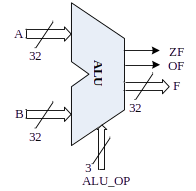

从上到下是

1. and -> 0
2. or -> 1
3. xor -> 2
4. nor -> 3
5. 加减 -> 4/5
6. 比较 -> 6
7. 移位 -> 7

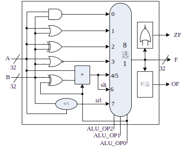

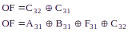


#### 信号配置表 

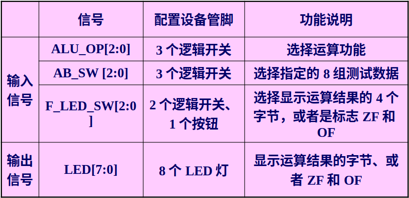


```verilog
`timescale 1ns / 1ps
// ALU 模块, 添加 ADC 运算.
module ALU(OP, A, B, F, ZF, CF, OF, SF, PF);
    parameter SIZE = 32;    // 运算位数
    input [3:0] OP;         // 运算符编码(剩余7个空位)
    input [SIZE:1] A;       // 左操作数 
    input [SIZE:1] B;       // 右操作数
    output reg [SIZE:1] F;  // 运算结果F
    output reg ZF, CF, OF, SF, PF; // 标志位
    reg C; // 最高位进位(减法时将自动取反)
    always @(*) begin
        case(OP) // 判断运算符并进行运算
            0: {C,F} <= A & B;        // 按位与
            1: {C,F} <= A | B;        // 按位或
            2: {C,F} <= A ^ B;        // 按位异或
            3: {C,F} <= ~(A | B);     // 按位或非
            4: {C,F} <= A + B;        // 加法
            5: {C,F} <= A - B;        // 减法
            6: {C,F} <= A < B;        // A<B 则结果为1, 否则为0
            7: {C,F} <= B << A;       // 将 B 左移 A 位
            8: {C,F} <= A + B + 1;    // 低位有进位加法(ADC)
            default: {C,F} <= 0;    // 未定义运算, 结果置零
        endcase
        ZF <= F==0; // 零标志, 结果为全零则置1, 否则置0
        CF <= C;    // 进借位标志取最高位进位(减法时需取反)(只对无符号数有意义)
        OF <= A[SIZE]^B[SIZE]^F[SIZE]^C; // 溢出标志由判溢公式计算(只对有符号数有意义)
        SF <= F[SIZE]; // 符号标志取结果最高位(补码符号位0正1负)(只对有符号数有意义)
        PF <= ~^F;     // 奇偶标志, 结果中1为偶数个则置1, 否则置0
    end
endmodule
```

本模块实现了 ALU 的功能。

功能实现方式：使用 case 语句实现不同的运算。

### （5）指令译码与控制单元

```verilog
`timescale 1ns / 1ps

module OP_Func(op_code,funct,Write_Reg,ALU_OP,rd_rt_s,imm_s,rt_imm_s,Mem_Write,alu_mem_s);
input [5:0]op_code;// 
input [5:0]funct;
output reg[2:0]ALU_OP;
output reg Write_Reg;
output reg rd_rt_s;
output reg imm_s;
output reg rt_imm_s;
output reg Mem_Write;
output reg alu_mem_s;
always@(*)
	begin	
			Write_Reg=1;
			ALU_OP=0;
			rd_rt_s=0;
			imm_s=0;
			rt_imm_s=0;
			Mem_Write=0;
			alu_mem_s=0;
				if(op_code==0)
					begin 
						case(funct)
						6'b100000:begin ALU_OP=3'b100;end// add 机器码为100000
						6'b100010:begin ALU_OP=3'b101;end// sub 机器码为100010
						6'b100100:begin ALU_OP=3'b000;end// and 机器码为100100
						6'b100101:begin ALU_OP=3'b001;end// or 机器码为100101
						6'b100110:begin ALU_OP=3'b010;end// xor 机器码为100110
						6'b100111:begin ALU_OP=3'b011;end// nor 机器码为100111
						6'b101011:begin ALU_OP=3'b110;end// slt 机器码为101011
						6'b000100:begin ALU_OP=3'b111;end// sll 机器码为000100
						endcase 
					end
				else
					begin
						case(op_code)
							6'b001000:begin rd_rt_s=1;imm_s=1;rt_imm_s=1;ALU_OP=100;end  
							6'b001100:begin rd_rt_s=1;rt_imm_s=1;ALU_OP=000; end  
							6'b001110:begin rd_rt_s=1;rt_imm_s=1;ALU_OP=010;end  
							6'b001011:begin rd_rt_s=1;rt_imm_s=1;ALU_OP=110; end  
							6'b100011:begin rd_rt_s=1;imm_s=1;rt_imm_s=1;alu_mem_s=1;ALU_OP=100; end  
							6'b101011:begin imm_s=1;rt_imm_s=1;ALU_OP=100;Write_Reg=0;Mem_Write=1; end  
					endcase
				end
			end
endmodule

```

## 测试模块

```verilog
module CPU_Test();
    reg rst, clk, clk_ram;
    wire [31:0] PC, Inst_code,
        RF_A, RF_B, ALU_F, M_R_Data;
    wire [3:0] ALU_OP;
    wire [1:0] W_Data_Select;
    wire W_Addr_Select, Write_Reg, RF_B_OUT,
        imm_signed, ALU_B_Select, Write_Mem,
        ZF, CF, OF, SF, PF;

    CPU_R_I CPU_Instance1(rst, clk, clk_ram, // 输入控制信号
    PC, Inst_code, // 取指令和指令分段模块输出
    W_Addr_Select, W_Data_Select, Write_Reg, RF_B_OUT, // 寄存器堆控制信号
    RF_A, RF_B, // 寄存器堆读出数据
    ALU_F, ZF, CF, OF, SF, PF, // ALU运算结果,标志寄存器
    Write_Mem, M_R_Data, // 数据存储器写入信号，读出数据
    );

    always #50 clk = ~clk;
    always #25 clk_ram = ~clk_ram;// RAM 时钟频率不低于 CPU 时钟频率的 2 倍
    initial begin
        clk = 0; rst = 1; clk_ram = 0; #20; rst = 0;
    end
endmodule
```


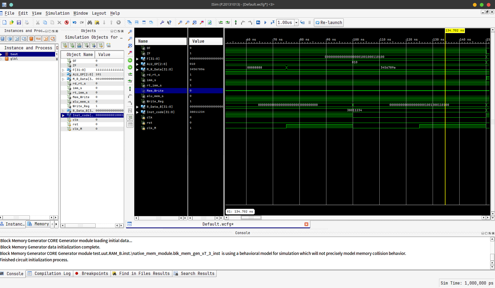

