# 实验八 R 型指令 CPU 设计

源码学习通上已经有了的说,下面是对 PPT 内容进行 markdown 格式的笔记摘抄和整理

## 目录

[[toc]]

## 1、实验目的

1. 掌握 **MIPS R 型指令的数据通路设计**，掌握指令流和数据流的控制方法；
2. 掌握**完整的单周期 CPU 顶层模块**的设计方法；
3. **实现 MIPS R 型指令的功能**；

## 2、实验内容与原理

设计实现一个单周期 CPU，实现 8 条 `R` 型指令；

1. 建立 R 型指令的数据通路；
2. 构造顶层模块，含部件：
   1. 指令存储器（实验七）
   2. PC 及自增电路（实验七）
   3. 寄存器堆模块（实验四）
   4. ALU 模块（实验三）
   5. 指令译码与控制单元：新增
      1. 根据指令码和功能码，为数据通路上各部件发送控制信号（置位或复位）；

### （1）R 型指令的数据通路


### （2）R 型指令集

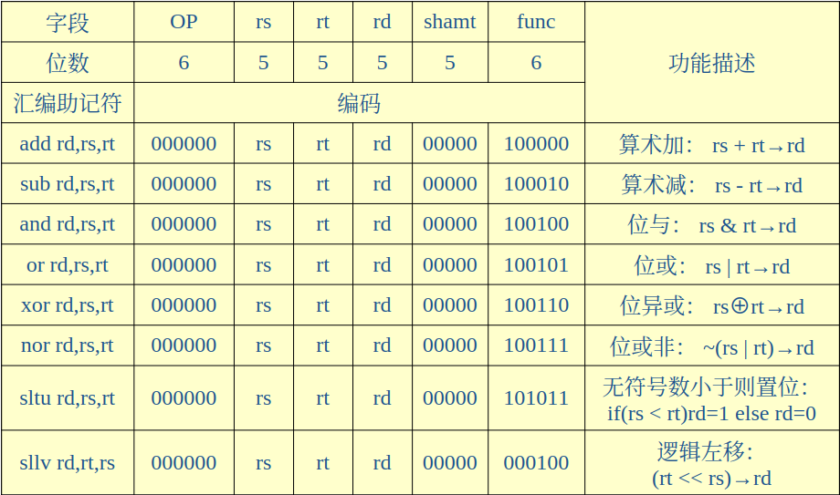

由上表可知

#### R 型指令的共同特征：

- 操作码字段 OP=000000b
- 指令的功能则由功能码字段 func 指出
- R 型指令的操作数有 3 个
  - 两个源操作数在 rs 和 rt 字段所指定的寄存器中
  - 目的操作数是 rt 字段所指定的寄存器

**汇编助记符**中，紧跟指令符号右边的寄存器是目的寄存器，这和**指令机器码**的排列顺序有差异

### （3）构造 CPU 顶层模块：

1. 新建一个工程；
2. 新建一个 Veilog Module 作为 CPU 顶层模块；
3. 拷贝各个模块的\*.v 文件到当前工程目录下；
4. 将各个\*.v 文件加到工程中来；
   1. 对于指令存储器的\*.xco，处理较复杂（可重新在工程中生成 ROM 的 IP 核）
5. 在顶层模块中，引用各个模块的实例；
   1. 定义一组信号做为各个模块间的信号连接；
6. 在顶层模块中，编写有关指令译码和控制单元的程序；

#### 注意：

- 寄存器模块：$0 要始终置为 0，且不允许写操作；
- 指令译码：OP=000000 为 R 型指令，由 func 字段识别具体 R 型指令；
- 控制信号赋值：依据指令译码，见下表

##### 指令译码与控制：OP=6‘b000000

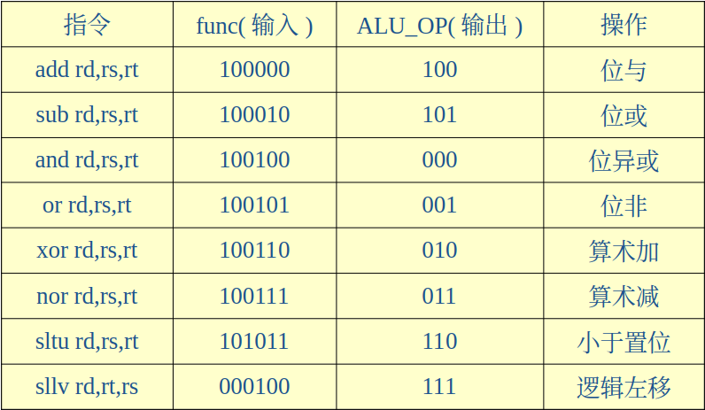

#### 时序设计

- 时钟源为 CPU 的主频脉冲 clk
- clk 的上升沿，启动指令存储器依据 PC 读指令
- clk 高电平持续期间，完成 PC 值的自增、指令译码、寄存器读操作，随后完成 ALU 运算
- clk 的下降沿则完成目的寄存器的写入、PC 值的更新和标志寄存器的更新
- 时序实现时：
  - 指令存储器的 clk：clk
  - PC 寄存器的打入 clk：~clk
  - 寄存器堆的写入 clk：~clk

#### 指令对标志寄存器的影响

- **传送类指令**和**跳转类指令**不影响标志位
- **有符号算术运算类指令**（包括 slt 和算术移位指令）**影响 ZF 和 OF**
- **无符号算术运算类指令**和**逻辑运算类**指令**影响 ZF**，**不影响 OF**
- **条件转移类**指令一般会使用**标志位 ZF**

#### 标志寄存器的赋值

- 算术运算类指令：影响标志位 ZF 和 OF
- 逻辑运算类指令：只影响标志位 ZF
- 存储器访问指令：不影响标志位
- 无条件跳转指令：不影响标志位
- 有条件分支指令：影响标志位 ZF

> 影响 → 赋值
> 不影响 → 不赋值

### （4）指令测试

- 实现的 CPU 能够支持 8 条 R 型指令子集吗？
- 用 8 条 R 型指令编写一段程序，用于测试 CPU 的功能：

#### 测试程序：汇编

```assembly
nor $1, $0,$0;  	#$1=FFFF_FFFF
sltu $2, $0, $1;  	#$2=0000_0001
add $3, $2, $2;  	#$3=0000_0002
add $4, $3, $2;  	#$4=0000_0003
add $5, $4, $3;  	#$5=0000_0005
add $6, $5, $3;  	#$6=0000_0007
sllv $7, $6, $2;  	#$7=0000_000E
add $9, $5, $6;  	#$9=0000_000C
sllv $8, $6, $9;  	#$8=0000_7000
xor $9, $1, $8;  	#$9=FFFF_8FFF
add $10, $9, $1; 	#$10=FFFF_8FFE
sub $11, $8, $7; 	#$11=0000_6FF2
sub $12, $7, $8;  	#$12=FFFF_900E
and $13, $9, $12;	#$13=FFFF_800E
or $14, $9, $12;  	#$14=FFFF_9FFF
or $15, $6, $7;  	#$15=0000_000F
nor $16, $6, $7; 	    #$16=FFFF_FFF0
add $17, $7, $3;	    #$17=0000_0010
sllv  $18, $8, $17;    #$18=7000_0000
sllv  $19, $3, $17;    #$19=0002_0000
sllv $20, $19, $7;    #$20=8000_0000
add  $21, $20, $1;   #$21=7FFF_FFFF
or $22, $18, $21;    #$22=7FFF_FFFF
add  $23, $20, $22; #$23=FFFF_FFFF
sub $24, $20, $22;  #$24=0000_0001
sub $25, $22, $20;  #$25=FFFF_FFFF
xor $26, $18, $1;     #$26=8FFF_FFFF
sltu $27, $22, $20;  #$27=0000_0001
sltu $28, $26, $20;  #$28=0000_0000
add $29, $22, $2;    #$29=8000_0000
sub $30, $20, $2;    #$30=7FFF_FFFF
add $31, $11, $26;  #$30=9000_6FF1
```

#### 测试程序：机器指令编码

```bash
00000827, 0001102b, 00421820, 00622020, 00832820, 00a33020, 00463804, 00a64820, 01264004, 00284826, 01215020, 01075822, 00e86022, 012c6824, 012c7025, 00c77825, 00c78027, 00e38820, 02289004, 02239804, 00f3a004, 0281a820, 0255b025, 0296b820, 0296c022, 02d4c822, 0241d026, 02d4d82b, 0354e02b, 02c2e820, 0282f022, 017af820
```

1. 将机器代码编辑成\*.coe 文件（格式化）；
2. 与指令存储器关联；
3. 重新生成 ROM 核：**Regenerate Core 操作**

### （5）实验验证

> 在板卡上如何看到测试程序的每条指令的执行结果？如何验证功能是否正确？

- 在 CPU 模块之上，**再构造一个实验验证模块**，其中引用改造过的 CPU 模块（**引出 ALU 的运算结果**）

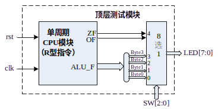

## 3、实验要求

- 在实验三、实验四、实验五和实验六的基础上，**编写一个 CPU 模块**，**能够实现 8 条指定的 R 型指令**。
- 编写一段**测试 8 条指令的汇编程序**，使用**实验六的汇编器**，将其翻译成**二进制机器码**，并通过**关联文件初始化指令存储器**。
- 编写一个**实验验证的顶层模块**，用于验证实验。
- 撰写实验报告。

## 4、实验代码

- [ ] 顶层模块
- [ ] PC
- [ ] 指令存储器
- [ ] 寄存器堆
- [ ] ALU

### （1）CPU 顶层模块


```verilog
//R_CPU.v
`timescale 1ns / 1ps // 定义模拟的时间单位和时间精度

module R_CPU(clk, rst, // 定义R_CPU模块和它的输入端口
    PC, PC_new, Inst_code, OP, func, rs, rt, rd,
    Write_Reg,ALU_OP,
    RF_A, RF_B,
    ALU_F, ZF, CF, OF, SF, PF,
    );

    input clk, rst; // 定义输入端口
    output [31:0] PC, PC_new, Inst_code; // 定义输出端口
    output [5:0] OP, func; // 定义输出端口
    output [4:0] rs, rt, rd; // 定义输出端口
    Instruct Instruct_Instance(.clk(clk),.rst(rst), // 实例化Instruct模块
        .PC(PC),.PC_new(PC_new),.Inst_code(Inst_code),
        .OP(OP),.rs(rs),.rt(rt),.rd(rd),.func(func),
        .shamt(),.imm(),.addr());

    output reg CF; // 定义输出寄存器
    output Write_Reg; // 定义输出端口
    output [3:0] ALU_OP; // 定义输出端口
    Control Ctrl_Instance(OP, func, CF, // 实例化Control模块
            Write_Reg,ALU_OP);

    wire [31:0] W_Data; // 定义线网
    output [31:0] RF_A,RF_B; // 定义输出端口
    RegFile RegFile_Instance( // 实例化RegFile模块
        .Clk(~clk),
        .Clr(rst),
        .Write_Reg(Write_Reg),
        .R_Addr_A(rs),
        .R_Addr_B(rt),
        .W_Addr(rd),
        .W_Data(W_Data),
        .R_Data_A(RF_A),
        .R_Data_B(RF_B));

    output reg ZF, OF, SF, PF; // 定义输出寄存器
    output [31:0] ALU_F; // 定义输出端口
    wire ALU_ZF, ALU_CF, ALU_OF, ALU_SF, ALU_PF; // 定义线网
    ALU ALU_Instance( // 实例化ALU模块
        .OP(ALU_OP),
        .A(RF_A),
        .B(RF_B),
        .F(ALU_F),
        .ZF(ALU_ZF),
        .CF(ALU_CF),
        .OF(ALU_OF),
        .SF(ALU_SF),
        .PF(ALU_PF));

    assign W_Data = ALU_F; // 将ALU_F的值赋给W_Data

    always @(negedge clk) begin // 在时钟的下降沿执行以下操作
        if (rst) begin // 如果复位信号为真
            ZF <= 0; // 将所有标志位清零
            CF <= 0;
            OF <= 0;
            SF <= 0;
            PF <= 0;
        end
        else if (ALU_OP !== 4'bXXXX) begin // 如果ALU_OP不等于4'bXXXX
            ZF <= ALU_ZF; // 将ALU的标志位赋给对应的输出寄存器
            CF <= ALU_CF;
            OF <= ALU_OF;
            SF <= ALU_SF;
            PF <= ALU_PF;
        end
    end
endmodule // 结束模块定义
```

本模块实例化了指令存储器、寄存器堆、ALU、控制单元，实现了 R 型指令的功能。

功能实现方式：实例化各个模块，将各个模块的输入输出端口连接起来。

### （2.1）🌞PC 及自增电路(实验七)

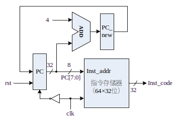

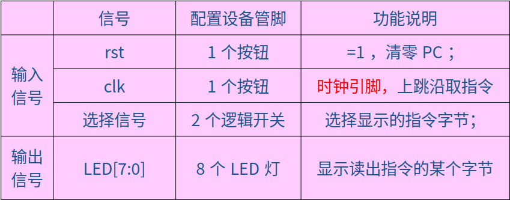

**PC及其自增电路：**

- MIPS地址32位，按字节编址；指令存储器：256×8位
- PC是32位，但是指令存储器地址只需8位
- 在指令周期（即时钟周期）clk上跳沿，执行取指令操作，在clk下跳沿更新PC值。
- 复位信号rst：=1时，PC清零，即指定MIPS CPU从0号主存开始执行程序。

```verilog
//instract.v
`timescale 1ns / 1ps
// 取指令和指令分段模块
module Instruct(clk, rst,
    PC, PC_new, Inst_code,
    OP, rs, rt, rd, shamt, func, imm, addr);
    input clk, rst; // 时钟及重置信号
    output reg [31:0] PC; // Program Counter, 程序计数器
    output [31:0] PC_new; // PC自增值
    output [31:0] Inst_code; // 指令机器码

    always @(negedge clk)
        if (rst) PC <= 32'h0000_0000; // 同步清零
        else PC <= PC_new; // 更新PC
    assign PC_new = PC + 4; // 组合逻辑, 暂存PC自增值

    // 实例化指令存储器IP核
    Rom_Instraction ROM_Instruction_Instance(
        .clka(clk),         // input wire clka
        .addra(PC[7:2]),    // input wire [5 : 0] addra
        .douta(Inst_code)); // output wire [31 : 0] douta

    // 指令分段
    output [5:0] OP, func;
    output [4:0] rs, rt, rd, shamt;
    output [15:0] imm; // offset/immediate of I-Type
    output [25:0] addr; // address of J-Type
    assign OP    = Inst_code[31:26];
    assign rs    = Inst_code[25:21];
    assign rt    = Inst_code[20:16];
    assign rd    = Inst_code[15:11];
    assign shamt = Inst_code[10: 6];
    assign func  = Inst_code[ 5: 0];
    assign imm   = Inst_code[15: 0];
    assign addr  = Inst_code[25: 0];
endmodule
```

本模块实现了 PC 及自增电路的功能。

功能实现方式：使用 ROM IP 核实现指令存储器，使用时钟下降沿触发 PC 自增。

### （2.2）🌞指令存储器(实验七)

PS:这边直接ise生成就好了的说

实验七是要求：设计一个指令存储器，只读，物理大小`64×32`位；

这个是基于实验五的，看看实验五这边，其实差不多（生成只读的指令存储器时，使用Memory IP核，同实验五，但是选择single port ROM）

为MIPS处理器设计一个`256×8`位的物理存储器，具有读写功能，按**字节编址**，**按字访问**，即`64×32`位 

#### 存储器模块输入输出端口 

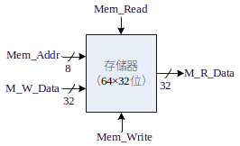

#### 字地址小端格式

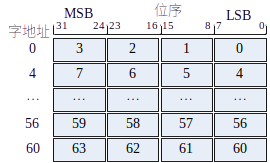

#### 存储器功能表


#### 信号配置表

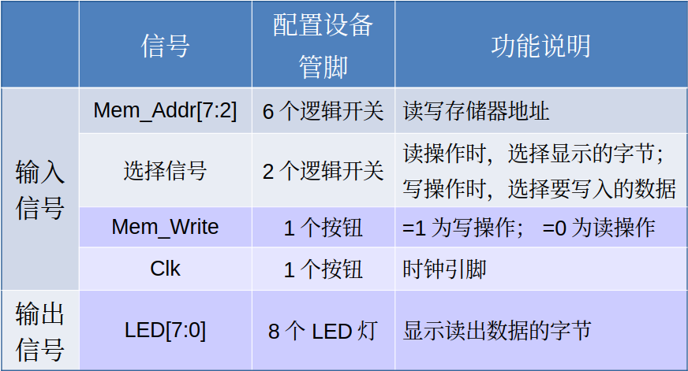

```verilog
//ROM_Instruction.v
/*******************************************************************************
*     This file is owned and controlled by Xilinx and must be used solely      *
*     for design, simulation, implementation and creation of design files      *
*     limited to Xilinx devices or technologies. Use with non-Xilinx           *
*     devices or technologies is expressly prohibited and immediately          *
*     terminates your license.                                                 *
*                                                                              *
*     XILINX IS PROVIDING THIS DESIGN, CODE, OR INFORMATION "AS IS" SOLELY     *
*     FOR USE IN DEVELOPING PROGRAMS AND SOLUTIONS FOR XILINX DEVICES.  BY     *
*     PROVIDING THIS DESIGN, CODE, OR INFORMATION AS ONE POSSIBLE              *
*     IMPLEMENTATION OF THIS FEATURE, APPLICATION OR STANDARD, XILINX IS       *
*     MAKING NO REPRESENTATION THAT THIS IMPLEMENTATION IS FREE FROM ANY       *
*     CLAIMS OF INFRINGEMENT, AND YOU ARE RESPONSIBLE FOR OBTAINING ANY        *
*     RIGHTS YOU MAY REQUIRE FOR YOUR IMPLEMENTATION.  XILINX EXPRESSLY        *
*     DISCLAIMS ANY WARRANTY WHATSOEVER WITH RESPECT TO THE ADEQUACY OF THE    *
*     IMPLEMENTATION, INCLUDING BUT NOT LIMITED TO ANY WARRANTIES OR           *
*     REPRESENTATIONS THAT THIS IMPLEMENTATION IS FREE FROM CLAIMS OF          *
*     INFRINGEMENT, IMPLIED WARRANTIES OF MERCHANTABILITY AND FITNESS FOR A    *
*     PARTICULAR PURPOSE.                                                      *
*                                                                              *
*     Xilinx products are not intended for use in life support appliances,     *
*     devices, or systems.  Use in such applications are expressly             *
*     prohibited.                                                              *
*                                                                              *
*     (c) Copyright 1995-2018 Xilinx, Inc.                                     *
*     All rights reserved.                                                     *
*******************************************************************************/
// You must compile the wrapper file Rom_Instraction.v when simulating
// the core, Rom_Instraction. When compiling the wrapper file, be sure to
// reference the XilinxCoreLib Verilog simulation library. For detailed
// instructions, please refer to the "CORE Generator Help".

// The synthesis directives "translate_off/translate_on" specified below are
// supported by Xilinx, Mentor Graphics and Synplicity synthesis
// tools. Ensure they are correct for your synthesis tool(s).

`timescale 1ns/1ps

module Rom_Instraction(
  clka,
  addra,
  douta
);

input clka;
input [5 : 0] addra;
output [31 : 0] douta;

// synthesis translate_off

  BLK_MEM_GEN_V7_3 #(
    .C_ADDRA_WIDTH(6),
    .C_ADDRB_WIDTH(6),
    .C_ALGORITHM(1),
    .C_AXI_ID_WIDTH(4),
    .C_AXI_SLAVE_TYPE(0),
    .C_AXI_TYPE(1),
    .C_BYTE_SIZE(9),
    .C_COMMON_CLK(0),
    .C_DEFAULT_DATA("0"),
    .C_DISABLE_WARN_BHV_COLL(0),
    .C_DISABLE_WARN_BHV_RANGE(0),
    .C_ENABLE_32BIT_ADDRESS(0),
    .C_FAMILY("artix7"),
    .C_HAS_AXI_ID(0),
    .C_HAS_ENA(0),
    .C_HAS_ENB(0),
    .C_HAS_INJECTERR(0),
    .C_HAS_MEM_OUTPUT_REGS_A(0),
    .C_HAS_MEM_OUTPUT_REGS_B(0),
    .C_HAS_MUX_OUTPUT_REGS_A(0),
    .C_HAS_MUX_OUTPUT_REGS_B(0),
    .C_HAS_REGCEA(0),
    .C_HAS_REGCEB(0),
    .C_HAS_RSTA(0),
    .C_HAS_RSTB(0),
    .C_HAS_SOFTECC_INPUT_REGS_A(0),
    .C_HAS_SOFTECC_OUTPUT_REGS_B(0),
    .C_INIT_FILE("BlankString"),
    .C_INIT_FILE_NAME("Rom_Instraction.mif"),
    .C_INITA_VAL("0"),
    .C_INITB_VAL("0"),
    .C_INTERFACE_TYPE(0),
    .C_LOAD_INIT_FILE(1),
    .C_MEM_TYPE(3),
    .C_MUX_PIPELINE_STAGES(0),
    .C_PRIM_TYPE(1),
    .C_READ_DEPTH_A(64),
    .C_READ_DEPTH_B(64),
    .C_READ_WIDTH_A(32),
    .C_READ_WIDTH_B(32),
    .C_RST_PRIORITY_A("CE"),
    .C_RST_PRIORITY_B("CE"),
    .C_RST_TYPE("SYNC"),
    .C_RSTRAM_A(0),
    .C_RSTRAM_B(0),
    .C_SIM_COLLISION_CHECK("ALL"),
    .C_USE_BRAM_BLOCK(0),
    .C_USE_BYTE_WEA(0),
    .C_USE_BYTE_WEB(0),
    .C_USE_DEFAULT_DATA(0),
    .C_USE_ECC(0),
    .C_USE_SOFTECC(0),
    .C_WEA_WIDTH(1),
    .C_WEB_WIDTH(1),
    .C_WRITE_DEPTH_A(64),
    .C_WRITE_DEPTH_B(64),
    .C_WRITE_MODE_A("WRITE_FIRST"),
    .C_WRITE_MODE_B("WRITE_FIRST"),
    .C_WRITE_WIDTH_A(32),
    .C_WRITE_WIDTH_B(32),
    .C_XDEVICEFAMILY("artix7")
  )
  inst (
    .CLKA(clka),
    .ADDRA(addra),
    .DOUTA(douta),
    .RSTA(),
    .ENA(),
    .REGCEA(),
    .WEA(),
    .DINA(),
    .CLKB(),
    .RSTB(),
    .ENB(),
    .REGCEB(),
    .WEB(),
    .ADDRB(),
    .DINB(),
    .DOUTB(),
    .INJECTSBITERR(),
    .INJECTDBITERR(),
    .SBITERR(),
    .DBITERR(),
    .RDADDRECC(),
    .S_ACLK(),
    .S_ARESETN(),
    .S_AXI_AWID(),
    .S_AXI_AWADDR(),
    .S_AXI_AWLEN(),
    .S_AXI_AWSIZE(),
    .S_AXI_AWBURST(),
    .S_AXI_AWVALID(),
    .S_AXI_AWREADY(),
    .S_AXI_WDATA(),
    .S_AXI_WSTRB(),
    .S_AXI_WLAST(),
    .S_AXI_WVALID(),
    .S_AXI_WREADY(),
    .S_AXI_BID(),
    .S_AXI_BRESP(),
    .S_AXI_BVALID(),
    .S_AXI_BREADY(),
    .S_AXI_ARID(),
    .S_AXI_ARADDR(),
    .S_AXI_ARLEN(),
    .S_AXI_ARSIZE(),
    .S_AXI_ARBURST(),
    .S_AXI_ARVALID(),
    .S_AXI_ARREADY(),
    .S_AXI_RID(),
    .S_AXI_RDATA(),
    .S_AXI_RRESP(),
    .S_AXI_RLAST(),
    .S_AXI_RVALID(),
    .S_AXI_RREADY(),
    .S_AXI_INJECTSBITERR(),
    .S_AXI_INJECTDBITERR(),
    .S_AXI_SBITERR(),
    .S_AXI_DBITERR(),
    .S_AXI_RDADDRECC()
  );

// synthesis translate_on

endmodule
```

本模块实现了指令存储器的功能。

功能实现方式：使用 IP 核生成指令存储器。

### （3）🌞寄存器堆(实验四)

设计一个32×32位的寄存器堆（即含有32个寄存器，每个寄存器32位）

- 双端口读：2个读端口
- 单端口写：1个写端口

#### 输入输出端口示意图

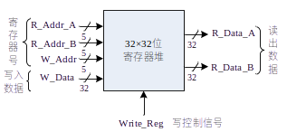

- 读访问操作：无需时钟同步，只要给出寄存器地址，即可读出寄存器中的数据。
- 写访问操作：需要时钟同步，所有写入操作的输入信号必须在时钟边沿来临时，已经有效（Write_Reg=1、地址和数据） 。

#### 寄存器堆功能表

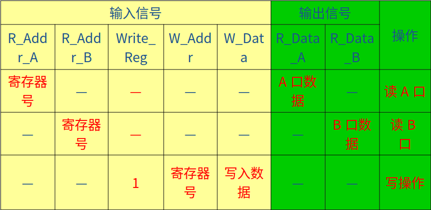

#### 寄存器堆逻辑结构图

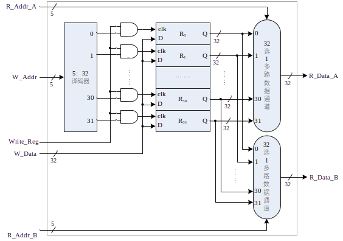

#### 实现

- 寄存器堆：
  - reg类型信号的数组
  - reg [31:0] REG_Files[0:31];
- 读操作：
  - 组合逻辑电路
  - assign R_Data_A = REG_Files[R_Addr_A];
  - assign R_Data_B = REG_Files[R_Addr_B];
- 写操作：
  - 时序逻辑电路
  - 需要Reset信号：用于初始化寄存器（全部清零）
  - 需要clk信号：用于写入寄存器

#### 信号配置表

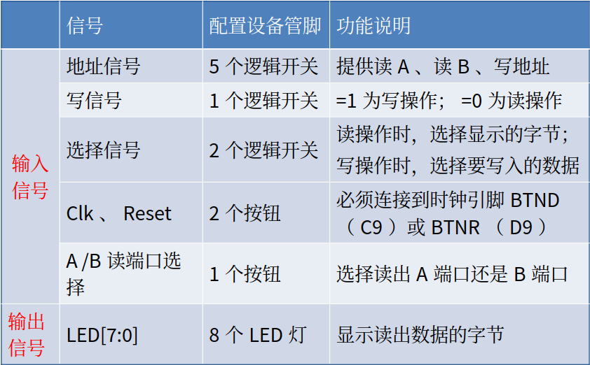


```verilog
`timescale 1ns / 1ps
// 寄存器堆模块
module RegFile(Clk, Clr, Write_Reg,
    R_Addr_A, R_Addr_B, W_Addr,
    W_Data, R_Data_A, R_Data_B);
    parameter ADDR = 5; // 地址位宽
    parameter SIZE = 32; // 数据位宽
    parameter NUMB = 1<<ADDR; // 寄存器个数

    input Clk, Clr, Write_Reg; // 时钟及清零信号, 写控制信号
    input [ADDR:1] R_Addr_A, R_Addr_B; // AB两端口读寄存器地址
    input [ADDR:1] W_Addr; // 写寄存器地址
    input [SIZE:1] W_Data; // 写入数据
    output [SIZE:1] R_Data_A, R_Data_B; // AB两端口读出数据

    reg [SIZE:1] REG_Files[0:NUMB-1]; // NUMB个SIZE位寄存器构成寄存器堆
    integer i; // 用于遍历NUMB个寄存器

    always @(posedge Clk) begin
        if (Clr) for(i=0;i<NUMB;i=i+1) REG_Files[i] <= 0; // 同步清零
        else if(Write_Reg && W_Addr) REG_Files[W_Addr] <= W_Data;
    end // 时钟上跳且写控制高电平时写入, REG_Files[0]即 R0 只读

    // 读操作没有使能或控制信号, 是组合逻辑电路, 使用数据流描述方式建模.
    assign R_Data_A = REG_Files[R_Addr_A];
    assign R_Data_B = REG_Files[R_Addr_B];
endmodule
```

本模块实现了寄存器堆的功能。

功能实现方式：使用数组实现寄存器堆，使用时钟上升沿触发写入，使用组合逻辑实现读取。

### （4）🌞ALU(实验三)

8种运算功能由**多个部件并行实现**，运算结果则经过一个八选一多路数据选择器由3根控制线ALU_OP[2:0]选通输出。

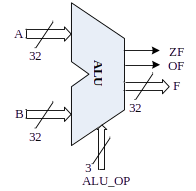

从上到下是

1. and -> 0
2. or -> 1
3. xor -> 2
4. nor -> 3
5. 加减 -> 4/5
6. 比较 -> 6
7. 移位 -> 7

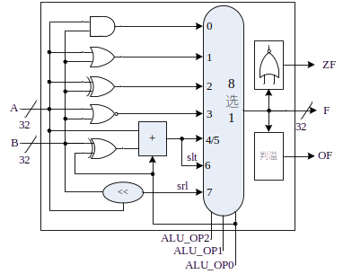


#### 信号配置表 

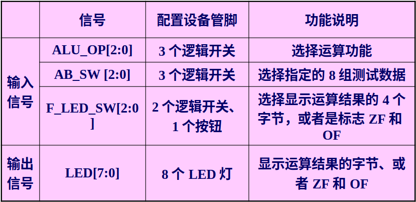


```verilog
`timescale 1ns / 1ps
// ALU 模块, 添加 ADC 运算.
module ALU(OP, A, B, F, ZF, CF, OF, SF, PF);
    parameter SIZE = 32;    // 运算位数
    input [3:0] OP;         // 运算符编码(剩余7个空位)
    input [SIZE:1] A;       // 左操作数 
    input [SIZE:1] B;       // 右操作数
    output reg [SIZE:1] F;  // 运算结果F
    output reg ZF, CF, OF, SF, PF; // 标志位
    reg C; // 最高位进位(减法时将自动取反)
    always @(*) begin
        case(OP) // 判断运算符并进行运算
            0: {C,F} <= A & B;        // 按位与
            1: {C,F} <= A | B;        // 按位或
            2: {C,F} <= A ^ B;        // 按位异或
            3: {C,F} <= ~(A | B);     // 按位或非
            4: {C,F} <= A + B;        // 加法
            5: {C,F} <= A - B;        // 减法
            6: {C,F} <= A < B;        // A<B 则结果为1, 否则为0
            7: {C,F} <= B << A;       // 将 B 左移 A 位
            8: {C,F} <= A + B + 1;    // 低位有进位加法(ADC)
            default: {C,F} <= 0;    // 未定义运算, 结果置零
        endcase
        ZF <= F==0; // 零标志, 结果为全零则置1, 否则置0
        CF <= C;    // 进借位标志取最高位进位(减法时需取反)(只对无符号数有意义)
        OF <= A[SIZE]^B[SIZE]^F[SIZE]^C; // 溢出标志由判溢公式计算(只对有符号数有意义)
        SF <= F[SIZE]; // 符号标志取结果最高位(补码符号位0正1负)(只对有符号数有意义)
        PF <= ~^F;     // 奇偶标志, 结果中1为偶数个则置1, 否则置0
    end
endmodule
```

本模块实现了 ALU 的功能。

功能实现方式：使用 case 语句实现不同的运算。

### （5）指令译码与控制单元

```verilog
`timescale 1ns / 1ps
// 指令译码及控制模块
module Control(OP, func, CF,
    Write_Reg,ALU_OP); // 控制信号
    input [5:0] OP, func; // Inst_code: OP func 字段
    input CF; // 进借位标志寄存器CF, 用于判断adc指令调用的实际运算
    output reg Write_Reg;// 输出控制信号
    output reg [3:0] ALU_OP; // ALU 运算符编码

    always @(*) begin
        if (OP === 6'b00_0000) begin// R型指令, 判断 func 字段
            Write_Reg <= (func !== 6'b00_1111); //则写入寄存器堆
            case(func)// 添加指令 adc(00_D)
                6'b10_0100: ALU_OP <= 4'b0000; // 0 and   按位与
                6'b10_0101: ALU_OP <= 4'b0001; // 1 or    按位或
                6'b10_0110: ALU_OP <= 4'b0010; // 2 xor   按位异或
                6'b10_0111: ALU_OP <= 4'b0011; // 3 nor   按位或非
                6'b10_0000: ALU_OP <= 4'b0100; // 4 add   加法运算(低位无进位 adc)
                6'b10_0010: ALU_OP <= 4'b0101; // 5 sub   减法运算
                6'b10_1011: ALU_OP <= 4'b0110; // 6 sltu  无符号A小于B则置位
                6'b00_0100: ALU_OP <= 4'b0111; // 7 sllv  将B左移A位
                default: ALU_OP <= 4'bXXXX; // R型非算术运算指令, ALU 结果置零
            endcase
        end
        else begin // 未定义指令
            Write_Reg <= 1'bX;
            ALU_OP <= 4'bXXXX;
        end
    end
endmodule
```

## 测试模块

用于测试八条指令的功能是否正确。

```verilog
//simu.v
`timescale 1ns / 1ps
// R型指令CPU测试
module CPU_R_simu();
    reg clk, rst;
    wire [31:0] Inst_code, PC, PC_new, RF_A, RF_B, ALU_F;
    wire [5:0] OP, func;
    wire [4:0] rs, rt, rd;
    wire [3:0] ALU_OP;
    wire Write_Reg,ZF, CF, OF, SF, PF;

    R_CPU CPU_Instance1(clk, rst, // 输入控制信号
        PC, PC_new, Inst_code, OP, func, rs, rt, rd, // 取指令和指令分段模块输出
        Write_Reg, ALU_OP, // 指令译码及控制模块输出
        RF_A, RF_B, // 寄存器堆输出
        ALU_F, ZF, CF, OF, SF, PF // ALU 输出
        ); // 寄存器堆B端口数据输出

    always #50 clk = ~clk;
    initial begin
        clk = 0; rst = 1; #20; rst = 0;

    end
endmodule
```

## 符号解释

### 🌞

🌞这个符号我用来说明这个模块可以沿用之前的代码