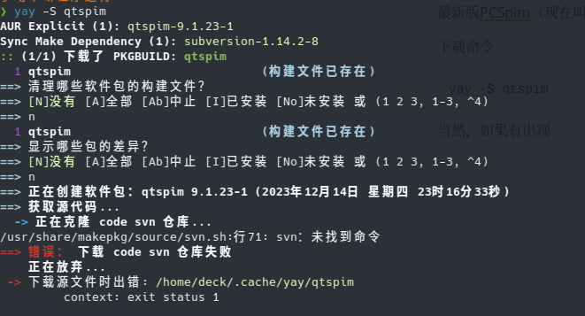
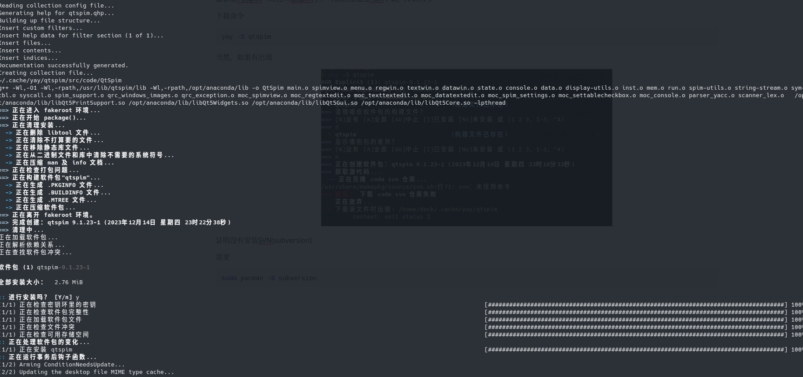
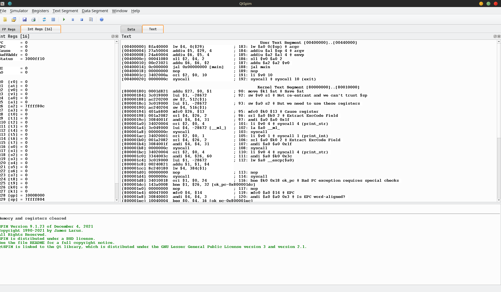
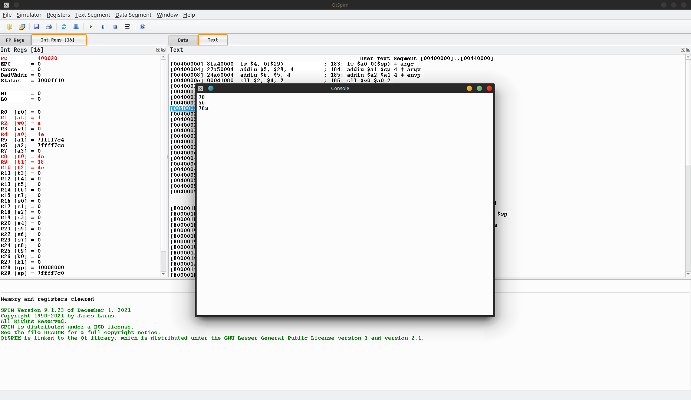
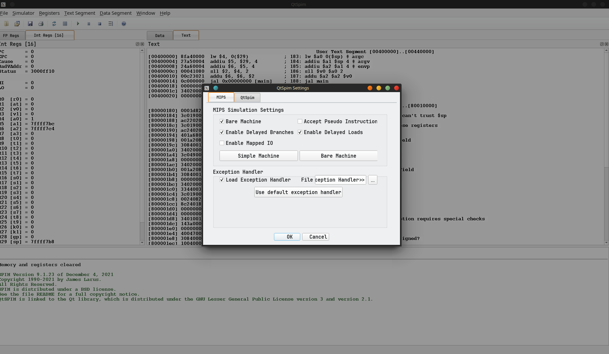
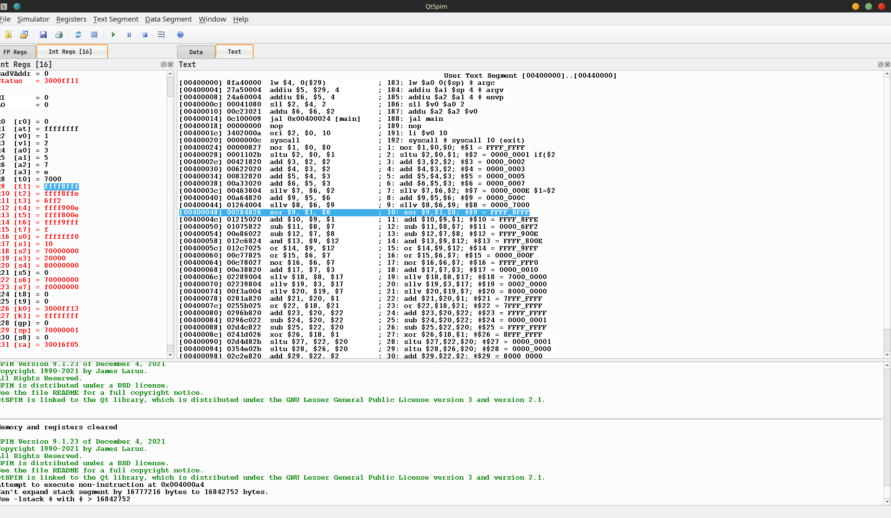

# 实验六

## 安装所需软件

最新版 `PCSpim`（现在叫 qtspim 了）可以直接通过 `AUR` 下载，`Arch` 万岁

下载命令

```bash
yay -S qtspim
```

当然，如果有出现



证明没有安装 `SVN(subversion)`

需要

```bash
sudo pacman -S subversion
```



编译完成后按 `y` 安装完成



## 编辑 asm 文件

用 `vscode` 编辑一个 `test.asm` 文件


```asm
main:	li $v0 , 5
	syscall
	move  $t0,$v0
	li   $v0,5
	syscall
	move $t1 , $v0
	bgt $t0,$t1,t0_bigger
	move $t2,$t1
	b endif
t0_bigger : move $t2,$t0
       endif :move $a0,$t2
                 li $v0,1
	syscall
	jr $ra

```

## 测试 test.asm

导入到 `qtspim` 点击启动，测试



测试正常，返回较大的数。

## 编写并执行 R_CPU_Test.asm

`R_CPU_Test.asm`

```asm
main:nor $1,$0,$0;		#$1 = FFFF_FFFF
sltu $2,$0,$1;		#$2 = 0000_0001 if($2<$3) $1=1 else $1=0
add $3,$2,$2;		#$3 = 0000_0002
add $4,$3,$2;		#$4 = 0000_0003
add $5,$4,$3;		#$5 = 0000_0005
add $6,$5,$3;		#$6 = 0000_0007
sllv $7,$6,$2;		#$7 = 0000_000E $1=$2<<$3
add $9,$5,$6;		#$9 = 0000_000C
sllv $8,$6,$9;		#$8 = 0000_7000
xor $9,$1,$8;		#$9 = FFFF_8FFF
add $10,$9,$1;		#$10 = FFFF_8FFE
sub $11,$8,$7; 		#$11 = 0000_6FF2
sub $12,$7,$8;		#$12 = FFFF_900E
and $13,$9,$12; 	#$13 = FFFF_800E
or $14,$9,$12;		#$14 = FFFF_9FFF
or $15,$6,$7;		#$15 = 0000_000F
nor $16,$6,$7;		#$16 = FFFF_FFF0
add $17,$7,$3;		#$17 = 0000_0010
sllv $18,$8,$17;	#$18 = 7000_0000
sllv $19,$3,$17;	#$19 = 0002_0000
sllv $20,$19,$7;	#$20 = 8000_0000
add $21,$20,$1; 	#$21 = 7FFF_FFFF
or $22,$18,$21;		#$22 = 7FFF_FFFF
add $23,$20,$22;	#$23 = FFFF_FFFF
sub $24,$20,$22;	#$24 = 0000_0001
sub $25,$22,$20;	#$25 = FFFF_FFFF
xor $26,$18,$1;		#$26 = 8FFF_FFFF
sltu $27,$22,$20;	#$27 = 0000_0001
sltu $28,$26,$20;	#$28 = 0000_0000
add $29,$22,$2;		#$29 = 8000_0000
sub $30,$20,$2;		#$30 = 7FFF_FFFF
add $31,$11,$26;	#$31 = 9000_6FF1

```

先切成 `Bare Machine`



逐步执行(好麻烦还是直接一键执行算了)

结果记录表



| 寄存器 | 内容        |
| ------ | ----------- |
| $0     | 0x0000 0000 |
| $1     | 0xffff ffff |
| $2     | 0x0000 0001 |
| $3     | 0x0000 0002 |
| $4     | 0x0000 0003 |
| $5     | 0x0000 0005 |
| $6     | 0x0000 0007 |
| $7     | 0x0000 000e |
| $8     | 0x0000 7000 |
| $9     | 0xffff 8fff |
| $10    | 0xffff 8ffe |
| $11    | 0x0000 6ff2 |
| $12    | 0xffff 900e |
| $13    | 0xffff 800e |
| $14    | 0xffff 9fff |
| $15    | 0x0000 000f |
| $16    | 0xfff ffff0 |
| $17    | 0x0000 0010 |
| $18    | 0x7000 0000 |
| $19    | 0x0002 0000 |
| $20    | 0x8000 0000 |
| $21    | 0x0000 0000 |
| $22    | 0x7000 0000 |
| $23    | 0xf000 0000 |
| $24    | 0x0000 0000 |
| $25    | 0x0000 0000 |
| $26    | 0x3000ff13  |
| $27    | 0xffff ffff |
| $28    | 0x0000 0000 |
| $29    | 0x7000 0001 |
| $30    | 0x0000 0000 |
| $31    | 0x3001 6f05 |

遇到的问题：蹦出来数值溢出的错误之后点了没往下走以为是我的 `qtspim` 有问题，结果是直接运行就好了，不用管那个报错。

解决方法：直接点绿色的运行按钮就好了
