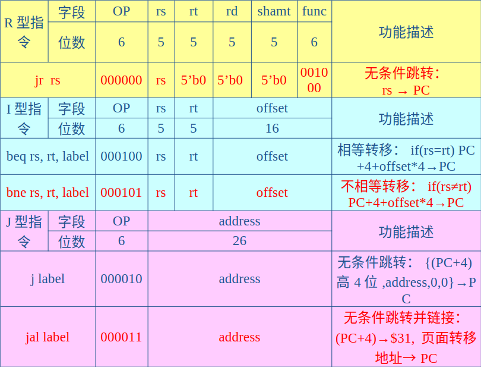

# 实验十：R-I-J 型指令的 CPU

## 1、实验目的

- 掌握 MIPS R 型、I 型和 J 型指令的综合数据通路设计

- 掌握各种转移类指令的控制流和指令流的多路选通控制方法；
- 掌握 J 型、I 型和 R 型转移指令的指令格式和寻址方式，学习转移地址的产生方法
- 掌握无条件转移指令和条件转移指令的实现方法；
- 编程实现 MIPS 的部分 J 型、I 型和 R 型转移指令的功能

## 2、实验内容与原理

实验九的基础上，预备实现 1 条 R 型转移指令、2 条 I 型条件转移指令和 2 条 J 型转移指令。
与原理课相比，多了 3 条转移指令。



从上表可知：

### J 型格式的指令

6 位的 OP 字段和 26 位的 address 字段构成
26 位的 address 不是直接转移地址，需要和（PC+4）的高 4 位并位处理

### 2 条 J 型格式的指令 j 和 jal 是无条件必转指令

相比 j 指令，jal 指令不仅转移，且在转移前，将 jal 指令的下一条指令的地址保存到编号为 31 的$ra（$31）寄存器。

### R 型格式必转指令 jr

将 rs 寄存器中的 32 位数据作指令地址，直接置入 PC;常和 jal 搭配使用，用于子程序的调用与返回

### jal 指令

相当于 call（子程序调用）指令，jr 指令相当于 ret（子程序返回）指令

```txt
#主存地址：指令
……
0x0040_0000:jal	subroutine1;#子程序调用,$ra=0x0040_0004
0x0040_0004: ……
……
0x0040_0038: subroutine1: 	……
……
0x0040_0040:jr	$31; #子程序返回
0x0040_0044:	……
```

### 2 条条件转移指令是 I 型指令格式

offset 是带符号数，需做符号扩展（为 32 位）后，再左移两位，与新的 PC 值（PC+4）相加，得到转移地址

### （2）转移指令的数据通路

#### 分析 5 条转移指令，转移地址的产生方法有 3 种：

（1）rs；
（2）PC+4+offset\*4；
（3）{(PC+4)高 4 位,address,0,0}；

#### 如何产生 PC 后继地址

**对于 PC 自增**，可以使用 PC_new（=PC+4）
**对于 rs**，直接使用寄存器堆的读出 A 数据端口
**对于相对转移**，添加一个地址加法器，将 PC_new 和符号扩展和左移 2 位后的 offset 相加
**对于页面寻址的转移地址**,需简单的左移和拼接操作


wr_data_s 信号用于选择写入寄存器的数据来源

用 Verilog HDL 描述如下：

```verilog
assign W_Addr = (w_r_s[1]) ? 5’b11111 : ((w_r_s[0]) ? rt : rd);
assign W_Data = (wr_data_s[1]) ? PC_new : ((wr_data_s[0]) ? M_R_Data : ALU_F);
```

PC 的四选一数据选择器及转移地址的计算

```verilog
always @(negedge clk)
case (PC_s)
	2’b00:	PC <= PC_new;
	2’b01:	PC <= R_Data_A;
	2’b10:	PC <= PC_new + (imm_data<<2);
	2’b11:	PC <= {PC_new[31:28], address, 2’b00};
endcase
```


### R-I-J型指令的控制流


### （3）指令测试

在MIPS模拟器上用实现的8条R型指令、6条I型指令和5条J型指令，编写一段用于测试的汇编程序
测试程序1（将内存单元10H开始的20个数据进行累加，累加和送至内存单元30H单元)

```verilog
#baseAddr 0000
	add	$t0,	$zero,	$zero;	#$8=0000_0000，累加器
	add	$t1,	$zero,	$zero;	#$9=0000_0000，变址指针
	addi	$t2,	$zero,	20;	#$10=0000_0014，计数器
Loop1:	lw 	$t3,	0x10($t1);	#$11=mem(0000_0010+$9)
	add	$t0,$t0,	$t3		#$8=累加和
	addi	$t1,$t1,	4		#指针+4
	addi	$t2,$t2,	-1		#$10=计数器-1
	beq 	$t2,$zero,Loop2	#$10等于0，则跳出循环
	j	Loop1
Loop2:	sw $t3,	0x30($zero)		#存数到0x30H单元
```

程序1汇编后机器码

```bash
00004020, 00004820, 200a0014, 8d2b0010, 010b4020, 21290004, 214affff, 11400001, 08000003, ac0b0030
```

程序2（将内存0号单元开始的10个数据复制20号单元开始的数据区，其中使用了BankMove子程序）

```verilog
#主程序：
#baseAddr 0000
 add  $a0, $zero, $zero;     #$a0=0000_0000源数据区域首址
 addi	$a1,$zero,20;         #$a1=0000_0014，目的数据区域首址
 addi	$a2, $zero,10;        #$a2=0000_000a，复制的数据个数
 jal	BankMove	     #子程序调用
#BankMove子程序：
 	add	$t0, $a0, $zero; 	#$t0=源数据区域首址
 	add	$t1, $a1, $zero;		#$t1=目的数据区域首址
 	add	$t2,	$a2,	$zero;	#$t2=数据块长度
Loop1:	lw	$t3,	0($t0);	#$t3=取出数据
	sw	$t3,	0($t1); 	#存数据
	addi	$t2,	$t2,	-1;       #计数值-1
	bne	$t2, $zero, Loop1;	#计数值≠0，则没有复制完，转循环体首部
	jr	$ra	#复制完成，则子程序返回
				
```

程序2汇编后，机器码如下：

```bash
00002020, 20050014, 2006000a, 0c000004, 00804020, 00a04820, 00c05020, 8d0b0000, ad2b0000, 214affff , 1540fffc, 03e00008
```

## 3、实验要求

1. 实验九的基础上，编写一个CPU模块，除了能够实现实验九的8条R型指令、6条I型指令外，还要求能够实现新的5条J型指令
   1. 将实验九的工程拷贝至新目录下,成为一个新工程；修改ROM_B和RAM_B的初始化关联文件为新工程下的*.coe文件。
   2. 定义一些控制和数据信号,添加PC的四选一数据通道和移位部件、地址加法器部件,重新对各模块进行逻辑连接。
   3. 修改和扩充CPU模块中指令译码、指令执行控制部分的代码，完善CPU模块

### 实验代码：

#### 顶层模块

```verilog
module CPU(
    input clk, rst, OF, ZF, F, ALU_OP, M_R_Data, w_r_s, imm_s, rt_imm_s, Mem_Write, Write_Reg, PC, PC_s, clk_M, R_Data_B, Inst_code
);
    output [31:0] Inst_code;  // 指令代码输出

    wire [5:0] op_code, funct;  // 操作码和功能码
    wire [4:0] rs_addr, rt_addr, rd_addr, shamt;  // 寄存器地址和移位量
    output [31:0] F;  // ALU 结果输出
    output OF, ZF;  // 溢出标志和零标志
    output [31:0] M_R_Data;  // 存储器读取数据
    output [2:0] ALU_OP;  // ALU 操作码
    wire [31:0] Mem_Addr;  // 存储器地址
    wire [4:0] W_Addr;  // 写入地址
    output imm_s, rt_imm_s, Mem_Write, Write_Reg;  // 立即数标志、寄存器写入标志和写寄存器地址
    output [1:0] w_r_s;  // 寄存器写入选择
    wire [31:0] imm_data;  // 立即数数据
    wire [31:0] R_Data_A;  // 寄存器数据 A
    output [31:0] R_Data_B;  // 寄存器数据 B
    wire [15:0] imm;  // 立即数
    wire [31:0] ALU_B;  // ALU 操作数 B
    wire [31:0] W_Data;  // 写入数据
    output [1:0] PC_s;  // 程序计数器状态
    wire [25:0] address;  // 地址
    wire [1:0] wr_data_s;  // 写入数据选择
    wire [31:0] PC_new;  // 新程序计数器值
    output [31:0] PC;  // 程序计数器

    // 调用程序计数器模块，用于管理程序计数器的状态
    PC pc1(clk, rst, Inst_code, PC_s, R_Data_A, address, PC, imm_data, PC_new);

    // 提取操作码、寄存器地址和功能码
    assign op_code = Inst_code[31:26];
    assign rs_addr = Inst_code[25:21];
    assign rt_addr = Inst_code[20:16];
    assign rd_addr = Inst_code[15:11];
    assign shamt = Inst_code[10:6];
    assign funct = Inst_code[5:0];
    assign imm = Inst_code[15:0];
    assign address = Inst_code[25:0];

    // 调用操作功能模块，用于执行指令的操作
    OP_Func op(op_code, funct, Write_Reg, ALU_OP, w_r_s, imm_s, rt_imm_s, Mem_Write, wr_data_s, PC_s, ZF);

    // 决定写入地址，根据写寄存器选择不同的写入地址
    assign W_Addr = (w_r_s[1]) ? 5'b11111 : ((w_r_s[0]) ? rt_addr : rd_addr);

    // 根据立即数标志选择立即数或寄存器数据作为写入数据
    assign imm_data = (imm_s) ? {{16{imm[15]}}, imm} : {{16{1'b0}}, imm};

    // 调用第四个实验模块，用于写入数据到寄存器
    MyRegFile F1(rs_addr, rt_addr, Write_Reg, R_Data_A, R_Data_B, rst, ~clk, W_Addr, W_Data);

    // 根据立即数或寄存器数据选择 ALU 操作数 B
    assign ALU_B = (rt_imm_s) ? imm_data : R_Data_B;

    // 调用第三个实验模块，用于执行 ALU 操作
    MyALU T1(OF, ZF, ALU_OP, R_Data_A, ALU_B, F);

    // 调用 RAM 模块，用于存储器读写
    RAM RAM_B (
        .clka(clk_M),  // 输入 clka
        .wea(Mem_Write),  // 输入 wea
        .addra(F[5:0]),  // 输入 addra
        .dina(R_Data_B),  // 输入 dina
        .douta(M_R_Data)  // 输出 douta
    );

    // 根据写入数据选择决定写入数据来源
    assign W_Data = (wr_data_s[1]) ? PC_new : ((wr_data_s[0]) ? M_R_Data : F);
endmodule

```

