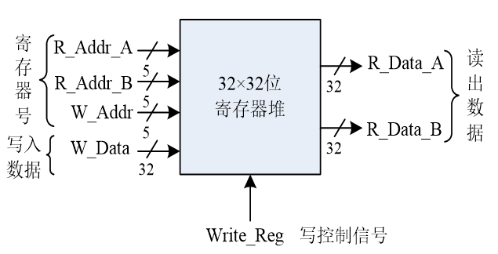
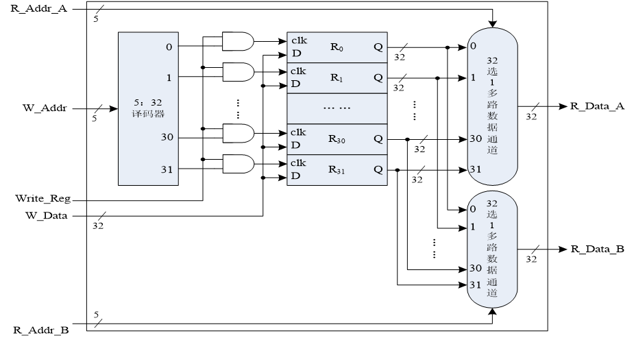

# 实验四

## 1、实验目的

学习使用Verilog HDL语言进行时序电路的设计方法；
掌握灵活运用Verilog HDL语言进行各种描述与建模的技巧和方法；
学习寄存器堆的数据传送与读写工作原理，掌握寄存器堆的设计方法。

## 2、实验内容与原理

- 设计一个32×32位的寄存器堆（即含有32个寄存器，每个寄存器32位）

### **输入输出端口示意图**



- 双端口读：2个读端口
- 单端口写：1个写端口

- 读访问操作：无需时钟同步，只要给出寄存器地址，即可读出寄存器中的数据。
- 写访问操作：需要时钟同步，所有写入操作的输入信号必须在时钟边沿来临时，已经有效（Write_Reg=1、地址和数据） 。

### 寄存器堆功能表

| **输入信号** |              |               |              |              | **输出信号** |              | **操作**   |
| ------------ | ------------ | ------------- | ------------ | ------------ | ------------ | ------------ | ---------- |
| **R_Addr_A** | **R_Addr_B** | **Write_Reg** | **W_Addr**   | **W_Data**   | **R_Data_A** | **R_Data_B** |            |
| **寄存器号** | **—**        | **—**         | **—**        | **—**        | **A口数据**  | **—**        | **读A口**  |
| **—**        | **寄存器号** | **—**         | **—**        | **—**        | **—**        | **B口数据**  | **读B口**  |
| **—**        | **—**        | **1**         | **寄存器号** | **写入数据** | **—**        | **—**        | **写操作** |

### 寄存器堆逻辑结构图



### 实验实现

- 寄存器堆：reg类型信号的数组
  - reg [31:0] REG_Files[0:31];
- 读操作：组合逻辑电路
  - assign R_Data_A = REG_Files[R_Addr_A];
  - assign R_Data_B = REG_Files[R_Addr_B];
- 写操作：时序逻辑电路
  - 需要Reset信号：用于初始化寄存器（全部清零）
  - 需要clk信号：用于写入寄存器

```verilog
 always @(posedge Clk or posedge Reset)
 begin
  if(Reset) //高电平有效，=1则初始化
   ……//初始化32个寄存器
  else
   begin
    if (Write_Reg) 
      ……//写入寄存器;
   end
 end
```

## 3、实验要求

- 编程实现基本的寄存器堆模块，并通过仿真验证；
- 编写一个实验验证的顶层模块，调用该寄存器堆模块
- 参考方法如下：
  - 使用5位开关提供读写的寄存器地址；
  - 1位开关提供Write_Reg信号；指定Write_Reg=0时执行读操作；=1时执行写操作；
  - 2位开关作为复用控制：若为读操作时，用于选择读出的32位数据的某个字节到8位LED灯显示；若为写操作，则选择4个指定数据之一作为写入数据。
  - 1个按钮提供Clk；1个按钮提供Reset；一个按钮作为读A端口/B端口的选择；
  - 8位LED灯作为读出数据的字节显示

### 信号配置表


### 代码实现

#### 顶层模块

```verilog
module TopLevelModule(Opt, Addr, Write_Reg, Clk, Reset, A_B, LED);
    input [1:0] Opt;
    input [4:0] Addr;
    input Write_Reg, Clk, Reset, A_B;
    output reg [7:0] LED;

    wire [31:0] R_Data_A, R_Data_B;
    reg [4:0] R_Addr_A, R_Addr_B;
    reg [31:0] W_Data;

    // 您的寄存器堆模块实例
    RegFile reg_file (
        .Clk(Clk),// 把顶层模块的时钟信号传递给寄存器堆模块
        .Clr(Reset),// 把顶层模块的复位信号传递给寄存器堆模块
        .Write_Reg(Write_Reg),// 把顶层模块的写使能信号传递给寄存器堆模块
        .R_Addr_A(R_Addr_A),// 把顶层模块的A端口读地址传递给寄存器堆模块
        .R_Addr_B(R_Addr_B),// 把顶层模块的B端口读地址传递给寄存器堆模块
        .W_Addr(Addr),// 把顶层模块的写地址传递给寄存器堆模块
        .W_Data(W_Data),// 把顶层模块的写数据传递给寄存器堆模块
        .R_Data_A(R_Data_A),// 把寄存器堆模块的A端口读数据传递给顶层模块
        .R_Data_B(R_Data_B)// 把寄存器堆模块的B端口读数据传递给顶层模块
    );

    initial LED <= 0;

    always @(posedge Clk or posedge Reset) begin
        if (Reset) begin
            LED <= 0;
        end else begin
            if (Write_Reg) begin
                // 根据Opt选择写入的数据
                case (Opt)
                    2'b00: W_Data = 32'h000f_000f;
                    2'b01: W_Data = 32'h0f0f_0f00;
                    2'b10: W_Data = 32'hf0f0_f0f0;
                    2'b11: W_Data = 32'hffff_ffff;
                endcase
            end else begin
                if (A_B) begin
                    R_Addr_A = Addr;
                    // 根据Opt显示R_Data_A的不同部分
                    case (Opt)
                        2'b00: LED = R_Data_A[7:0];
                        2'b01: LED = R_Data_A[15:8];
                        2'b10: LED = R_Data_A[23:16];
                        2'b11: LED = R_Data_A[31:24];
                    endcase
                end else begin
                    R_Addr_B = Addr;
                    // 根据Opt显示R_Data_B的不同部分
                    case (Opt)
                        2'b00: LED = R_Data_B[7:0];
                        2'b01: LED = R_Data_B[15:8];
                        2'b10: LED = R_Data_B[23:16];
                        2'b11: LED = R_Data_B[31:24];
                    endcase
                end
            end
        end
    end
endmodule

```

#### 寄存器堆实现

```verilog
`timescale 1ns / 1ps
// 寄存器堆模块
module RegFile(Clk, Clr, Write_Reg,
    R_Addr_A, R_Addr_B, W_Addr,
    W_Data, R_Data_A, R_Data_B);
    parameter ADDR = 5; // 地址位宽
    parameter SIZE = 32; // 数据位宽
    parameter NUMB = 1<<ADDR; // 寄存器个数

    input Clk, Clr, Write_Reg; // 时钟及清零信号, 写控制信号
    input [ADDR:1] R_Addr_A, R_Addr_B; // AB两端口读寄存器地址
    input [ADDR:1] W_Addr; // 写寄存器地址
    input [SIZE:1] W_Data; // 写入数据
    output [SIZE:1] R_Data_A, R_Data_B; // AB两端口读出数据

    reg [SIZE:1] REG_Files[0:NUMB-1]; // NUMB个SIZE位寄存器构成寄存器堆
    integer i; // 用于遍历NUMB个寄存器

    always @(posedge Clk) begin
        if (Clr) for(i=0;i<NUMB;i=i+1) REG_Files[i] <= 0; // 同步清零
        else if(Write_Reg && W_Addr) REG_Files[W_Addr] <= W_Data;
    end // 时钟上跳且写控制高电平时写入, REG_Files[0]即 R0 只读

    // 读操作没有使能或控制信号, 是组合逻辑电路, 使用数据流描述方式建模.
    assign R_Data_A = REG_Files[R_Addr_A];
    assign R_Data_B = REG_Files[R_Addr_B];
endmodule
```

本模块实现了寄存器堆的功能。

功能实现方式：使用数组实现寄存器堆，使用时钟上升沿触发写入，使用组合逻辑实现读取。

1. **模块声明和参数定义**：定义了模块`RegFile`，包括输入输出端口和一些参数设置，比如地址位宽`ADDR`、数据位宽`SIZE`以及寄存器个数`NUMB`。

2. **输入输出端口**：定义了时钟信号`Clk`、清零信号`Clr`、写控制信号`Write_Reg`，两个读地址`R_Addr_A`和`R_Addr_B`，一个写地址`W_Addr`，以及写入数据`W_Data`和两个读出数据`R_Data_A`和`R_Data_B`。

3. **寄存器数组**：使用`reg [SIZE:1] REG_Files[0:NUMB-1]`定义了一个寄存器数组，用于存储数据。

4. **写操作逻辑**：在时钟上升沿（`posedge Clk`），如果`Clr`为高，则清零所有寄存器；如果`Write_Reg`为高且`W_Addr`非零，则将`W_Data`写入指定的寄存器。注意这里保留了`REG_Files[0]`（即R0寄存器）为只读。

5. **读操作逻辑**：通过组合逻辑将指定地址的寄存器内容分配给`R_Data_A`和`R_Data_B`。

这个模块实现了一个基本的寄存器堆功能，支持同步清零、同步写入和组合逻辑读取。

####  测试模块

```verilog
module Fourth_experiment_test;
    // Inputs
    reg [4:0] Addr;
    reg Write_Reg;
    reg [1:0] Opt;
    reg Clk;
    reg Reset;
    reg A_B;

    // Outputs
    wire [7:0] LED;

    // 实例化您的寄存器堆顶层模块
    TopLevelModule uut (
        .Addr(Addr), 
        .Write_Reg(Write_Reg), 
        .Opt(Opt), 
        .Clk(Clk), 
        .Reset(Reset), 
        .A_B(A_B), 
        .LED(LED)
    );

    // 时钟信号生成
    always #20 Clk = ~Clk;

    // 初始测试条件
    initial begin
        // 初始化信号
        Clk = 0;
        Reset = 1; // 初始时进行复位
        #40; // 等待一段时间以完成复位
        Reset = 0; // 关闭复位信号

        // 测试写入操作
        Addr = 5'b00001; // 设置写入地址
        Write_Reg = 1; // 启用写操作
        Opt = 2'b00; // 设置写入数据选项
        A_B = 0; // A/B 选择不影响写操作
        #40; // 等待一个时钟周期以执行写操作

        // 测试读取操作
        Write_Reg = 0; // 关闭写操作
        A_B = 1; // 选择读取R_Data_A
        Opt = 2'b00; // 选择输出R_Data_A的低8位到LED
        #40; // 等待一个时钟周期以执行读操作
    end
endmodule

```


## 4、实验步骤

1. 在Xilinx ISE中创建工程，编源码，然后编译、综合
2. 编写激励代码，观察仿真波形，直至验证正确

## 5、思考与探索

（1）选择8个寄存器执行读写操作，将实验结果记录到表中，结果是否符合预期；如果不符，分析原因。
（2）修改基本寄存器堆模块，实现MIPS计算机的寄存器堆，以供后续MIPS CPU的设计使用。
（3）谈谈实验中读操作和写操作在时序上有何区别？反映到电路实现上，又有何不同？
