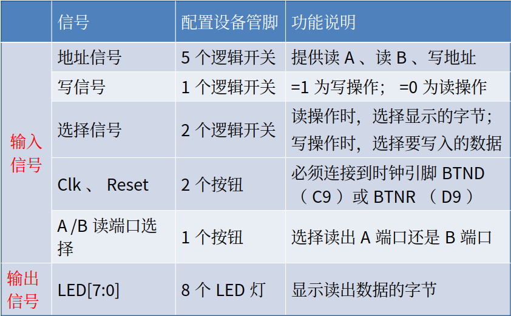

# 实验四

## 1、实验目的

学习使用Verilog HDL语言进行时序电路的设计方法；
掌握灵活运用Verilog HDL语言进行各种描述与建模的技巧和方法；
学习寄存器堆的数据传送与读写工作原理，掌握寄存器堆的设计方法。

## 2、实验内容与原理

- 设计一个32×32位的寄存器堆（即含有32个寄存器，每个寄存器32位）

### **输入输出端口示意图**


- 双端口读：2个读端口
- 单端口写：1个写端口

- 读访问操作：无需时钟同步，只要给出寄存器地址，即可读出寄存器中的数据。
- 写访问操作：需要时钟同步，所有写入操作的输入信号必须在时钟边沿来临时，已经有效（Write_Reg=1、地址和数据） 。

### 寄存器堆功能表

| **输入信号** |              |               |              |              | **输出信号** |              | **操作**   |
| ------------ | ------------ | ------------- | ------------ | ------------ | ------------ | ------------ | ---------- |
| **R_Addr_A** | **R_Addr_B** | **Write_Reg** | **W_Addr**   | **W_Data**   | **R_Data_A** | **R_Data_B** |            |
| **寄存器号** | **—**        | **—**         | **—**        | **—**        | **A口数据**  | **—**        | **读A口**  |
| **—**        | **寄存器号** | **—**         | **—**        | **—**        | **—**        | **B口数据**  | **读B口**  |
| **—**        | **—**        | **1**         | **寄存器号** | **写入数据** | **—**        | **—**        | **写操作** |

### 寄存器堆逻辑结构图 


### 实验实现

- 寄存器堆：reg类型信号的数组
  - reg [31:0] REG_Files[0:31];
- 读操作：组合逻辑电路
  - assign R_Data_A = REG_Files[R_Addr_A];
  - assign R_Data_B = REG_Files[R_Addr_B];
- 写操作：时序逻辑电路
  - 需要Reset信号：用于初始化寄存器（全部清零）
  - 需要clk信号：用于写入寄存器

```verilog
 always @(posedge Clk or posedge Reset)
 begin
  if(Reset) //高电平有效，=1则初始化
   ……//初始化32个寄存器
  else
   begin
    if (Write_Reg) 
      ……//写入寄存器;
   end
 end
```

## 3、实验要求

- 编程实现基本的寄存器堆模块，并通过仿真验证；
- 编写一个实验验证的顶层模块，调用该寄存器堆模块
- 参考方法如下：
  - 使用5位开关提供读写的寄存器地址；
  - 1位开关提供Write_Reg信号；指定Write_Reg=0时执行读操作；=1时执行写操作；
  - 2位开关作为复用控制：若为读操作时，用于选择读出的32位数据的某个字节到8位LED灯显示；若为写操作，则选择4个指定数据之一作为写入数据。
  - 1个按钮提供Clk；1个按钮提供Reset；一个按钮作为读A端口/B端口的选择；
  - 8位LED灯作为读出数据的字节显示

### 信号配置表



### 代码实现

```verilog
`timescale 1ns / 1ps
// 寄存器堆模块
module RegFile(Clk, Clr, Write_Reg,
    R_Addr_A, R_Addr_B, W_Addr,
    W_Data, R_Data_A, R_Data_B);
    parameter ADDR = 5; // 地址位宽
    parameter SIZE = 32; // 数据位宽
    parameter NUMB = 1<<ADDR; // 寄存器个数

    input Clk, Clr, Write_Reg; // 时钟及清零信号, 写控制信号
    input [ADDR:1] R_Addr_A, R_Addr_B; // AB两端口读寄存器地址
    input [ADDR:1] W_Addr; // 写寄存器地址
    input [SIZE:1] W_Data; // 写入数据
    output [SIZE:1] R_Data_A, R_Data_B; // AB两端口读出数据

    reg [SIZE:1] REG_Files[0:NUMB-1]; // NUMB个SIZE位寄存器构成寄存器堆
    integer i; // 用于遍历NUMB个寄存器

    always @(posedge Clk) begin
        if (Clr) for(i=0;i<NUMB;i=i+1) REG_Files[i] <= 0; // 同步清零
        else if(Write_Reg && W_Addr) REG_Files[W_Addr] <= W_Data;
    end // 时钟上跳且写控制高电平时写入, REG_Files[0]即 R0 只读

    // 读操作没有使能或控制信号, 是组合逻辑电路, 使用数据流描述方式建模.
    assign R_Data_A = REG_Files[R_Addr_A];
    assign R_Data_B = REG_Files[R_Addr_B];
endmodule
```

本模块实现了寄存器堆的功能。

功能实现方式：使用数组实现寄存器堆，使用时钟上升沿触发写入，使用组合逻辑实现读取。
