# MIPS 指令集及汇编

**摘抄自学习通课件。不知道最早来源在哪，格式略有改动。**

## 一、MIPS 简介

MIPS 为美国芯片设计公司，它采用的是精简指令系统计算结构（RISC 结构）（与之对应的：（复杂指令集）CISC 结构）。MIPS 架构的产品多见于工作站（索尼 PS2 的 Emotion Engine 处理器）。RISC 比 CISC 的设计更加简单，由于其授权费用低，被 INTEL 外的大多数厂商使用。同时在设计理念上 MIPS 强调软硬件协同提高计算机性能，并简化硬件设计。

MIPS 是最早的，最成功的 RISC 处理器之一，源于 Stanford 大学的 John Hennessy 教授的研究成果。（Hennessy 于 1984 年在硅谷创建了 MIPS 公司）。MIPS 是（Microcomputer without interlocked pipeline stages）的缩写，含义是**无互锁流水级微处理器**。

MIPS 的指令系统经过通用处理器指令体系 MIPS I、 MIPS II、MIPS III、MIPS IV 到 MIPS V，嵌入 式指令体系 MIPS16、MIPS32 到 MIPS64 的发展 已经十分成熟。应用广泛的 32 位 MIPS CPU 包括 R2000，R3000 其 ISA 都是 MIPS I，另一个广泛使用的、含有许多 重要改进的 64 位 MIPS CPU R4000 及其后续产 品，其 ISA 版本为 MIPS III。龙芯 2E 微处理器是一款实现 64 位 MIPSⅢ 指令集的通用 RISC 处理器，**与 X86 指令架构互不兼容**；芯片面积 6.8mm×5.2mm；最高工作频率为 1GHz；实测功耗 5-7 瓦。由于与 X86 指令的不兼容，龙芯 2E 无法运行现有的 Windows 32/64 位操作系统，和基于 Windows 的 众多应用软件。

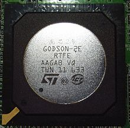

## 二、MIPS 体系结构

### 1.寄存器特点

MIPS 包含 32 个通用寄存器 （$0-$31 均为 32 位），硬件没有强制性的指定寄存器使用规则，但是在实际使用中，这些寄存器的用法都遵循一系列约定，寄存器约定用法引入了一系列的寄存器约定名。在使用寄存器的时候，要尽量用这些约定名或助记符，而不直接引用寄存器编号。

<table>
    <tr>
        <td colspan="3">寄存器特点</td>
    </tr>
    <tr>
        <td>编号</td>
        <td>助记符</td>
        <td>用法</td>
    </tr>
    <tr>
        <td>$0</td>
        <td>$zero</td>
        <td>恒为0</td>
    </tr>
    <tr>
        <td>$1</td>
        <td>$at</td>
        <td>用作汇编器的暂时变量</td>
    </tr>
    <tr>
        <td>$2-$3</td>
        <td>$v0-$v1</td>
        <td>子函数调用返回结果</td>
    </tr>
    <tr>
        <td>$4-$7</td>
        <td>$a0-$a3</td>
        <td>子函数调用参数</td>
    </tr>
    <tr>
        <td>$8-$15</td>
        <td>$t0-$t7</td>
        <td>临时变量，子函数使用时不需要保存与恢复</td>
    </tr>
    <tr>
        <td>$16-$23</td>
        <td>$s0-$s7</td>
        <td>保存变量，子函数使用时需要保存与恢复</td>
    </tr>
    <tr>
        <td>$24-$25</td>
        <td>$t8-$t9</td>
        <td>临时变量，子函数使用时不需要保存与恢复</td>
    </tr>
    <tr>
        <td>$26-$27</td>
        <td>$k0-$k1</td>
        <td>通常被中断或异常处理程序使用作为保存一些系统参数</td>
    </tr>
    <tr>
        <td>$28</td>
        <td>$gp</td>
        <td>全局指针，指向全局数据区，一些运行系统维护这个指针来更方便的存取staic和extern变量</td>
    </tr>
    <tr>
        <td>$29</td>
        <td>$sp</td>
        <td>堆栈指针，指向当前堆栈顶部</td>
    </tr>
    <tr>
        <td>$30</td>
        <td>$fp</td>
        <td>帧指针，指向当前过程的帧的底部 第9个寄存器变量。 框架指针</td>
    </tr>
    <tr>
        <td>$31</td>
        <td>$ra</td>
        <td>返回地址，子函数调用时保存返回地址</td>
    </tr>
</table>

### （1）两个特殊寄存器

$0：不管你存放什么值，其返回值永远是零。
$31：永远存放着正常函数调用指令(jal)的返回地址。

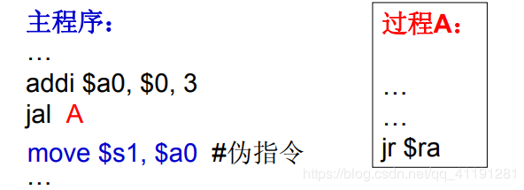

### （2）$at

由编译器生成的复合指令使用

### （3）$v0, $v1

用来存放一个子程序 (函数) 的非浮点 运算的结果或返回值。如果这两个寄存器不够存放 需要返回的值，编译器将会通过内存来完成。

### （4）$ a0-a3

用来传递子函数调用时前 4 个非 浮点参数。

### （5）$ t0-t9

依照约定，一个子函数可以不用保 存并随便的使用这些寄存器。在作表达式计算时，这些寄存器是非常好的暂时变量。当调用一个子函数时，这些寄存器中的 值有可能被子函数破坏掉。所以也是最不安全的。

### （6）$ s0-s8

依照约定，子函数必须保证当函数返回时这些寄存器的内 容必须恢复到函数调用以前的值，或者在子函数里不用这些寄存器或把它们保存 在堆栈上并在函数退出时恢复。这种约定使得这些寄存器非常适合作为寄存器变量、 或存放一些在函数调用期间必须保存的原来的值。（类比：x86 汇编中的函数序言和函数尾声）

### （7）$ k0, k1

被 OS 的异常或中断处理程序使 用。被使用后将不会恢复原来的值。因此它 们很少在别的地方被使用。

### （8）$gp

如果存在一个全局指针，它将指向运行时决定 的静态数据(static data)区域的一个位置。这意味 着，利用 gp 作基指针，在 gp 指针 32K 左右的数 据存取，系统只需要一条指令就可完成。该指令如图：

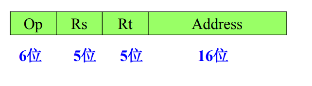
如果没有全局指针，存取一个静态数据区域 的值需要两条指令：一条是获取有编译器和 loader 决定好的 32 位的地 址常量。另外一条是对数据的真正存取。为了使用$ gp, 编译器在编译时刻必须知道 一个数据是否在$ gp 的 64K（上下 32k）范围之内。并不是所有的编译和运行系统支持 gp 的使用。

### （9）$sp

堆栈指针的上下需要显式的通过指令来实现。因此 MIPS 通常只在子函数进入和退出的时刻才调整堆栈的指针。这通过被调用的子函数来实现。SP 通常被调整到这个被调用的子函数需要的堆栈的最低的地方，从而编译器可以通过相对于 sp 的偏移量来存取堆栈上的堆栈变量。
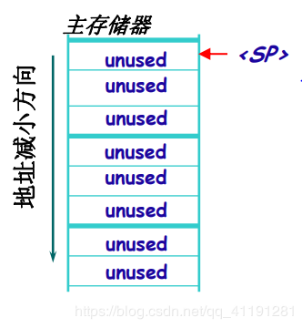

### （10）$fp（另外的约定名是 s8）

fp 作为框架指针可以被函数用来记录堆栈的情况，在一个过程中变量相对于函数指针的偏移量是不变的。（相对地址）一些 编程语言显示的支持这一点。汇编编程员经常会利用 fp 的 这个用法。C 语言的库函数 alloca( )就是利用了 fp 来动态 调整堆栈的。

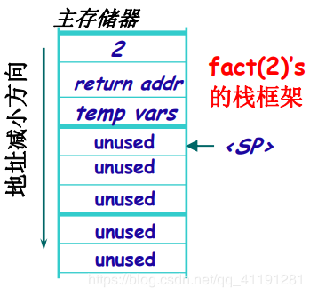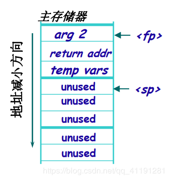

**注意**：如果堆栈的底部 在编译时刻不能被决定，你就不能通过$ sp 来存取堆栈变量，因此 $fp 被初始化为一个相对于该函数堆栈的一个常量的位置。这种用法对其他函数可以是不可见的。

### （11）$ra

当调用任何一个子函数时，返回地址存放在 ra 寄存器中，因此通常一个子程序的最后一个指令是： jr ra .子函数如果还要调用其他的子函数，必须保存 ra 的值，通常通过堆栈。

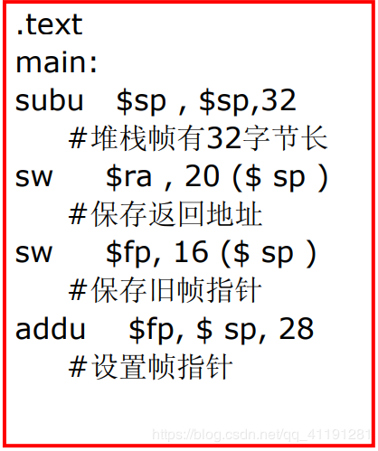

### (12) 其他方面

MIPS 里没有状态码。CPU 状态寄存器或内部都不包含任何用户程序计算的结果状态信息。
**hi  和  lo** 是与乘法运算器相关的两个寄存器，是用来存放结果的地方。它们并不是通用寄存器，除了用在乘除法之 外，也不能有做其他用途。MIPS 里定义了一些指令可以往 hi 和 lo 里存入任 何值。
**浮点运算协处理器 (浮点加速器，FPA)**，如果存在的话，有 32 个浮点寄存器。按汇编语言的简单约定讲，是从`$f0`到`$f31`。
实际上，对于 MIPS I 和 MIPS II 的机器，只有 16 个偶数号的寄存器可以用来做数学计算。当然，它们可以既 用来做单精度(32 位)和双精度(64 位)。当你做一个双精度的运算时，寄存器`$f1`存放`$f0` 的余数。奇数号的寄存器只用来作为寄存器与 FPA 之间的数据传送。MIPS III CPU 有 32 个 FP 寄存器。但是为了保持软件与 过去的兼容性，最好不要用奇数号的寄存器。

**对比一下 x86 寄存器结构：**

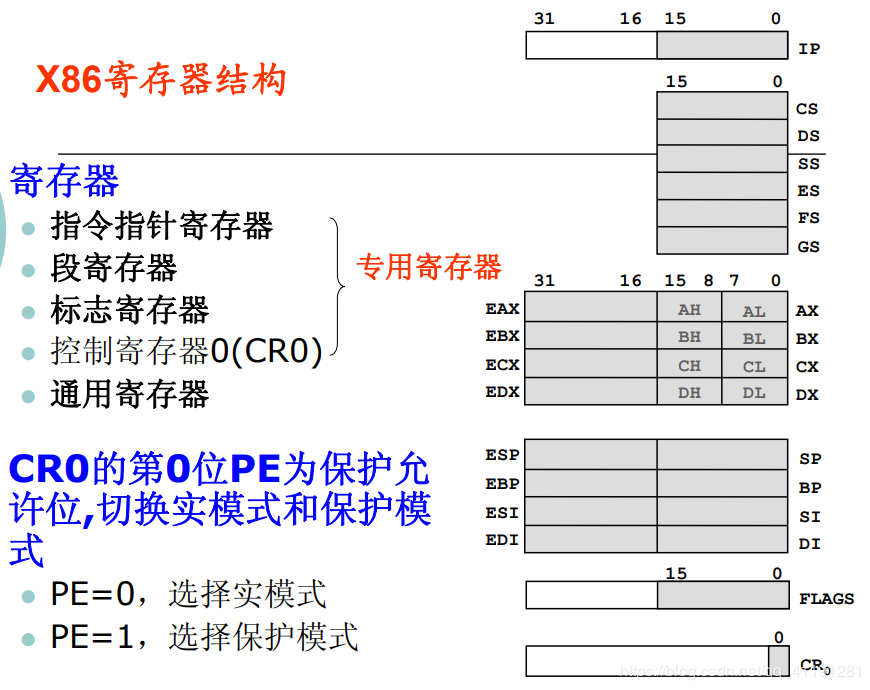

**寄存器约定小结：**

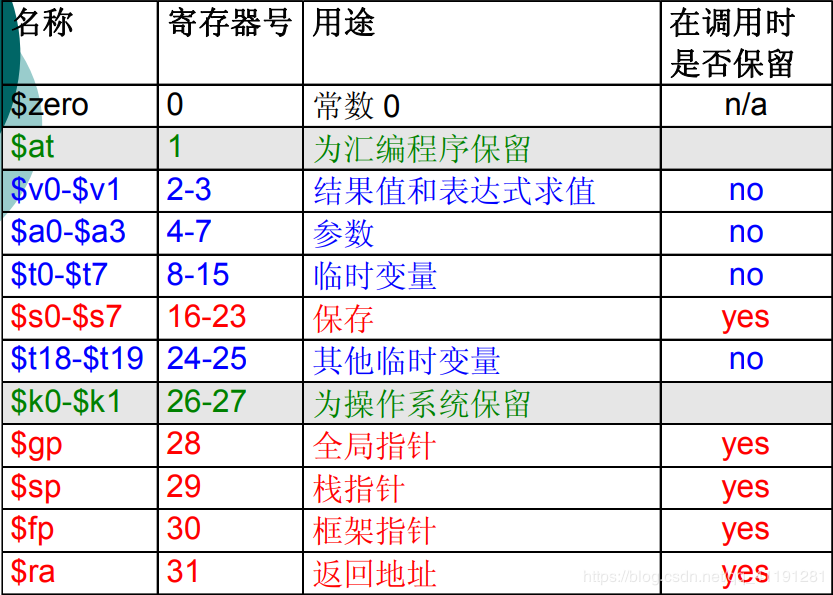

## 2.整数乘法单元和寄存器

MIPS 体系结构认为乘法非常重要，应该用硬件实现乘法指令，这在 RISC CPU 中并不常见。乘法结果寄存器是互锁的：只有在整数乘法 运算完成，得到完整的结果后，才能读取结 果寄存器。牺牲速度以换取执行简单和节省芯片空间。

## 3.寻址方式

只有加载或存储指令可以访问存储器。存储器的寻址方式为 **基址-偏移寻址**（存储单元的地址是某个寄存 器与指令中的偏移量之和）。

## 4.存储器和寄存器中的数据类型

MIPS CPU 的一次操作可读出或写入 1~8 个字节的数据，\*MIPS 编译器提供了 64 位指针，它把 long 解释成 64 位数 据，总之 long 不应该小于 int 。

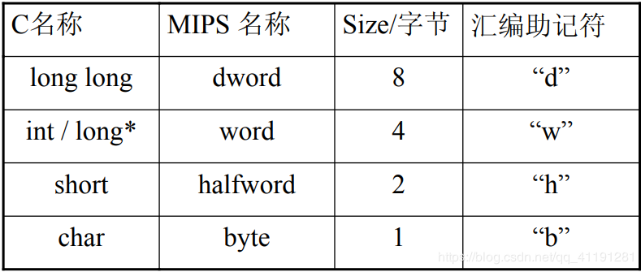

## 三、MIPS 指令与汇编

### 1.指令格式

**对于一条汇编语言指令来说，有两个问题要解决：**

• **要指出进行什么操作**

• **要指出大多数指令涉及的 操作数 和 操作结果 放在何处**

#### **操作数**

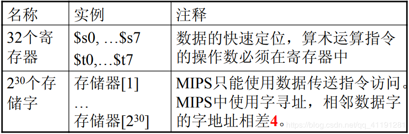

在 MIPS 中字（4 个字节）的地址必须是 4 的倍数，存取数据时可以避免一个数据分两次存取。

#### MIPS 有三种指令格式：（所有指令都是 32 位长）

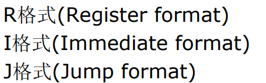

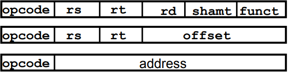

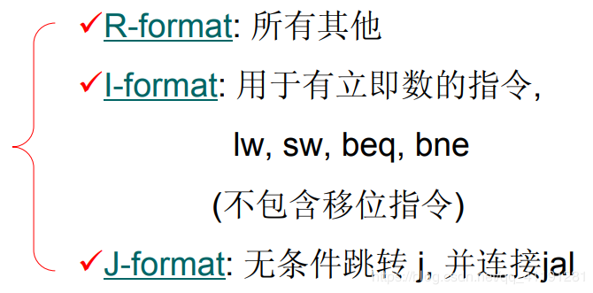

##### （1）R-型 指令

一条 32 位的 MIPS R 型指令按下表 bit 数划分为 6 个字段：6 + 5 + 5 + 5 + 5 + 6 = 32bit

| opcode | rs  | rt  | rd  | shamt | funct |
| ------ | --- | --- | --- | ----- | ----- |
| 6      | 5   | 5   | 5   | 5     | 6     |

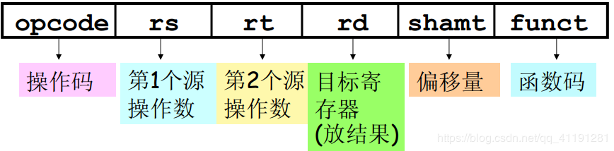

**实例**： **add $8, $17, $18 # $8 = $17 + $18**

第一个操作数是寄存器$17,第二个寄存器是$18,目的寄存器结果是$8.该指令没有移位。因为，加法是运算指令，指令操作类型码*op*是 0，*funct*是 32。

所以格式是：

| opcode | rs       | rt       | rd      | shamt | funct  |
| ------ | -------- | -------- | ------- | ----- | ------ |
| **0**  | **$ 17** | **$ 18** | **$ 8** | **0** | **32** |

##### （2）I-型 指令

一条 32 位的 MIPS I 型指令 按下表 bit 数划分为 4 个字段： 6 + 5 + 5 + 1 6 = 32bit

| opcode | rs  | rt  | address |
| ------ | --- | --- | ------- |
| 6      | 5   | 5   | 16      |

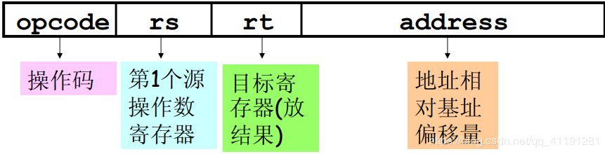

###### **I-型指令分类**：**装入/存储指令**、**分支指令**和 **立即数运算指令**

装入/存储指令

**数据装入**：Rt = Mem[Rs + Address]

**数据存储**：Mem[Rs + Address] = Rt

实例： `lw $s1, 100($s2)` # 暂时寄存器 $s1=A[i]，并假设Astart= 100
第一个操作数是寄存器 `$s2`, 第二个操作数是寄存器`$s1`；数组的起始地址是 Astart，称为表头地址。
所以这条指令的格式是：

| opcode | rs  | rt  | address |
| ------ | --- | --- | ------- |
| 35     | $s2 | $s1 | 100     |

分支指令

`if (Rs <relation> Rt) goto (PC+4) + Address` （PC 为程序计数器，指向当前执行的指令）

分支指令采用的寻址方式为 **PC 相对寻址** ——分支 目标的地址是 （PC+4）（下一条指令的地址）与指令中的偏移量之和

立即数运算指令

addi $21, $22, -50 （立即数，可以为十进制） # 将 $22 与 -50 相加 ，并将结果保存在 $21 中。

所以这条指令的格式是：

| opcode | rs  | rt  | immediate |
| ------ | --- | --- | --------- |
| 8      | $22 | $21 | -50       |

#### （3） J-型 指令

一条 32 位的 MIPS J 型指令 按下表 bit 数划分为 2 个字段： 6 + 26 = 32bit。

| 操作码     | 目标地址           |
| ---------- | ------------------ |
| **opcode** | **target address** |
| 6          | 26                 |

### 2.寻址方式

#### 1.寄存器寻址

MIPS 算术运算指令的操作数必须从 32 个 32 位寄存器中选取。

**实例：**

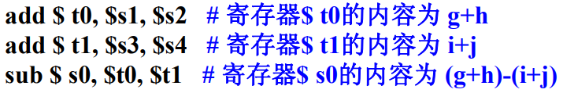

#### 2.立即数寻址

以常数作为操作数，无须访问存储器就可以使用常数。因为常数操作数频繁出现，所以在算术指令中加入常数字段，比从存储器中读取常数快得多。

**实例：**

addi $sp,   $sp,   4（常数）                 # $ sp =$ sp + 4

| op   | rs  | rt  | Immediate |
| ---- | --- | --- | --------- |
| addi | $sp | $sp | 4         |

小问题：怎么样将一个 32 位的常数装入寄存器 $s0 中呢？？？

分两次装入，先装入高 16 位，再装入低 16 位） 如图：

| 0000 0000 0011 1101（高 16 位） | 0000 1001 0000 0000 （低 16 位） |
| ------------------------------- | -------------------------------- |
| **61**                          | **2304**                         |

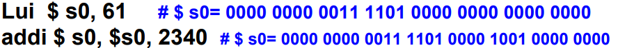

#### 3.基址或偏移寻址

操作数在存储器中，且存储器地址是某寄存器与指令中某常量的和。

**实例：**

`Lw $t0,   8 ($ s0 )` # $s0 中装的是存储器中的地址

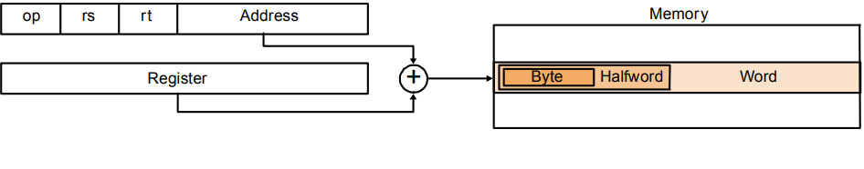

#### 4.PC 相对寻址

**实例：**

条件分支指令 `bne $s0,  $s1,  Exit`     #如果`$s0` 不等于`$s1`，则跳转到 Exit

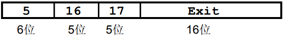

**PC = PC +** **分支地址**

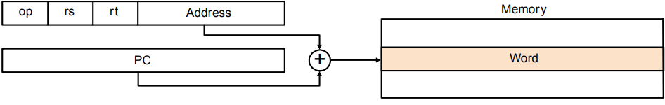

问题 1：为什么选 PC 寄存器？
因为几乎所有的条件分支指令都是跳转到附近的地址。
问题 2：如何处理 16 位无法表达的远距离分支？
插入一个无条件跳转到分支目标地址的指令，把分支 指令中的条件变反以决定是否跳过该指令。

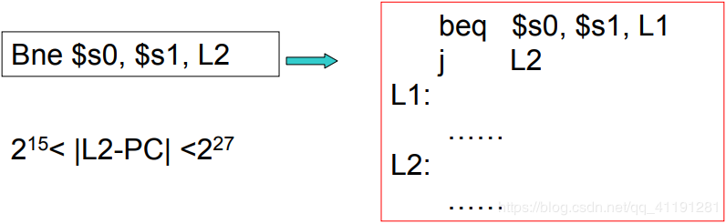

#### 5.伪直接寻址

跳转地址= PC 中原高 4 位 + 指令中的 26 位 + 00 （32 位地址）

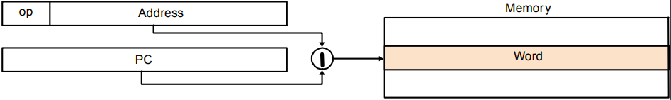

#### 寻址方式总览

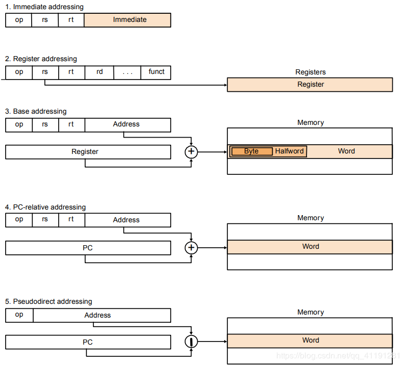

### 3.指令系统

#### （1）数据传送指令

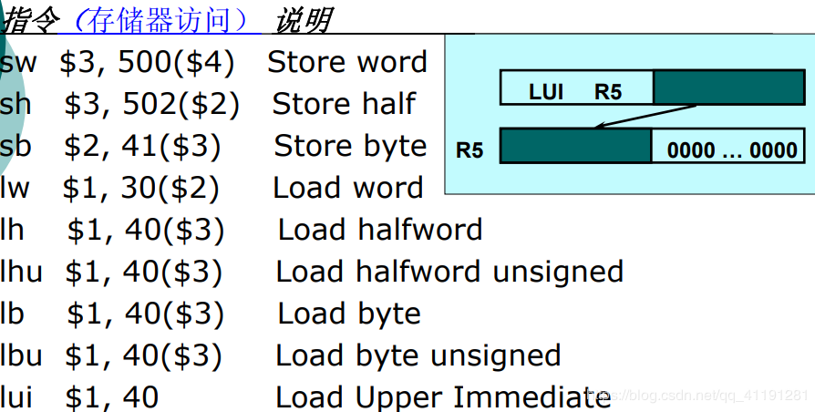

#### （2）算术/逻辑指令

每条指令有且仅有 3 个操作数，且只执行一个操作

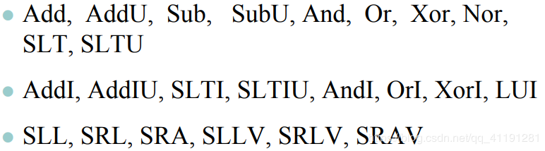

R 格式——ALU 指令的格式
Rs、Rt、Rd 为寄存器编号
Funct 字段为指令功能代码

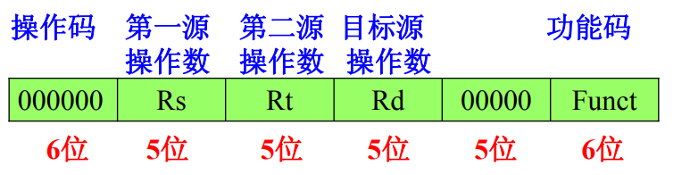

乘法除法（multiply / divide）指令 演示图

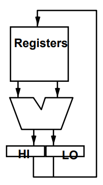

#### 算术指令总体概览图

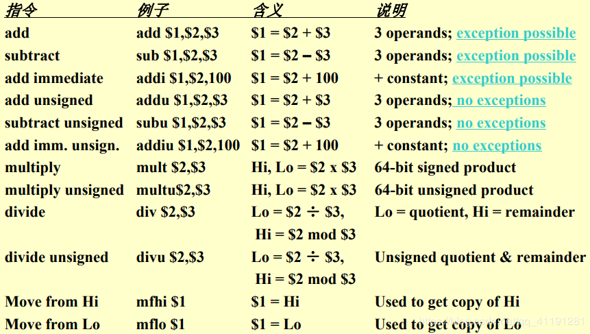

无符号整数一般都是用来表示存储器地址，溢出即使发生，也大多数被忽略掉了，因此 MIPS 采用了两种不同的算术运算指令来分别处理 。
（ 1 ） addu, addiu, subu 在发生溢出的时 候不产生异常
（ 2 ）add, addi, sub 在发生溢出时产生异常

发生**溢出**的情况：
加法：两正数相加结果为负，两负数相加结果为正
减法：正数减负数结果为负，负数减正数结果为正

MIPS 在检测到溢出发生时会产生一个异常，造成溢出 指令的地址被存到一个特定寄存器中
乘法：multu Hi 不为 0 ，mult Hi 各位不等于 Lo 符号位

MIPS 乘 /除法指令都忽略了溢出的情况，程序必须自己 判断得到的积 /商是否超出了 32 位寄存器能表示的范围，还必须自己处理除零操作

逻辑指令总体概览图：

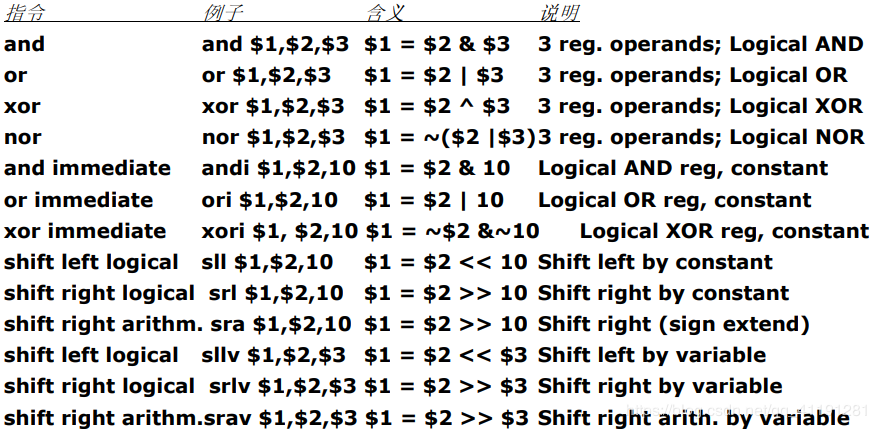

**说明：**

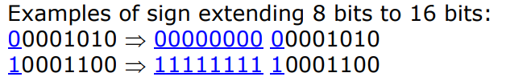

算术指令 总是将立即数做符号位扩展即便指令是无符号的!
逻辑指令（andi, ori 通常处理无符号数）不对立即 数做符号位扩展 (They are zero extended)
load / store 指令 地址计算时总是扩展立即数
乘 / 除 指令 任何情况下都不进行扩展，总是当成 usigned

addiu 在执行前也要将指令中的立即数进 行符号位扩展，因为：虽然 U 代表无符号 数，但是 addiu 事实上都被看作一条不会 发生溢出的 add 指令，因此常用它来加上 一个负的立即数。

#### （3）控制类指令

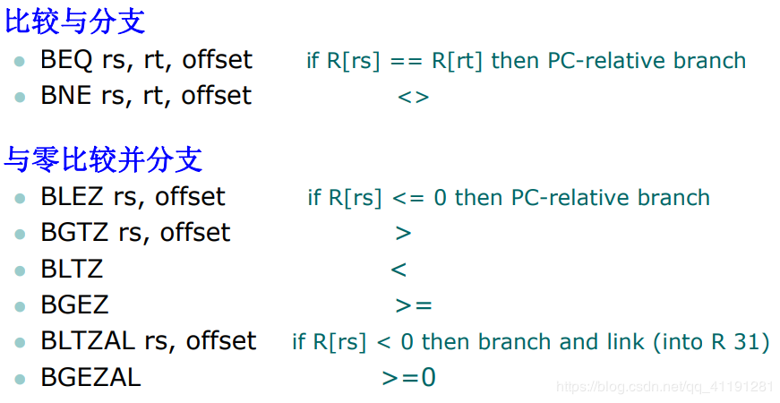

如果要实现其他比较功能，则需要两个以上的指令
基本上都是与零比较（这个速度快）

##### 控制类指令概览：（跳转分支和比较指令）

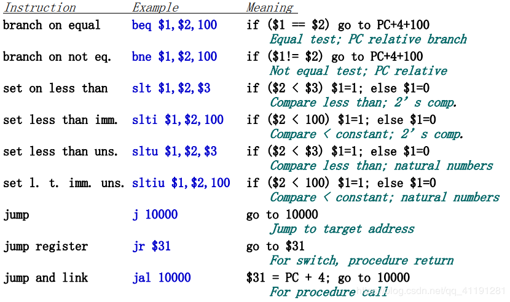

## 四、杂记（MIPS 计算机硬件对函数调用（过程）的支持）

### 1.为新数据分配空间

利用堆栈去存储函数调用的过程中不适合用寄存器保存的局部变量（如局部数组或结构）。

#### **过程框架**

也叫活动记录，是指包含了函数调用（过程）保存的寄存器和局部变量的堆栈段。下图给出了过程调用之前、之中和之后的堆栈状态。

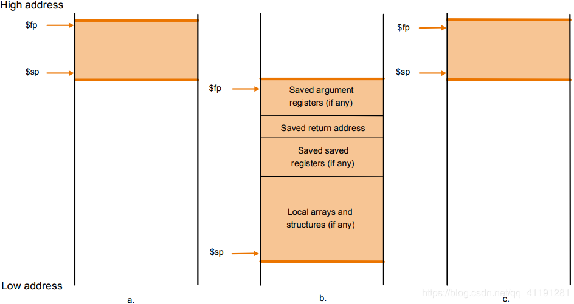

框架指针`$fp`指向框架的第一个字，通常是保存调用的参数寄存器。栈指针`$sp` 指向栈顶，在程序执行的过程中栈指针有可能改变。因此通过固定的框架指针来访问变量要比用栈指针更简便。如果一个过程的栈中没有局部变量，编译器将不 设置和恢复框架指针，以节省时间（主要是通过 `$fp` 来访问局部变量）。当需要框架指针时，以调用时的`$sp` 值作为框架 指针的初值，调用返回时，根据`$fp`恢复`$sp` 值。

### 2.MIPS 程序和数据的存储器空间使用约定

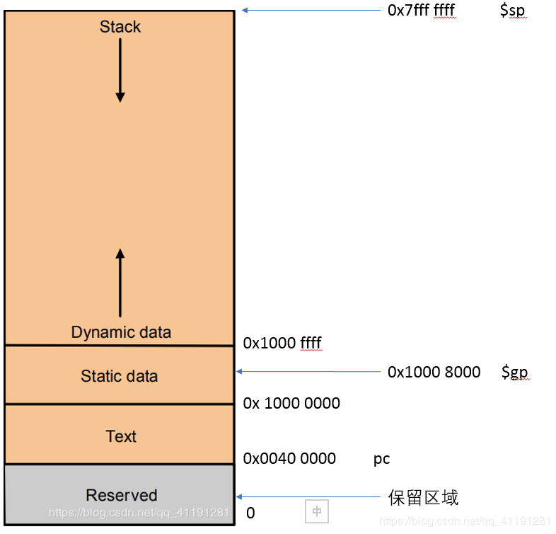

从顶端开始，对栈指针初始化为 7fffffff，并向下向数据段增长；在底端，程序代码（文本）开始于 00400000；静态数据开始于 10000000；紧接着是由 C 中 malloc 进行存储器分 配的动态数据，朝堆栈段向上增长 。
全局指针被设定为易于访问数据的地址，以便使用相对于$gp 的 ±16 位偏移量 0x1000 0000 -- 0x1000 ffff

在 32 位 MIPS 体系结构下，最多可寻址 4GB 地址空间。在 4GB 空间情况下内存地址空的分配如下图：

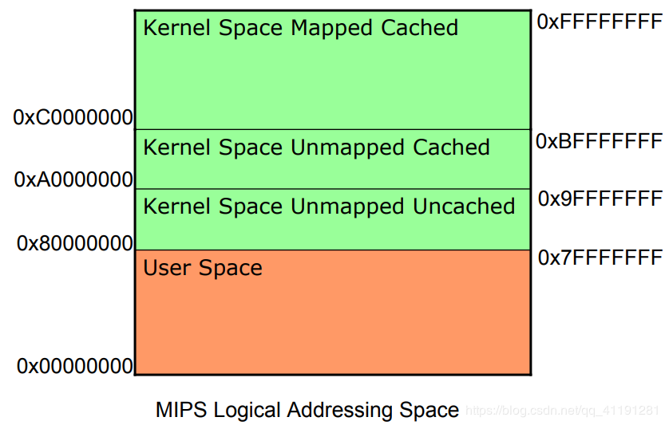

MIPS 体系结构下，程序计数器（PC）不是一个寄存器，在一个具有流水线的 CPU 中，程序计数器的值在一个给定的时刻有多个可选值，但可见的只有一个。
