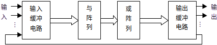
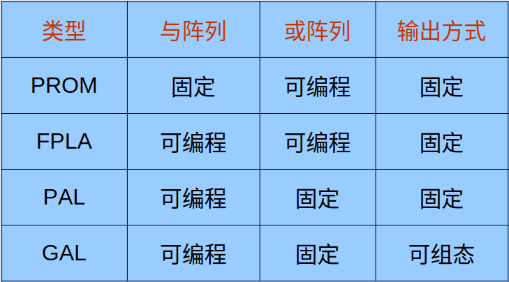
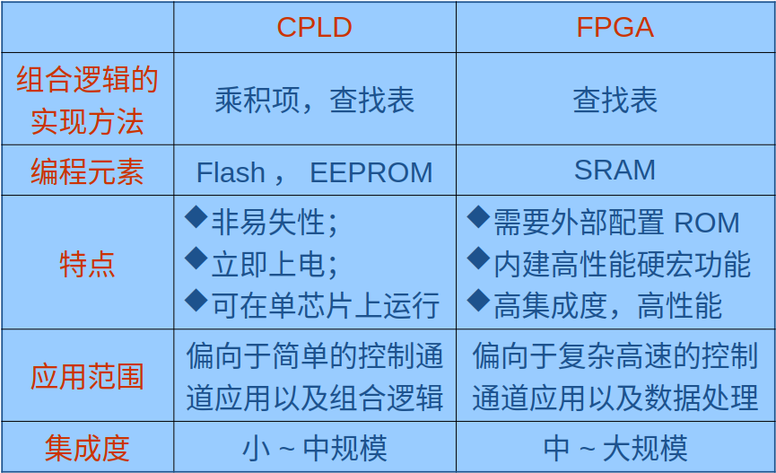
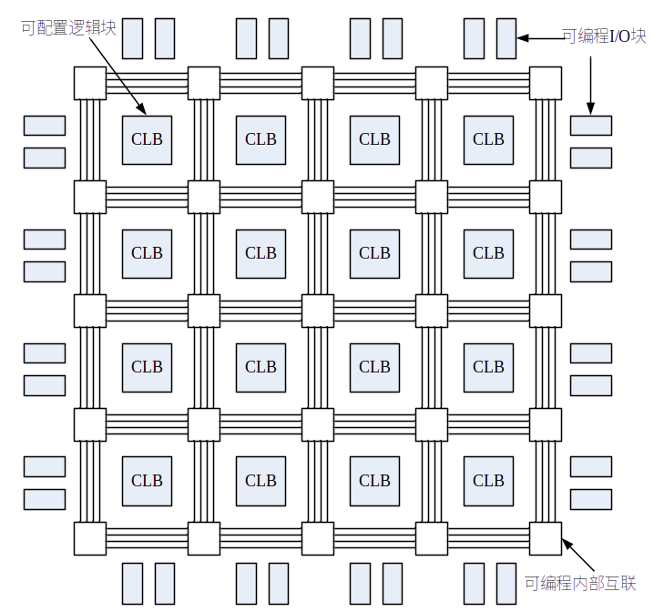

# 计算机硬件设计、FPGA 与 HDL

## 1 计算机硬件组成、设计及实现

### 1.1 计算机硬件组成

#### 1.1.1 冯·诺依曼计算机

按照冯·诺依曼的定义，计算机的硬件系统由五大部件组成：

1. 运算器
2. 存储器
3. 控制器
4. 输入设备
5. 输出设备

采用二进制表示指令和数据。

#### 1.1.2 采用二进制表示指令和数据

采用二进制表示指令和数据。

计算机的部件必须能够存储、处理、运算二进制信息，这样的二进制信息又称为**数字信号**。

对数字信号能够进行存储、算术运算和逻辑运算的电路称为**数字电路**。

**计算机硬件设计和实现的基础就是数字电路。**

#### 1.1.3 数字电路对于计算机的意义

在计算机技术发展的历程中，数字电路的发展起着决定性的作用。

1. 第一代计算机：使用电子管实现
2. 第二代计算机：使用晶体管器件实现
3. 第三代计算机开始至今：硬件实现均是基于集成电路器件或技术。

### 1.2 数字电路的发展

#### 1.2.1 数字电路

数字电路：用**数字信号**完成对数字量进行**算术运算和逻辑运算**的电路。

#### 1.2.2 数字电路的特点

特点：
采用二进制 1 和 0 两种数码，对应两种逻辑状态：真和假。
逻辑运算是数字电路最基本的运算形式：与、或、非。
门电路和触发器是数字电路最基本的电路单元。

#### 1.2.3 数字电路的分类

- 电子管 → 晶体管 → 半导体集成电路

- 分离器件电路 → 集成电路 IC

- 集成电路的规模：集成度
- 小规模集成电路 SSIC
- 中规模集成电路 MSIC
- 大规模集成电路 LSIC
- 超大规模集成电路 VLSIC
- 甚大规模集成电路 ULSIC
- 巨大规模集成电路 GSIC

按照制造工艺，数字电路分为：

- TTL 型：采用双极型晶体管
- CMOS 型：采用 NMOS 和 PMOS 两种互补的金属-氧化物半导体场效应晶体管

按照可编程性：

- 不可编程器件
- 可编程逻辑器件 PLD

| 分类     | 类型               | 描述                                                      |
| -------- | ------------------ | --------------------------------------------------------- |
| 制造工艺 | TTL 型             | 采用双极型晶体管                                          |
| 制造工艺 | CMOS 型            | 采用 NMOS 和 PMOS 两种互补的金属-氧化物半导体场效应晶体管 |
| 可编程性 | 不可编程器件       | -                                                         |
| 可编程性 | 可编程逻辑器件 PLD | -                                                         |

### 1.3 计算机硬件设计数字电路设计芯片

设计开发数字电路，可以选择 3 类芯片：

（1）标准芯片：

1. 具有通用、固定逻辑功能的集成电路器件 ，相同编号的芯片具有相同的逻辑功能和引脚排列。
2. 标准芯片集成度低，逻辑功能简单、固定。
3. 缺点是：所需要的芯片个数多，占用电路板体积大，功耗大，可靠性差，难于实现复杂的逻辑功能；逻辑功能固定，一旦完成设计，就很难再进行更改。

（2）可编程逻辑器件 `PLD` ：
1. 具有通用的逻辑结构，内部包含大量的可编程开关，用户编程配置这些开关为不同的状态，就能实现不同的逻辑功能。
2. 可以按通用的集成电路器件进行批量生产。
3. 编程配置过程由最终的电路产品用户借助编程工具实现，而不必由芯片制造厂商来完成。

（3）定制芯片：

将设计好的电路交付半导体器件制造厂商，由厂商选择合适的技术来生产满足特定性能指标的芯片。

由于生产的芯片主要用于一些特定的应用场合，因此也称为专用集成电路 `ASIC`。

主要优点：针对特定的应用需求生产，能够根据特定的任务进行优化。

定制芯片的缺点是：设计和开发周期长，产品投放市场时间长；成本高，风险大，生产数量大。

## 2 FPGA

### 2.1 可编程逻辑器件 PLD

#### 2.1.1 PLD 结构

#### 2.1.2 PLD 分类：按集成度分为

#### 简单 PLD：低密度 PLD（低于 700 门/片）

- 可编程只读存储器 PROM

- 现场可编程逻辑阵列 FPLA
- 可编程阵列逻辑 PAL
- 通用可编程阵列逻辑 GAL

##### 简单 PLD 特点对比：

#### 复杂 PLD：高密度 PLD

- 现场可编程门阵列 FPGA（Field Programable Gate Array）

- 复杂可编程逻辑器件 CPLD（Complex Programmable Logic Device）

##### 复杂 PLD 特点对比：

### 2.2 FPGA 结构

1. 可配置逻辑模块 CLB
2. 可编程输入输出模块 IOB
3. 可编程内部连线 PIC

### 2.3 FPGA 芯片的主要生产厂商：

1. Xilinx 公司：全球最大的生产厂商
2. Altera 公司
3. Actel 公司

对 Xilinx FPGA 芯片进行设计开发，要使用 Xilinx 公司的开发软件平台——集成软件环境 ISE（Integrated Software Environment），在其中用硬件描述语言 VHDL 或者 Verilog 语言编程。 (这课件里的是老东西，现在我们不用 ise 了的)

## 3 HDL

HDL（ Hardware Description Language ）语言：以文本形式来描述数字系统硬件结构和行为，是一种用形式化方法来描述数字电路和系统的语言，可以从上层到下层来逐层描述自己的设计思想。

1. 用一系列分层次的模块来表示复杂的数字系统
2. 逐层进行验证仿真
3. 把具体的模块组合由综合工具转化成门级网表
4. 利用布局布线工具把网表转化为具体电路结构的实现

### HDL 语言特点：

1. HDL 语言既包含一些高级程序设计语言的结构形式，同时也兼顾描述硬件线路连接的具体结构。

2. 通过使用结构级行为描述，可以在不同的抽象层次描述设计。
3. HDL 语言是并行处理的。
4. HDL 语言具有时序的概念：存在时延的概念。

HDL 语言不仅可以描述硬件电路的功能，还可以描述电路的时序。

### 各种硬件描述语言：

随着 EDA 技术的发展，使用硬件语言设计 CPLD/FPGA 已成为一种趋势。

目前最主要的硬件描述语言

VHDL（Very-High-Speed Integrated Circuit HDL）

Verilog HDL

对比：

VHDL 发展的较早，语法严格、繁琐；

Verilog HDL 在 C 语言的基础上发展起来，语法较自由。

其他硬件描述语言：

ABEL：用于编程 PAL、GAL

AHDL：Altera 公司开发

#### 1、VHDL：

HDTV 诞生于 1982 年，1987 年底，被 IEEE 和美国国防部确认为标准硬件描述语言。
VHDL 描述数字系统的结构、行为、功能和接口。
将设计实体分成内部和外部两部分，外部又称可视部分或端口；内部又称不可视部分，它涉及实体的内部功能和算法完成部分。

##### VHDL 特点：

1. VHDL 具有更强的行为描述能力。

2. VHDL 丰富的仿真语句和库函数。
3. VHDL 具有支持大规模设计的分解和已有设计的再利用功能。
4. 可以利用 EDA 工具进行逻辑综合和优化，并自动的把 VHDL 描述设计转变成门级网表。
5. VHDL 对设计的描述具有相对独立性。

#### 2、Verilog HDL：

1983 年末，由 GDA（Gateway Design Automation）公司的 Phil Moorby 首创
1995 年，Verilog HDL 成为 IEEE 标准，即 IEEE Standard 1364-1995。
新版本：2001 年 IEEE 公布的 Verilog 2001。
主要优点是：简洁、高效、功能强、易学易用，语法与 C 语言有许多相似之处。

##### Verilog HDL 特点：

1. 既能进行面向综合的电路设计，也可用于电路的模拟仿真。
2. 设计能够在多个层次上加以描述，从开关级、门级、寄存器传送级（RTL）到算法级，包括进程和队列级。
3. 设计的规模可以是任意的；语言不对设计的规模（大小）施加任何限制。
4. 有三种电路描述与建模方式：
   1. 行为描述方式：使用过程化结构建模；
   2. 数据流描述方式：使用连续赋值语句方式建模；
   3. 结构描述方式：使用门和模块实例语句描述建模。
5. 具有混合方式建模能力，即在一个设计中每个模块均可以在不同设计层次上建模。
6. 可使用内置基本逻辑门，在门级对设计完整建模。
7. 可使用内置开关级原语，在开关级对设计完整建模。
8. 用户可灵活创建自定义原语（UDP）。
9. 可通过使用编程语言接口（PLI），允许与外部函数交互。
